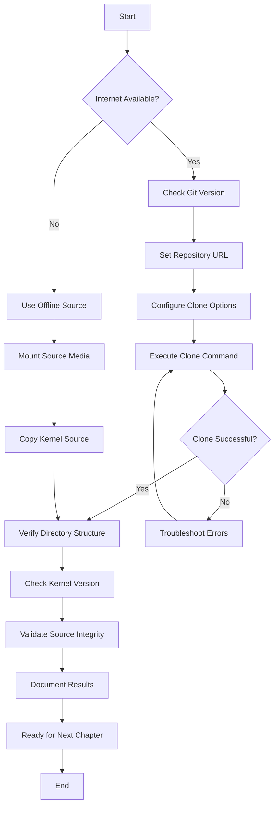
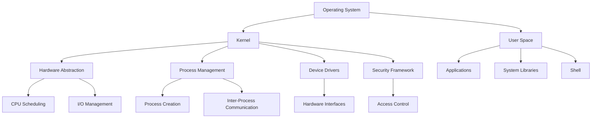

# Chapter 1: Kernel Acquisition

This chapter covers acquiring the Linux kernel source code, which is the foundation of our custom Linux distribution.

## Goals

- Obtain the latest Linux kernel source code
- Understand the kernel's role in the distro
- Prepare for subsequent compilation and configuration

## Distro Overview

Our target is a minimalistic, container-enabled Linux distribution that is hardened and secure for general-purpose use. Key features:

- Minimal footprint
- Container support (Docker, Podman)
- Security hardening (SELinux, AppArmor)
- General-purpose usability

## Chapter plan (learning-first)

### Learning objectives

- Acquire and verify the official Linux kernel source
- Read and interpret the top-level kernel Makefile
- Understand the kernel source layout and where features live
- Run basic verification and logging for reproducibility

### Timebox

- Research & prep: 30 min
- Clone & verification: 10–40 min (network-dependent)
- Document & log results: 15–30 min

### Prerequisites

- Git installed (version 2.0+)
- Internet connection
- ~1 GB free space for shallow clone; ~10+ GB for full source
- Basic command-line familiarity

### Success criteria

- Kernel source present in `kernel/` folder
- Makefile shows the expected VERSION/PATCHLEVEL/SUBLEVEL
- A verification log exists at `01-kernel-acquisition/verification.log`

### Quick start (commands)

```powershell
# from repo root
cd d:\education\linuxfromscratch\01-kernel-acquisition\kernel

# shallow clone (faster)
git clone --depth 1 https://git.kernel.org/pub/scm/linux/kernel/git/torvalds/linux.git .

# verify top-level Makefile (PowerShell)
Get-Content Makefile -TotalCount 15

# create a small verification log (PowerShell)
"Kernel Verification - $(Get-Date)" | Out-File ..\verification.log -Encoding utf8
("Version: " + ((Select-String "^VERSION =" Makefile).Line -split "=\s*")[1]) | Out-File -Append ..\verification.log
("Patchlevel: " + ((Select-String "^PATCHLEVEL =" Makefile).Line -split "=\s*")[1]) | Out-File -Append ..\verification.log
Get-Content ..\verification.log
```

### Exercises (practice)

- Exercise 1: Perform the shallow clone and attach the first 15 lines of `Makefile` to the verification log.
- Exercise 2: Run `git remote -v` and note which remotes are configured.

### Next steps

- If verification is successful: proceed to `../02-toolchain-setup/README.md`.
- If network or disk issues occur: see Troubleshooting section below.

## Process Flow



## Kernel Architecture Overview



## Verification Checklist

| Check            | Command                       | Expected Result           |
| ---------------- | ----------------------------- | ------------------------- |
| Directory exists | `ls -la kernel/`              | kernel/ directory present |
| Git repo valid   | `git status`                  | On branch main, clean     |
| Version correct  | `grep VERSION Makefile`       | VERSION = 6               |
| Files intact     | `find . -name "*.c" \| wc -l` | ~60,000+ files            |
| No corruption    | `git fsck`                    | No errors reported        |

## Key Commands

### Clone Kernel Repository

```bash
# Navigate to kernel directory
cd 01-kernel-acquisition/kernel

# Clone with shallow depth for faster download
git clone --depth 1 https://git.kernel.org/pub/scm/linux/kernel/git/torvalds/linux.git .

# Alternative: Clone specific version
# git clone --depth 1 --branch v6.17 https://git.kernel.org/pub/scm/linux/kernel/git/torvalds/linux.git .
```

### Verify Kernel Version

```bash
# Check version in Makefile
head -10 Makefile

# Expected output:
# VERSION = 6
# PATCHLEVEL = 17
# SUBLEVEL = 0
# EXTRAVERSION =
# NAME = Baby Opossum Posse

# Full version: 6.17.0
```

### Check Repository Status

```bash
# Verify git status
git status

# Check remote URL
git remote -v

# View recent commits
git log --oneline -5
```

## Directory Structure After Clone

```
kernel/
├── arch/           # Architecture-specific code
├── drivers/        # Device drivers
├── fs/            # Filesystem code
├── include/       # Header files
├── init/          # Kernel initialization
├── kernel/        # Core kernel code
├── lib/           # Library functions
├── mm/            # Memory management
├── net/           # Networking code
├── scripts/       # Build scripts
├── Makefile       # Main build file
└── README         # Kernel documentation
```

## References

- [Linux Kernel Official Repository](https://git.kernel.org/pub/scm/linux/kernel/git/torvalds/linux.git/)
- [Kernel.org Main Page](https://www.kernel.org/)
- [Linux Kernel Documentation](https://www.kernel.org/doc/)
- [Git Shallow Cloning](https://git-scm.com/docs/git-clone#Documentation/git-clone.txt---depthltdepthgt)

## Learn how the Linux kernel repo works (new lessons)

To help you understand the kernel source even as a beginner, this repo includes a set of detailed lessons under `01-kernel-acquisition/how_linux_works/`:

- `00-intro.md` — Mental model of the kernel, navigation strategies, and code references for syscalls and structures.
- `01-repo-layout.md` — Deep dive into each top-level directory with educational context, analogies, code pointers, and a relationship diagram.
- `02-tracing-syscalls.md` — Step-by-step syscall tracing (fork/open examples), with sequence diagrams and tracing tools.
- `03-subsystems.md` — Guided reading of memory, scheduler, FS, networking, drivers with interactions and diagrams.
- `04-hands-on-exercises.md` — Practical exercises using the local `kernel/` clone, with safety notes and expected outputs.

Each lesson is now longer, includes mermaid graphs, code references to specific files/lines, educational explanations, and hands-on tasks. They point directly into the `kernel/` folder so you can grep/read and experiment locally.

## Learning Outcomes

After completing this chapter, you will:

- Understand how to acquire kernel source code
- Know the basic kernel directory structure
- Be able to verify kernel versions
- Have the foundation for kernel configuration
