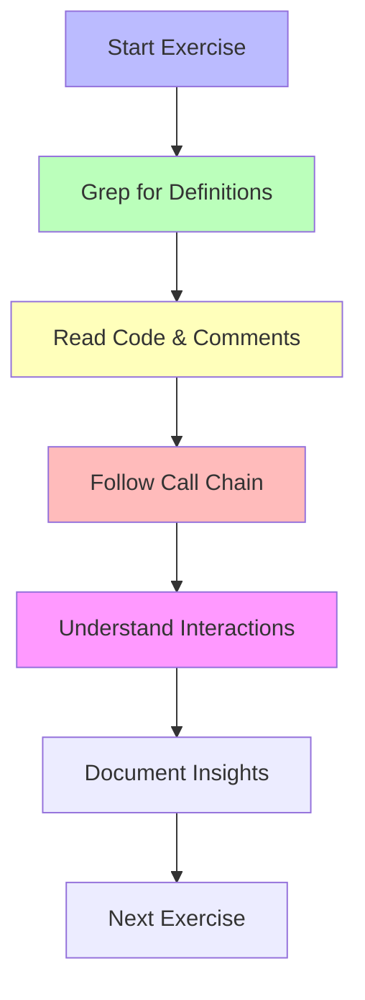

# Hands-on Exercises: Read and Run

This lesson provides practical, hands-on exercises to apply the concepts from previous lessons. You'll use the local ../kernel/ clone to grep, read, and analyze code. Includes safety notes, expected outputs, and educational insights.

## Educational Context: Learning by Doing

Reading code is theory; running commands and tracing paths builds intuition. These exercises simulate real debugging tasks, teaching you to navigate the repo like a kernel developer.

Analogy: These are lab sessions in a science class hands-on to reinforce lectures.

## Prerequisites

- Cloned kernel in ../kernel/
- Terminal access
- Basic grep/sed skills

## Safety Notes

- Never modify the system's kernel files.
- Work in the cloned repo only.
- For live testing, use VMs or containers.
- If building a test kernel, do it in a separate directory.

## Exercise A: Find Where mount() Is Implemented

**Goal**: Trace the mount() syscall from definition to VFS.

**Steps**:

1. Find the syscall definition.
   `ash
   cd ../kernel
   grep -R 'SYSCALL_DEFINE.\*mount' -n fs/ kernel/ | head -n 5

   # Expected: fs/namespace.c:123:SYSCALL_DEFINE5(mount, ...)

   `

2. Read the implementation.
   `ash
   sed -n '120,200p' fs/namespace.c

   # Look for do_mount() call

   `

3. Follow to VFS.
   `ash
   grep -n 'do_mount' fs/namespace.c
   # Output: fs/namespace.c:145: ret = do_mount(...);
   `

**Code reference**: s/namespace.c do_mount(): Handles mount flags, calls do_new_mount().

**Educational insight**: Mount involves superblock setup and VFS integration. Read comments for mount namespaces.

**Expected Output**: Syscall in s/namespace.c, calls do_mount do_new_mount filesystem-specific mount.

## Exercise B: Count Syscall Implementations

**Goal**: Quantify syscalls to understand scope.

**Steps**:
`ash
cd ../kernel
grep -R 'SYSCALL_DEFINE' -n | wc -l

# Expected: ~400+ syscalls

`

**Educational insight**: Syscalls are the kernel's public API. More syscalls mean more functionality but also attack surface.

## Exercise C: Trace Opening a File from User Space to Kernel

**Goal**: Full path from open() to disk.

**Steps**:

1. Userland: int fd = open('file.txt', O_RDONLY);
2. Kernel: s/open.c SYSCALL_DEFINE3(open, ...)
3. VFS: do_filp_open() path_openat() do_last()
4. Filesystem: ext4's ext4_file_open()

**Code reference**: s/open.c do_last(): Final path resolution and permission checks.

**Educational insight**: File opening involves namei (lookup), permission checks, and inode ops.

**Hands-on**: Add a printk in do_last (test kernel only) and observe dmesg during cat file.txt.

## Exercise D: Read Documentation/ for a Subsystem

**Goal**: Use docs as entry points.

**Steps**:
`ash
cd ../kernel/Documentation
ls -la | grep -i filesystems

# Open filesystems/overlayfs.rst

head -n 50 Documentation/filesystems/overlayfs.rst
`

**Educational insight**: Docs explain design decisions. Always check here before code.

## Exercise E: Analyze a Driver Probe Function

**Goal**: Understand driver initialization.

**Steps**:
`ash
cd ../kernel
grep -n 'probe' drivers/net/ethernet/intel/e1000/e1000_main.c | head -n 5

# Read the e1000_probe function

sed -n '1000,1100p' drivers/net/ethernet/intel/e1000/e1000_main.c
`

**Code reference**: e1000_probe(): PCI device detection, resource allocation, netdev registration.

**Educational insight**: Probe functions are like constructors; they set up hardware interfaces.

## Exercise F: Explore Memory Allocation Paths

**Goal**: Trace kmalloc to page allocator.

**Steps**:
`ash
cd ../kernel
grep -n 'kmalloc' mm/slab.c | head -n 5

# Follow to \_\_kmalloc

grep -n '\_\_kmalloc' mm/slab.c

# Eventually to alloc_pages in page_alloc.c

`

**Code reference**: mm/slab.c \_\_kmalloc(): Slab allocation, falls back to buddy if needed.

**Educational insight**: Memory allocators are layered: slab buddy physical pages.

## Mermaid Diagram: Exercise Flow

This shows the iterative process of kernel exploration.

## Advanced Exercises (Optional)

1. **Build a Minimal Kernel**: Use Chapter 4 to configure and build a kernel with debug symbols. Boot in QEMU and attach gdb.

2. **Ftrace a Syscall**: Use race-cmd to trace ork live and analyze the output.

3. **Patch and Test**: Add a simple printk to kernel/fork.c, rebuild, and verify in dmesg.

These exercises turn theory into practice. Use them to build confidence in reading and modifying kernel code safely.
