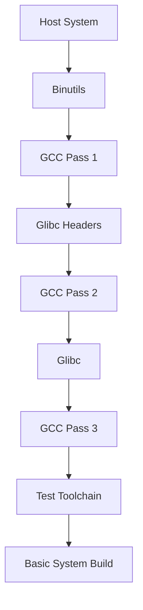

# What is a Toolchain in Linux From Scratch?

## Overview

A toolchain is a collection of programming tools used to compile software from source code into executable binaries. In the context of Linux From Scratch (LFS), building a cross-compilation toolchain is crucial because it allows us to compile software for our target system without relying on the host system's libraries and tools, ensuring a clean, self-contained build.

## Key Components

- **Binutils**: Provides essential binary utilities like the assembler (`as`), linker (`ld`), and object file tools.
- **GCC (GNU Compiler Collection)**: The core compiler for C and C++ languages.
- **Glibc (GNU C Library)**: The standard C library providing core functions and system calls.

## Why Build a Separate Toolchain?

- **Host Independence**: Avoids contamination from the host system's libraries.
- **Reproducibility**: Ensures consistent builds across different environments.
- **Security**: Builds a trusted set of tools from verified sources.

## Learning Objectives

- Understand the role of each toolchain component.
- Set up the LFS build environment variables.
- Prepare the directory structure for the build process.

## Quick Start

```bash
# Set the LFS environment variable (adjust path as needed)
export LFS=/mnt/lfs

# Create essential directories
mkdir -pv $LFS/{etc,var} $LFS/usr/{bin,lib,sbin} $LFS/tools

# Add LFS tools to PATH
export PATH=$LFS/tools/bin:$PATH

# Set target architecture (example for x86_64)
export LFS_TGT=x86_64-lfs-linux-gnu
```

## Toolchain Build Flow



## Security Considerations

- Use verified source tarballs with checksums.
- Build in a clean environment to prevent host pollution.
- Consider enabling compiler hardening flags where appropriate.

## Exercises

- **Exercise 1**: Set the `LFS` and `LFS_TGT` variables and create the directory structure. Verify with `ls -la $LFS`.
- **Exercise 2**: Download and verify the source packages for binutils, GCC, and glibc using their respective checksums.

## Next Steps

Proceed to Chapter 2.2 to build Binutils, the first component of our toolchain.
