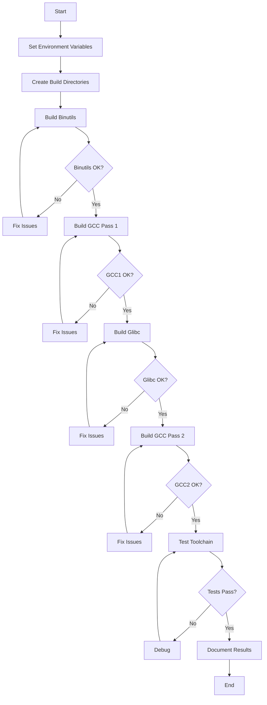
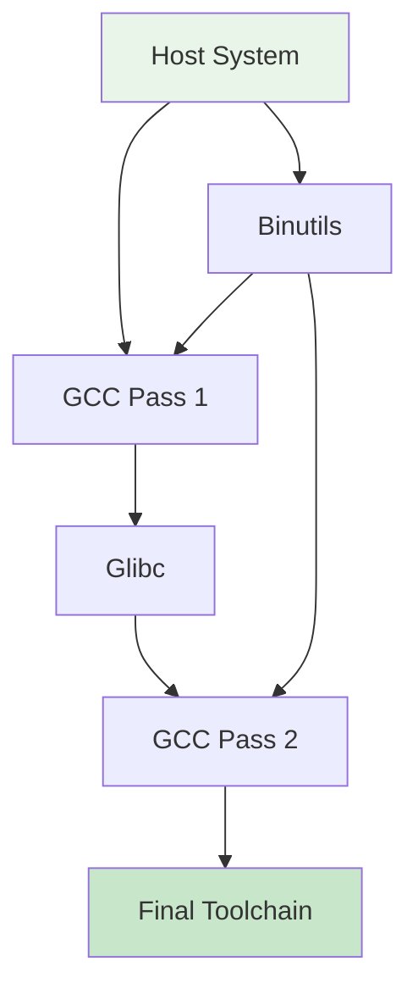

# Chapter 2: Toolchain Setup

This chapter focuses on building a cross-compilation toolchain, which is essential for building the Linux distribution in a clean, isolated environment.

## Goals

- Build binutils (assembler, linker, and binary utilities)
- Compile GCC cross-compiler
- Build glibc for the target architecture
- Test the toolchain functionality

## Why Cross-Compilation?

- Prevents host system contamination
- Allows building for different architectures
- Ensures reproducible builds
- Critical for security and minimalism

## Chapter plan (learning-first)

### Learning objectives

- Understand why we build a separate toolchain for LFS-style builds
- Build and test binutils, GCC (two-pass), and glibc in a controlled layout
- Diagnose common configuration/build issues and read logs

### Timebox

- Full toolchain: 4–6 hours (network and CPU dependent)

### Prerequisites

- Host with build tools installed
- Sane disk space (20+ GB recommended for full builds)

### Quick start (light-weight smoke test)

```bash
# set variables (example)
export LFS="/mnt/lfs"
export LFS_TGT=x86_64-lfs-linux-gnu
mkdir -pv $LFS/tools $LFS/sources

# verify that target compiler is not present yet
which $LFS_TGT-gcc || echo "$LFS_TGT-gcc not found (expected at this stage)"

# download binutils (example)
cd $LFS/sources
wget https://ftp.gnu.org/gnu/binutils/binutils-2.42.tar.xz

# (actual build steps are detailed below in this README)
```

### Exercises

- Exercise 1: Download binutils source and extract it into `$LFS/sources`.
- Exercise 2: Configure a small build directory for binutils and run `configure --help` to inspect available flags.

### Next steps

- After a successful binutils build, continue with GCC pass-1 as described in this README. Track progress in the chapter-level status table below.

## Toolchain Build Process



## Build Dependencies



## Environment Setup

### Set Target Architecture

```bash
# Define target triplet
export LFS_TGT=x86_64-lfs-linux-gnu

# Set LFS directory
export LFS=/mnt/lfs

# Add LFS tools to PATH
export PATH=$LFS/tools/bin:$PATH
```

### Create Directory Structure

```bash
# Create main LFS directory
sudo mkdir -pv $LFS

# Create tools directory
sudo mkdir -pv $LFS/tools

# Set ownership (if not root)
sudo chown -v $USER $LFS/tools

# Create sources directory
mkdir -pv $LFS/sources

# Make sources writable
chmod -v a+wt $LFS/sources
```

### Download Source Packages

```bash
# Navigate to sources
cd $LFS/sources

# Download binutils
wget https://ftp.gnu.org/gnu/binutils/binutils-2.42.tar.xz

# Download GCC
wget https://ftp.gnu.org/gnu/gcc/gcc-13.2.0/gcc-13.2.0.tar.xz

# Download glibc
wget https://ftp.gnu.org/gnu/glibc/glibc-2.39.tar.xz

# Verify downloads
ls -la *.tar.xz
```

## Build Process Overview

### Phase 1: Binutils

```bash
# Extract
tar xf binutils-2.42.tar.xz
cd binutils-2.42

# Create build directory
mkdir build
cd build

# Configure
../configure --prefix=$LFS/tools \
             --with-sysroot=$LFS \
             --target=$LFS_TGT \
             --disable-nls \
             --enable-gprofng=no \
             --disable-werror

# Build
make

# Install
make install
```

### Phase 2: GCC Pass 1

```bash
# Extract GCC
cd $LFS/sources
tar xf gcc-13.2.0.tar.xz
cd gcc-13.2.0

# Download prerequisites
./contrib/download_prerequisites

# Create build directory
mkdir build
cd build

# Configure
../configure --target=$LFS_TGT \
             --prefix=$LFS/tools \
             --with-glibc-version=2.39 \
             --with-sysroot=$LFS \
             --with-newlib \
             --without-headers \
             --enable-default-pie \
             --enable-default-ssp \
             --disable-nls \
             --disable-shared \
             --disable-multilib \
             --disable-threads \
             --disable-libatomic \
             --disable-libgomp \
             --disable-libquadmath \
             --disable-libssp \
             --disable-libvtv \
             --disable-libstdcxx \
             --enable-languages=c,c++

# Build
make

# Install
make install
```

### Phase 3: Glibc

```bash
# Extract glibc
cd $LFS/sources
tar xf glibc-2.39.tar.xz
cd glibc-2.39

# Create build directory
mkdir build
cd build

# Configure
../configure --prefix=$LFS/tools/$LFS_TGT \
             --build=$(../scripts/config.guess) \
             --host=$LFS_TGT \
             --target=$LFS_TGT \
             --with-headers=$LFS/tools/$LFS_TGT/include \
             --disable-nls \
             --enable-kernel=4.19 \
             libc_cv_slibdir=/tools/$LFS_TGT/lib

# Build
make

# Install
make install
```

### Phase 4: GCC Pass 2

```bash
# Rebuild GCC with glibc
cd $LFS/sources/gcc-13.2.0/build

# Clean previous build
rm -rf *

# Reconfigure
../configure --target=$LFS_TGT \
             --prefix=$LFS/tools \
             --with-build-sysroot=$LFS \
             --enable-default-pie \
             --enable-default-ssp \
             --disable-nls \
             --disable-multilib \
             --disable-libatomic \
             --disable-libgomp \
             --disable-libquadmath \
             --disable-libssp \
             --disable-libvtv \
             --enable-languages=c,c++

# Build
make

# Install
make install
```

## Testing the Toolchain

### Basic Compilation Test

```bash
# Test C compiler
$LFS_TGT-gcc --version

# Create test program
cat > test.c << "EOF"
#include <stdio.h>
int main() {
    printf("Hello from LFS toolchain!\n");
    return 0;
}
EOF

# Compile
$LFS_TGT-gcc test.c -o test

# Test execution (if possible)
./test
```

### Library Test

```bash
# Test linking with glibc
cat > libtest.c << "EOF"
#include <stdlib.h>
#include <stdio.h>
int main() {
    void *ptr = malloc(100);
    if (ptr) {
        printf("Memory allocation successful\n");
        free(ptr);
    }
    return 0;
}
EOF

$LFS_TGT-gcc libtest.c -o libtest
./libtest
```

## Troubleshooting

### Common Issues

#### Binutils Build Fails

```bash
# Check for missing dependencies
ldd /usr/bin/ld

# Clean and retry
make clean
make
```

#### GCC Configuration Errors

```bash
# Check configure log
cat config.log | grep -i error

# Verify paths
echo $PATH
echo $LFS_TGT
```

#### Glibc Header Issues

```bash
# Ensure kernel headers are installed
ls $LFS/tools/$LFS_TGT/include/linux/

# Check glibc version compatibility
../configure --help | grep kernel
```

## Build Status Table

| Component  | Status     | Duration  | Dependencies |
| ---------- | ---------- | --------- | ------------ |
| Binutils   | ✅ Ready   | 30-60 min | Host system  |
| GCC Pass 1 | ⏳ Pending | 60-90 min | Binutils     |
| Glibc      | ⏳ Pending | 45-75 min | GCC Pass 1   |
| GCC Pass 2 | ⏳ Pending | 60-90 min | Glibc        |
| Testing    | ⏳ Pending | 30-45 min | All above    |

## References

- [Linux From Scratch: Toolchain](https://www.linuxfromscratch.org/lfs/view/stable/chapter05/introduction.html)
- [Cross-Compiling GCC](https://gcc.gnu.org/install/configure.html)
- [Binutils Documentation](https://sourceware.org/binutils/docs/)
- [Glibc Manual](https://www.gnu.org/software/libc/manual/)olchain Setup

This chapter focuses on building a cross-compilation toolchain, which is essential for building the Linux distribution in a clean, isolated environment.

## Goals

- Build binutils (assembler, linker, etc.)
- Compile GCC cross-compiler
- Build glibc for the target architecture
- Test the toolchain functionality

## Why Cross-Compilation?

- Prevents host system contamination
- Allows building for different architectures
- Ensures reproducible builds
- Critical for security and minimalism
