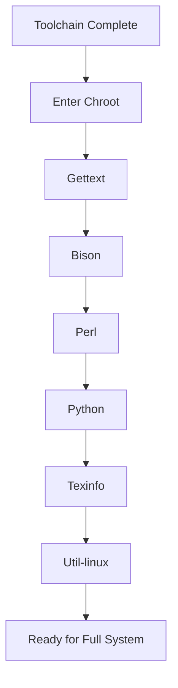

# What is the Basic System?

## Overview

The basic system consists of essential userland packages that provide the core functionality of a Linux distribution. These packages are built after the toolchain and before entering the chroot environment for the full system build.

## Key Packages

- **Gettext**: Internationalization utilities
- **Bison**: Parser generator for programming languages
- **Perl**: Scripting language for build tools
- **Python**: Modern scripting language
- **Texinfo**: Documentation system
- **Util-linux**: Essential system utilities

## Why These Packages?

These provide the tools needed for building other packages and basic system administration. They are built in a specific order to satisfy dependencies.

## Learning Objectives

- Understand the purpose of each basic system package
- Learn the chroot environment setup
- Master the package building workflow

## Quick Start

```bash
# After toolchain testing, prepare for chroot
cd $LFS

# Mount virtual filesystems (if needed)
mount -v --bind /dev $LFS/dev
mount -v --bind /dev/pts $LFS/dev/pts
mount -vt proc proc $LFS/proc
mount -vt sysfs sysfs $LFS/sys
mount -vt tmpfs tmpfs $LFS/run

# Enter chroot
chroot "$LFS" /usr/bin/env -i \
    HOME=/root \
    TERM="$TERM" \
    PS1='(lfs chroot) \u:\w\$ ' \
    PATH=/usr/bin:/usr/sbin \
    /bin/bash --login
```

## Build Flow



## Security Considerations

- Build in clean chroot environment
- Verify package integrity
- Use minimal privileges

## Exercises

- **Exercise 1**: Set up the chroot environment and verify you're inside.
- **Exercise 2**: List the source packages in `/sources` and check their versions.

## Next Steps

Proceed to Chapter 3.2 to build Gettext.
