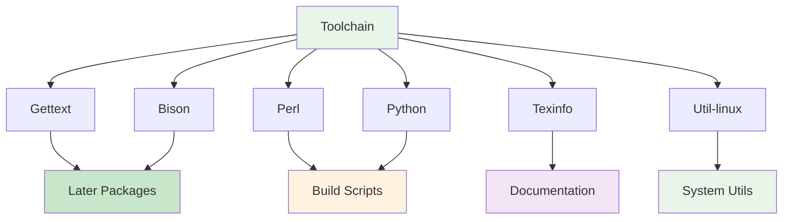
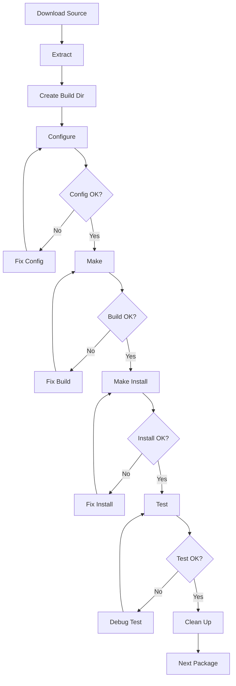

# Chapter 3: Basic System Build

Building the core components of the Linux system, including essential utilities and libraries.

## Components to Build

- Gettext (internationalization)
- Bison (parser generator)
- Perl (scripting language)
- Python (programming language)
- Texinfo (documentation)
- Util-linux (system utilities)

## Importance

These tools are needed to build more complex packages later in the process. This creates a self-hosting system capable of building itself.

## Chapter plan (learning-first)

### Learning objectives

- Build the core userland components needed for a minimal system
- Understand package build patterns and FHS layout used by LFS
- Run simple integration tests to validate installations

### Quick start (example)

```bash
# ensure LFS variables are set
export LFS=/mnt/lfs
export PATH=$LFS/tools/bin:$PATH

# example: extract and configure gettext
cd $LFS/sources
tar xf gettext-0.22.tar.xz
cd gettext-0.22
./configure --disable-shared
make && sudo make install
```

### Exercises

- Exercise A: Build and install `gettext` and run `msgfmt --version` to confirm.
- Exercise B: Create a small script that checks presence and versions of Perl and Python on your build host.

### Next steps

- After the basic toolchain and core utilities are installed, proceed to Chapter 4 to configure and build the kernel with features required for containers and hardening.

## Component Dependencies



## Build Process Pattern



## Build Environment

### Enter Chroot Environment

```bash
# Mount virtual filesystems
mount -v --bind /dev $LFS/dev
mount -v --bind /dev/pts $LFS/dev/pts
mount -vt proc proc $LFS/proc
mount -vt sysfs sysfs $LFS/sys
mount -vt tmpfs tmpfs $LFS/run

# Enter chroot
chroot "$LFS" /tools/bin/env -i \
    HOME=/root \
    TERM="$TERM" \
    PS1='\u:\w\$ ' \
    PATH=/bin:/usr/bin:/sbin:/usr/sbin:/tools/bin \
    /tools/bin/bash --login
```

### Create Essential Directories

```bash
# Create FHS directories
mkdir -pv /{boot,home,mnt,opt,srv}

# Create user directories
mkdir -pv /etc/{opt,sysconfig}
mkdir -pv /lib/firmware
mkdir -pv /media/{floppy,cdrom}
mkdir -pv /usr/{,local/}{bin,include,lib,sbin,src}
mkdir -pv /usr/{,local/}share/{color,dict,doc,info,locale,man}
mkdir -pv /usr/{,local/}share/{misc,terminfo,zoneinfo}
mkdir -pv /usr/{,local/}share/man/man{1..8}
mkdir -pv /var/{cache,local,log,mail,opt,spool}
mkdir -pv /var/lib/{color,misc,locate}

# Set permissions
ln -sfv /run /var/run
ln -sfv /run/lock /var/lock
```

## Package Build Commands

### Gettext Build

```bash
cd $LFS/sources
tar xf gettext-0.22.tar.xz
cd gettext-0.22

./configure --disable-shared
make
cp -v gettext-tools/src/{msgfmt,msgmerge,xgettext} /usr/bin
```

### Bison Build

```bash
cd $LFS/sources
tar xf bison-3.8.2.tar.xz
cd bison-3.8.2

./configure --prefix=/usr \
            --docdir=/usr/share/doc/bison-3.8.2
make
make install
```

### Perl Build

```bash
cd $LFS/sources
tar xf perl-5.38.0.tar.xz
cd perl-5.38.0

# Configure for LFS
sh Configure -des \
             -Dprefix=/usr \
             -Dvendorprefix=/usr \
             -Dprivlib=/usr/lib/perl5/5.38/core_perl \
             -Darchlib=/usr/lib/perl5/5.38/core_perl \
             -Dsitelib=/usr/lib/perl5/5.38/site_perl \
             -Dvendorlib=/usr/lib/perl5/5.38/vendor_perl \
             -Dvendorarch=/usr/lib/perl5/5.38/vendor_perl \
             -Dman1dir=/usr/share/man/man1 \
             -Dman3dir=/usr/share/man/man3 \
             -Dpager="/usr/bin/less -isR" \
             -Duseshrplib \
             -Dusethreads

make
make install
```

### Python Build

```bash
cd $LFS/sources
tar xf Python-3.12.0.tar.xz
cd Python-3.12.0

./configure --prefix=/usr \
            --enable-shared \
            --without-ensurepip
make
make install
```

### Texinfo Build

```bash
cd $LFS/sources
tar xf texinfo-7.1.tar.xz
cd texinfo-7.1

./configure --prefix=/usr
make
make install
```

### Util-linux Build

```bash
cd $LFS/sources
tar xf util-linux-2.39.1.tar.xz
cd util-linux-2.39.1

./configure --prefix=/usr \
            --bindir=/usr/bin \
            --sbindir=/usr/sbin \
            --sysconfdir=/etc \
            --disable-chfn-chsh \
            --disable-login \
            --disable-nologin \
            --disable-su \
            --disable-setpriv \
            --disable-runuser \
            --disable-pylibmount \
            --disable-static \
            --without-python \
            --without-systemd \
            --without-systemdsystemunitdir
make
make install
```

## Testing

### Verify Installations

```bash
# Test gettext
msgfmt --version

# Test bison
bison --version

# Test perl
perl -v

# Test python
python3 --version

# Test texinfo
makeinfo --version

# Test util-linux
blkid --version
```

### Run Basic Tests

```bash
# Create test script
cat > test_system.sh << "EOF"
#!/bin/bash
echo "Testing basic system components..."

# Test Perl
perl -e 'print "Perl OK\n"'

# Test Python
python3 -c 'print("Python OK")'

# Test bison
echo "int main() { return 0; }" | bison -o /dev/null -

echo "All tests passed!"
EOF

chmod +x test_system.sh
./test_system.sh
```

## Build Status Table

| Component  | Status     | Duration  | Purpose              |
| ---------- | ---------- | --------- | -------------------- |
| Gettext    | ⏳ Pending | 20-30 min | Internationalization |
| Bison      | ⏳ Pending | 15-25 min | Parser generator     |
| Perl       | ⏳ Pending | 45-60 min | Scripting language   |
| Python     | ⏳ Pending | 60-90 min | Programming language |
| Texinfo    | ⏳ Pending | 15-25 min | Documentation        |
| Util-linux | ⏳ Pending | 20-30 min | System utilities     |

## References

- [Linux From Scratch: Basic System](https://www.linuxfromscratch.org/lfs/view/stable/chapter06/introduction.html)
- [Filesystem Hierarchy Standard](https://refspecs.linuxfoundation.org/fhs.shtml)
- [Perl Installation Guide](https://perldoc.perl.org/perlinstall)
- [Python Build Guide](https://docs.python.org/3/using/unix.html)

## Build Environment

### Enter Chroot Environment

```bash
# Mount virtual filesystems
mount -v --bind /dev $LFS/dev
mount -v --bind /dev/pts $LFS/dev/pts
mount -vt proc proc $LFS/proc
mount -vt sysfs sysfs $LFS/sys
mount -vt tmpfs tmpfs $LFS/run

# Enter chroot
chroot "$LFS" /tools/bin/env -i \
    HOME=/root \
    TERM="$TERM" \
    PS1='\u:\w\$ ' \
    PATH=/bin:/usr/bin:/sbin:/usr/sbin:/tools/bin \
    /tools/bin/bash --login
```

### Create Essential Directories

```bash
# Create FHS directories
mkdir -pv /{boot,home,mnt,opt,srv}

# Create user directories
mkdir -pv /etc/{opt,sysconfig}
mkdir -pv /lib/firmware
mkdir -pv /media/{floppy,cdrom}
mkdir -pv /usr/{,local/}{bin,include,lib,sbin,src}
mkdir -pv /usr/{,local/}share/{color,dict,doc,info,locale,man}
mkdir -pv /usr/{,local/}share/{misc,terminfo,zoneinfo}
mkdir -pv /usr/{,local/}share/man/man{1..8}
mkdir -pv /var/{cache,local,log,mail,opt,spool}
mkdir -pv /var/lib/{color,misc,locate}

# Set permissions
ln -sfv /run /var/run
ln -sfv /run/lock /var/lock
```

## Package Build Pattern

### General Build Steps

```bash
# Example for a typical package
cd $LFS/sources

# Extract
tar xf package-1.0.tar.xz
cd package-1.0

# Configure
./configure --prefix=/usr \
            --sysconfdir=/etc \
            --localstatedir=/var \
            --disable-static \
            --docdir=/usr/share/doc/package-1.0

# Build
make

# Install
make install
```

### Gettext Build

```bash
cd $LFS/sources
tar xf gettext-0.22.tar.xz
cd gettext-0.22

./configure --disable-shared
make
cp -v gettext-tools/src/{msgfmt,msgmerge,xgettext} /usr/bin
```

### Bison Build

```bash
cd $LFS/sources
tar xf bison-3.8.2.tar.xz
cd bison-3.8.2

./configure --prefix=/usr \
            --docdir=/usr/share/doc/bison-3.8.2
make
make install
```

### Perl Build

```bash
cd $LFS/sources
tar xf perl-5.38.0.tar.xz
cd perl-5.38.0

# Configure for LFS
sh Configure -des \
             -Dprefix=/usr \
             -Dvendorprefix=/usr \
             -Dprivlib=/usr/lib/perl5/5.38/core_perl \
             -Darchlib=/usr/lib/perl5/5.38/core_perl \
             -Dsitelib=/usr/lib/perl5/5.38/site_perl \
             -Dvendorlib=/usr/lib/perl5/5.38/vendor_perl \
             -Dvendorarch=/usr/lib/perl5/5.38/vendor_perl \
             -Dman1dir=/usr/share/man/man1 \
             -Dman3dir=/usr/share/man/man3 \
             -Dpager="/usr/bin/less -isR" \
             -Duseshrplib \
             -Dusethreads

make
make install
```

### Python Build

```bash
cd $LFS/sources
tar xf Python-3.12.0.tar.xz
cd Python-3.12.0

./configure --prefix=/usr \
            --enable-shared \
            --without-ensurepip
make
make install
```

### Texinfo Build

```bash
cd $LFS/sources
tar xf texinfo-7.1.tar.xz
cd texinfo-7.1

./configure --prefix=/usr
make
make install
```

### Util-linux Build

```bash
cd $LFS/sources
tar xf util-linux-2.39.1.tar.xz
cd util-linux-2.39.1

./configure --prefix=/usr \
            --bindir=/usr/bin \
            --sbindir=/usr/sbin \
            --sysconfdir=/etc \
            --disable-chfn-chsh \
            --disable-login \
            --disable-nologin \
            --disable-su \
            --disable-setpriv \
            --disable-runuser \
            --disable-pylibmount \
            --disable-static \
            --without-python \
            --without-systemd \
            --without-systemdsystemunitdir
make
make install
```

## Testing

### Verify Installations

```bash
# Test gettext
msgfmt --version

# Test bison
bison --version

# Test perl
perl -v

# Test python
python3 --version

# Test texinfo
makeinfo --version

# Test util-linux
blkid --version
```

### Run Basic Tests

```bash
# Create test script
cat > test_system.sh << "EOF"
#!/bin/bash
echo "Testing basic system components..."

# Test Perl
perl -e 'print "Perl OK\n"'

# Test Python
python3 -c 'print("Python OK")'

# Test bison
echo "int main() { return 0; }" | bison -o /dev/null -

echo "All tests passed!"
EOF

chmod +x test_system.sh
./test_system.sh
```

## References

- [Linux From Scratch: Basic System](https://www.linuxfromscratch.org/lfs/view/stable/chapter06/introduction.html)
- [Filesystem Hierarchy Standard](https://refspecs.linuxfoundation.org/fhs.shtml)
- [Perl Installation Guide](https://perldoc.perl.org/perlinstall)
- [Python Build Guide](https://docs.python.org/3/using/unix.html)
