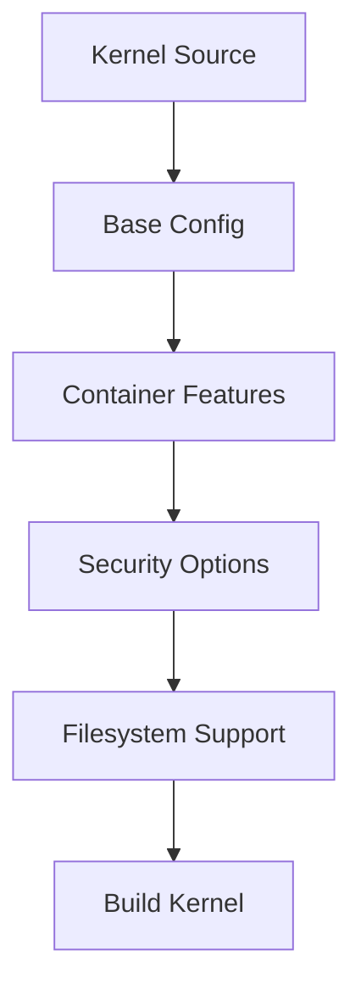

# Kernel Configuration Introduction

## Overview

Kernel configuration is the process of selecting which features, drivers, and options to include in the Linux kernel. For our container-ready distro, we need to enable essential features plus container support and hardening options.

## Key Areas

- **Core Kernel**: Basic system support
- **Container Features**: Namespaces, cgroups, overlayfs
- **Security**: Hardening options, LSM support
- **Filesystems**: Essential and container filesystems
- **Networking**: Basic and container networking

## Tools

- `make menuconfig`: Interactive configuration
- `make oldconfig`: Update existing config
- `.config` file: Configuration storage

## Learning Objectives

- Understand kernel configuration options
- Enable container and security features
- Optimize for our use case

## Quick Start

```bash
cd /sources/linux
make mrproper  # Clean any existing config
make defconfig  # Start with defaults
make menuconfig  # Interactive config
```

## Configuration Flow



## Security Considerations

- Enable security modules (SELinux/AppArmor)
- Disable unnecessary features
- Enable kernel hardening options

## Exercises

- **Exercise 1**: Start with `make defconfig` and examine the `.config` file.
- **Exercise 2**: Use `make menuconfig` to navigate the configuration menus.

## Next Steps

Proceed to Chapter 4.2 for detailed menuconfig usage.
