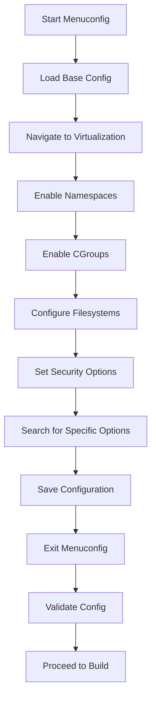

# Using Menuconfig for Kernel Configuration

## Introduction

Menuconfig is the most user-friendly interface for configuring the Linux kernel, providing a text-based, menu-driven system that allows you to enable or disable thousands of kernel features, drivers, and options. Unlike editing `.config` files directly or using other configuration interfaces, menuconfig offers:

- **Visual hierarchy**: Clear menu structure showing relationships between options
- **Dependency tracking**: Automatic handling of option dependencies
- **Help system**: Built-in documentation for each option
- **Search functionality**: Quick location of specific configuration options
- **Safety**: Prevents invalid configurations through dependency checking

For our container-ready Linux distribution, menuconfig is essential for enabling features like namespaces, cgroups, overlay filesystems, and security modules that form the foundation of modern container runtimes.

## Prerequisites

Before starting menuconfig, ensure you have:

- **Kernel source code** extracted in `/sources/linux`
- **Basic configuration** created (via `make defconfig` or similar)
- **Terminal** with proper locale settings (UTF-8 recommended)
- **Ncurses development libraries** (usually included in basic system)
- **Sufficient terminal size** (minimum 80x25, recommended 100x30+)

## Environment Setup

```bash
# Navigate to kernel source directory
cd /sources/linux

# Ensure clean starting point (optional, removes any stale config)
make mrproper

# Create initial configuration (if not already done)
# For x86_64 systems:
make defconfig

# Verify configuration exists
ls -la .config
```

## Starting Menuconfig

Launch menuconfig with the following command:

```bash
make menuconfig
```

This will display the main menuconfig interface. The interface consists of:

- **Top section**: Current menu path and available commands
- **Main area**: Configuration options with current values
- **Bottom section**: Legend showing keyboard shortcuts
- **Right side**: Help panel (when available)

## Navigation Guide

### Basic Movement

- **↑/↓ or k/j**: Move up/down through options
- **→/Enter**: Enter submenu or select option
- **←/Esc**: Go back to parent menu
- **Tab**: Switch between different panels

### Option Selection

- **Space**: Toggle option (for tristate: N→M→Y→N)
- **Y**: Select 'Yes' (built-in)
- **N**: Select 'No' (disabled)
- **M**: Select 'Module' (loadable module)

### Menu Navigation

- **Enter**: Enter submenu
- **Esc-Esc**: Exit current menu (return to parent)
- **Q or Esc**: Quit menuconfig (with save prompt)

### Special Functions

- **/**: Search for configuration options
- **H**: Display help for current option
- **S**: Save configuration
- **L**: Load alternate configuration
- **O**: Save configuration to alternate file

## Key Configuration Areas

Menuconfig organizes kernel options into logical categories. Here's a detailed breakdown of the main menu sections:

### 1. General Setup

**Purpose**: Basic kernel configuration options that affect overall behavior.

**Key Options**:

- `CONFIG_LOCALVERSION`: Custom kernel version string
- `CONFIG_DEFAULT_HOSTNAME`: Default system hostname
- `CONFIG_SWAP`: Enable swap support
- `CONFIG_SYSVIPC`: System V IPC support (required for many applications)
- `CONFIG_POSIX_MQUEUE`: POSIX message queues
- `CONFIG_CROSS_MEMORY_ATTACH`: Cross-memory attach (used by some container tools)

**Container Impact**: Enable `CONFIG_CROSS_MEMORY_ATTACH` for improved container performance.

### 2. Processor Type and Features

**Purpose**: CPU-specific optimizations and features.

**Key Options**:

- `CONFIG_HZ`: Timer frequency (1000Hz recommended for containers)
- `CONFIG_PREEMPT`: Preemption model (voluntary preemption good for latency)
- `CONFIG_SMP`: Symmetric multiprocessing support
- `CONFIG_X86_MSR`: Model-specific registers (needed for some monitoring tools)

**Container Impact**: Higher HZ values improve timer accuracy for container workloads.

### 3. Power Management

**Purpose**: Power saving and management features.

**Key Options**:

- `CONFIG_PM`: Power management core
- `CONFIG_CPU_FREQ`: CPU frequency scaling
- `CONFIG_HIBERNATION`: Suspend to disk

**Container Impact**: Generally disable hibernation in container hosts to save space.

### 4. Device Drivers

**Purpose**: Hardware device support.

**Key Options**:

- `CONFIG_BLK_DEV`: Block device support
- `CONFIG_NETDEVICES`: Network device support
- `CONFIG_INPUT`: Input device support
- `CONFIG_VIRTIO`: Virtualization device support

**Container Impact**: Enable `CONFIG_VIRTIO` for better virtualized container performance.

### 5. Filesystem Support

**Purpose**: Filesystem drivers and features.

**Key Options**:

- `CONFIG_EXT4_FS`: EXT4 filesystem
- `CONFIG_BTRFS_FS`: Btrfs filesystem (good for containers)
- `CONFIG_OVERLAY_FS`: Overlay filesystem (essential for containers)
- `CONFIG_TMPFS`: Temporary filesystem
- `CONFIG_PROC_FS`: /proc filesystem
- `CONFIG_SYSFS`: /sys filesystem

**Container Impact**: `CONFIG_OVERLAY_FS` is critical for Docker/Podman layered images.

### 6. Security Options

**Purpose**: Kernel security features and modules.

**Key Options**:

- `CONFIG_SECURITY`: Security subsystem
- `CONFIG_SECURITY_SELINUX`: SELinux support
- `CONFIG_SECURITY_APPARMOR`: AppArmor support
- `CONFIG_SECURITY_YAMA`: Yama LSM (ptrace restrictions)
- `CONFIG_SECCOMP`: Secure computing mode
- `CONFIG_SECCOMP_FILTER`: Seccomp filtering

**Container Impact**: Enable SELinux/AppArmor and seccomp for container security.

### 7. Cryptographic API

**Purpose**: Cryptographic algorithms and hardware acceleration.

**Key Options**:

- `CONFIG_CRYPTO`: Crypto core
- `CONFIG_CRYPTO_AES`: AES encryption
- `CONFIG_CRYPTO_SHA256`: SHA-256 hashing

**Container Impact**: Enable basic crypto for secure container registries.

### 8. Virtualization

**Purpose**: Virtualization and container support.

**Key Options**:

- `CONFIG_VIRTUALIZATION`: Virtualization core
- `CONFIG_KVM`: Kernel-based Virtual Machine
- `CONFIG_NAMESPACES`: Namespace support (essential for containers)
- `CONFIG_USER_NS`: User namespaces
- `CONFIG_PID_NS`: PID namespaces
- `CONFIG_NET_NS`: Network namespaces
- `CONFIG_UTS_NS`: UTS namespaces
- `CONFIG_IPC_NS`: IPC namespaces
- `CONFIG_CGROUPS`: Control groups (essential for containers)
- `CONFIG_CGROUP_SCHED`: CPU scheduler cgroups
- `CONFIG_MEMCG`: Memory cgroups
- `CONFIG_BLK_CGROUP`: Block I/O cgroups

**Container Impact**: All namespace and cgroup options are critical for container isolation.

### 9. Library Routines

**Purpose**: Kernel library functions.

**Key Options**:

- `CONFIG_CRC32`: CRC32 functions
- `CONFIG_LIBCRC32C`: CRC32C functions
- `CONFIG_ZLIB`: Zlib compression

**Container Impact**: Enable compression libraries for better container image handling.

## Container-Specific Configuration Walkthrough

For a container-ready system, follow these steps in menuconfig:

### Step 1: Enable Namespaces

```
General setup  --->
    [*] Namespaces support
    [*]   UTS namespace
    [*]   IPC namespace
    [*]   User namespace
    [*]   PID namespace
    [*]   Network namespace
    [*]   Cgroup namespace
```

### Step 2: Enable CGroups

```
General setup  --->
    [*] Control Group support  --->
        [*]   Memory controller
        [*]   CPU controller
        [*]   CPU accounting
        [*]   Block I/O controller
        [*]   Device controller
        [*]   Freezer controller
        [*]   PIDs controller
```

### Step 3: Enable Container Filesystems

```
File systems  --->
    [*] Overlay filesystem support
    [*] AUFS filesystem support (optional alternative)
```

### Step 4: Enable Networking for Containers

```
Networking support  --->
    Networking options  --->
        [*] Network namespaces
        [*] 802.1d Ethernet Bridging
        [*] 802.1Q VLAN Support
        [*] Virtual ethernet pair device
        [*] MAC-VLAN support
        [*] IP-VLAN support
```

### Step 5: Enable Security Features

```
Security options  --->
    [*] Enable different security models
    [*]   NSA SELinux Support
    [*]   Simplified Mandatory Access Control kernel support
    [*]   Seccomp support
    [*]   Seccomp BPF-based system call filter
```

## Search Functionality

Menuconfig's search feature is powerful for finding specific options:

```bash
# Press '/' in menuconfig to enter search mode
/menuconfig> NAMESPACE
```

Search results show:

- **Symbol**: Configuration option name
- **Type**: Bool, tristate, string, etc.
- **Prompt**: Human-readable description
- **Location**: Menu path to find the option
- **Depends on**: Prerequisites for the option

## Configuration File Management

### Saving Configuration

- **S**: Save to `.config` (current directory)
- **O**: Save to alternate file

### Loading Configuration

- **L**: Load from alternate file
- **make oldconfig**: Update existing config with new options
- **make olddefconfig**: Update with defaults for new options

### Backup Best Practices

```bash
# Backup your working configuration
cp .config .config.backup

# Compare configurations
diff .config .config.backup
```

## Advanced Features

### Configuration Fragments

Create partial configuration files for specific features:

```bash
# Container config fragment
cat > container.config << EOF
CONFIG_NAMESPACES=y
CONFIG_USER_NS=y
CONFIG_PID_NS=y
CONFIG_NET_NS=y
CONFIG_CGROUPS=y
CONFIG_OVERLAY_FS=y
EOF

# Merge with main config
./scripts/kconfig/merge_config.sh .config container.config
```

### Dependency Checking

Menuconfig automatically handles dependencies, but you can check manually:

```bash
# Check configuration for issues
make configcheck

# List all configuration options
make listnewconfig
```

## Troubleshooting Common Issues

### 1. Missing Dependencies

**Problem**: Option shows as `---` (unavailable)
**Solution**: Check "Depends on" in help, enable prerequisites first

### 2. Configuration Conflicts

**Problem**: Enabling one option disables another
**Solution**: Use search to find conflicts, choose appropriate alternatives

### 3. Terminal Display Issues

**Problem**: Garbled display or missing colors
**Solution**: Ensure UTF-8 locale and proper terminal settings

### 4. Configuration Not Saved

**Problem**: Changes lost after exit
**Solution**: Always use 'S' to save before exiting

### 5. Build Errors After Configuration

**Problem**: Kernel fails to compile
**Solution**: Check for missing dependencies or invalid combinations

## Performance Considerations

### For Container Hosts

- **HZ=1000**: Better timer resolution for container scheduling
- **Preemptible kernel**: Reduces latency for container workloads
- **High memory limits**: Support for memory-intensive containers

### For Security

- **Stack protector**: Prevents buffer overflow exploits
- **Address space randomization**: Makes exploits more difficult
- **Seccomp**: Restricts system calls in containers

## Security Implications

### Container Isolation

- **Namespaces**: Provide process, network, and filesystem isolation
- **CGroups**: Limit resource usage per container
- **Seccomp**: Restrict available system calls
- **Capabilities**: Fine-grained privilege control

### Kernel Hardening

- **SELinux/AppArmor**: Mandatory access control
- ** Yama**: Prevents ptrace-based attacks
- **Lockdown**: Prevents loading unsigned kernel modules

## Configuration Validation

After configuration, validate your settings:

```bash
# Check for container-related options
grep -E "(NAMESPACE|CGROUP|OVERLAY|SECCOMP)" .config

# Verify no unmet dependencies
make silentoldconfig

# Test compilation (quick syntax check)
make configcheck
```

## Menuconfig Workflow Diagram



## Exercises

### Exercise 1: Basic Navigation

1. Start menuconfig: `make menuconfig`
2. Navigate through the main menu categories
3. Enter each submenu and observe the available options
4. Practice moving between menus using arrow keys and Enter/Esc
5. Exit without saving changes

**Expected Outcome**: Familiarity with menuconfig interface and navigation

### Exercise 2: Container Feature Enablement

1. Start menuconfig with your base configuration
2. Navigate to "General setup" → "Namespaces support"
3. Enable all namespace options (UTS, IPC, User, PID, Network)
4. Navigate to "General setup" → "Control Group support"
5. Enable core cgroups and controllers (Memory, CPU, Block I/O)
6. Search for "OVERLAY" and enable overlay filesystem
7. Save the configuration and exit
8. Verify changes: `grep -E "(NAMESPACE|CGROUP|OVERLAY)" .config`

**Expected Outcome**: Container-essential kernel features enabled

### Exercise 3: Security Configuration

1. Navigate to "Security options" in menuconfig
2. Enable the security subsystem
3. Enable SELinux support
4. Enable AppArmor support
5. Enable seccomp and seccomp filtering
6. Search for "YAMA" and enable Yama LSM
7. Save configuration and verify security options

**Expected Outcome**: Security framework configured for container security

### Exercise 4: Search and Dependency Exploration

1. Use the search function (`/`) to find "BRIDGE"
2. Examine the search results and dependencies
3. Navigate to the actual location of the bridge option
4. Check the help text for the bridge option
5. Enable bridge support and any required dependencies
6. Search for "VETH" and enable virtual ethernet support

**Expected Outcome**: Understanding of search functionality and option dependencies

### Exercise 5: Configuration Management

1. Create a backup of your current `.config`
2. Make several configuration changes
3. Save the configuration
4. Compare with backup: `diff .config .config.backup`
5. Load the backup configuration
6. Reapply your changes using search and navigation

**Expected Outcome**: Proficiency in configuration file management

## Common Configuration Patterns

### Minimal Container Host

```
CONFIG_NAMESPACES=y
CONFIG_USER_NS=y
CONFIG_PID_NS=y
CONFIG_NET_NS=y
CONFIG_CGROUPS=y
CONFIG_MEMCG=y
CONFIG_OVERLAY_FS=y
CONFIG_BRIDGE=y
CONFIG_VETH=y
```

### Security-Focused Container Host

```
CONFIG_SECURITY_SELINUX=y
CONFIG_SECURITY_APPARMOR=y
CONFIG_SECCOMP=y
CONFIG_SECCOMP_FILTER=y
CONFIG_SECURITY_YAMA=y
CONFIG_STRICT_KERNEL_RWX=y
```

### Performance-Optimized Container Host

```
CONFIG_HZ=1000
CONFIG_PREEMPT_VOLUNTARY=y
CONFIG_CGROUP_SCHED=y
CONFIG_FAIR_GROUP_SCHED=y
CONFIG_BLK_CGROUP=y
```

## Next Steps

With menuconfig configuration complete, proceed to Chapter 4.3 for hardening options. Your kernel is now configured with essential container support, but additional security hardening will further enhance the system's container capabilities.

## References

- Kernel Configuration Documentation: `Documentation/kbuild/kconfig-language.txt`
- Container Kernel Features: `Documentation/namespaces/`
- Security Configuration: `Documentation/security/`
- Menuconfig Manual: Run `make help | grep menuconfig`
