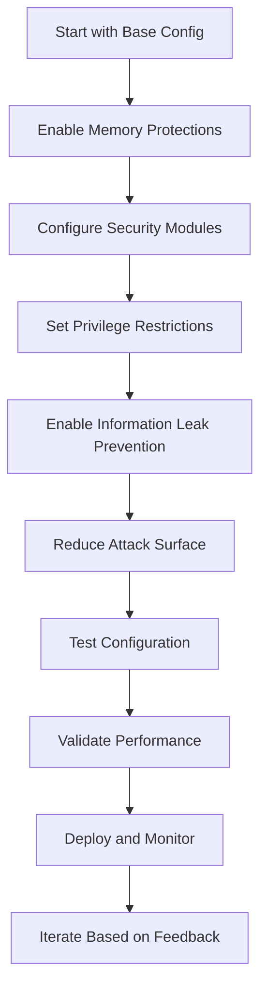

# Kernel Hardening Options

## Introduction

Kernel hardening options are security features that protect the system against various classes of attacks and vulnerabilities. These options add runtime checks, restrict privileged operations, randomize memory layouts, and implement mandatory access controls. For a container-ready Linux distribution, hardening is particularly important because containers share the host kernel, making kernel-level protections critical for container security.

Hardening options can be categorized into:

- **Memory protections**: Prevent exploitation of memory corruption vulnerabilities
- **Privilege restrictions**: Limit what privileged processes can do
- **Information leaks**: Prevent disclosure of sensitive system information
- **Attack surface reduction**: Disable unnecessary kernel features

## Prerequisites

- Kernel source configured with basic options (Chapter 4.2)
- Understanding of security trade-offs vs. performance
- Backup of working configuration

## Memory Protection Options

### Address Space Layout Randomization (ASLR)

**Configuration Option**: `CONFIG_RANDOMIZE_BASE`

**Purpose**: Randomizes the base address of the kernel and user-space programs, making it harder for attackers to predict memory locations for exploits.

**Technical Details**:

- Randomizes kernel `.text` and `.data` sections
- Randomizes user-space stack, heap, and library locations
- Uses entropy from hardware random number generators

**Security Impact**: Significantly increases difficulty of return-oriented programming (ROP) and other memory-based exploits.

**Performance Impact**: Minimal (< 1% overhead)

**Container Impact**: Essential for container security as it protects both host and container processes.

**Configuration**:

```
Processor type and features  --->
    [*] Randomize the address space layout of the kernel image
```

### Stack Protector

**Configuration Option**: `CONFIG_STACKPROTECTOR`

**Purpose**: Protects against stack buffer overflow attacks by placing canary values on the stack that are checked before function returns.

**Technical Details**:

- Inserts random canary values between local variables and return addresses
- Checks canary integrity on function exit
- Terminates process if corruption detected

**Security Impact**: Prevents many stack-based buffer overflow exploits.

**Performance Impact**: Very low (1-2% overhead)

**Container Impact**: Protects container applications from stack-based exploits.

**Configuration**:

```
General setup  --->
    [*] Stack Protector buffer overflow detection
    [*]   Strong Stack Protector
```

### Fortify Source

**Configuration Option**: `CONFIG_FORTIFY_SOURCE`

**Purpose**: Adds compile-time and runtime checks for buffer overflows in common C library functions.

**Technical Details**:

- Replaces unsafe functions (strcpy, sprintf) with bounds-checked versions
- Performs compile-time bounds checking where possible
- Runtime checks for remaining cases

**Security Impact**: Prevents many string and buffer overflow vulnerabilities.

**Performance Impact**: Minimal compile-time impact, small runtime overhead.

**Container Impact**: Protects applications using standard C library functions.

**Configuration**:

```
General setup  --->
    [*] Fortify source
```

### Strict Kernel RWX

**Configuration Option**: `CONFIG_STRICT_KERNEL_RWX`

**Purpose**: Enforces read-only permissions on kernel code and read-write permissions on data sections.

**Technical Details**:

- Marks kernel text as read-only, execute
- Marks kernel data as read-write, no-execute
- Prevents execution of data and writing to code

**Security Impact**: Prevents code injection and data execution attacks.

**Performance Impact**: None (hardware-enforced)

**Container Impact**: Protects kernel from container-based attacks.

**Configuration**:

```
Processor type and features  --->
    [*] Enforce strict kernel RWX mappings
```

## Privilege Restriction Options

### Yama LSM

**Configuration Option**: `CONFIG_SECURITY_YAMA`

**Purpose**: Restricts ptrace system calls to prevent debugging of processes by unauthorized users.

**Technical Details**:

- Controls process tracing permissions
- Prevents ptrace of processes outside user's session
- Modes: 0 (disabled), 1 (restricted), 2 (admin-only), 3 (no-attach)

**Security Impact**: Prevents debugging-based attacks and information disclosure.

**Performance Impact**: None

**Container Impact**: Prevents cross-container debugging attacks.

**Configuration**:

```
Security options  --->
    [*] Yama support
    (2) Default Yama mode
```

### Lockdown LSM

**Configuration Option**: `CONFIG_SECURITY_LOCKDOWN_LSM`

**Purpose**: Prevents loading of unsigned kernel modules and restricts access to kernel features.

**Technical Details**:

- Integrity mode: Prevents loading unsigned modules
- Confidentiality mode: Additional restrictions on kernel data access
- Controlled via `kernel.lockdown` parameter

**Security Impact**: Prevents kernel module-based rootkits and exploits.

**Performance Impact**: None

**Container Impact**: Prevents container escapes via kernel modules.

**Configuration**:

```
Security options  --->
    [*] Basic module for enforcing kernel lockdown
    [*]   Lockdown LSM early in init
```

### Seccomp BPF

**Configuration Option**: `CONFIG_SECCOMP` and `CONFIG_SECCOMP_FILTER`

**Purpose**: Allows processes to restrict available system calls, providing sandboxing capabilities.

**Technical Details**:

- Mode 1: Strict seccomp (limited syscall whitelist)
- Mode 2: BPF-filtered seccomp (custom syscall filters)
- Used by Docker, systemd, and other container runtimes

**Security Impact**: Provides syscall-level sandboxing for applications.

**Performance Impact**: Low (filter evaluation overhead)

**Container Impact**: Core technology for container security (used by Docker/Podman).

**Configuration**:

```
General setup  --->
    [*] Enable seccomp support
    [*]   Enable seccomp filter
```

## Information Leak Prevention

### Kernel Address Display Restriction

**Configuration Option**: `CONFIG_SECURITY_DMESG_RESTRICT`

**Purpose**: Prevents unprivileged users from reading kernel syslog buffer.

**Technical Details**:

- Restricts access to `/proc/kmsg` and `dmesg` command
- Prevents disclosure of kernel memory addresses
- Controlled by `kernel.dmesg_restrict` sysctl

**Security Impact**: Prevents kernel address leakage attacks.

**Performance Impact**: None

**Container Impact**: Prevents information disclosure to containers.

**Configuration**:

```
Security options  --->
    [*] Restrict unprivileged access to the kernel syslog
```

### Hide Kernel Pointers

**Configuration Option**: `CONFIG_DEBUG_KERNEL` → `CONFIG_DEBUG_INFO` (inverse logic)

**Purpose**: Prevents kernel pointers from being printed in various kernel messages.

**Technical Details**:

- Replaces pointer values with `<pointer>` in logs
- Prevents address space layout information disclosure
- Applies to oops messages, stack traces, etc.

**Security Impact**: Reduces information available for kernel exploits.

**Performance Impact**: None

**Container Impact**: Prevents kernel layout information leakage.

**Configuration**:

```
Kernel hacking  --->
    [*] Kernel debugging
    [ ]   Enable kernel pointer display
```

## Attack Surface Reduction

### Unused Module Support

**Configuration Option**: `CONFIG_MODULES` (with restrictions)

**Purpose**: Allows loading kernel modules but with restrictions to prevent abuse.

**Technical Details**:

- `CONFIG_MODULE_SIG`: Require signed modules
- `CONFIG_MODULE_SIG_FORCE`: Enforce module signatures
- `CONFIG_MODPROBE_PATH`: Restrict module loading paths

**Security Impact**: Prevents loading malicious kernel modules.

**Performance Impact**: None

**Container Impact**: Prevents container escapes via module loading.

**Configuration**:

```
[*] Enable loadable module support
    [*]   Module signature verification
    [*]     Require modules to be validly signed
    [*]     Automatically sign all modules
```

### DebugFS Restrictions

**Configuration Option**: `CONFIG_DEBUG_FS`

**Purpose**: Controls access to debug filesystem that exposes internal kernel state.

**Technical Details**:

- DebugFS provides debugging interfaces
- Can expose sensitive kernel information
- Should be restricted in production systems

**Security Impact**: Prevents access to kernel debugging interfaces.

**Performance Impact**: None

**Container Impact**: Prevents container access to debug information.

**Configuration**:

```
Kernel hacking  --->
    [ ] Debug filesystem
```

## Security Modules (LSMs)

### SELinux

**Configuration Option**: `CONFIG_SECURITY_SELINUX`

**Purpose**: Provides mandatory access control (MAC) with fine-grained security policies.

**Technical Details**:

- Labels all system objects (files, processes, network sockets)
- Enforces security policies based on labels
- Supports multiple policy types (targeted, mls, etc.)

**Security Impact**: Provides comprehensive access control beyond traditional Unix permissions.

**Performance Impact**: Moderate (5-15% depending on policy complexity)

**Container Impact**: Essential for secure multi-tenant container deployments.

**Configuration**:

```
Security options  --->
    [*] NSA SELinux Support
    [*]   NSA SELinux boot parameter
    [*]   NSA SELinux runtime disable
    [*]   NSA SELinux Development Support
    [*]   NSA SELinux AVC Statistics
    (targeted) Default SELinux mode
```

### AppArmor

**Configuration Option**: `CONFIG_SECURITY_APPARMOR`

**Purpose**: Provides application-level mandatory access control through profiles.

**Technical Details**:

- Uses pathname-based security profiles
- Profiles specify allowed file access, network operations, etc.
- Supports learning mode for profile development

**Security Impact**: Provides application confinement similar to SELinux but simpler.

**Performance Impact**: Low (2-5% overhead)

**Container Impact**: Good alternative to SELinux for container security.

**Configuration**:

```
Security options  --->
    [*] AppArmor support
```

### BPF LSM

**Configuration Option**: `CONFIG_BPF_LSM`

**Purpose**: Allows eBPF programs to act as Linux Security Modules.

**Technical Details**:

- Uses Berkeley Packet Filter bytecode for security policies
- Allows runtime security policy updates
- Can implement complex security logic

**Security Impact**: Provides programmable security policies.

**Performance Impact**: Variable (depends on BPF program complexity)

**Container Impact**: Enables advanced container security policies.

**Configuration**:

```
Security options  --->
    [*] BPF LSM support
```

## Container-Specific Hardening

### User Namespace Restrictions

**Configuration Option**: `CONFIG_USER_NS`

**Purpose**: Allows unprivileged user namespaces for better container isolation.

**Technical Details**:

- Allows non-root users to create namespaces
- Essential for rootless containers
- Can be restricted via sysctl

**Security Impact**: Enables secure user isolation in containers.

**Performance Impact**: Low

**Container Impact**: Required for Podman rootless containers.

**Configuration**:

```
General setup  --->
    [*] Namespaces support
    [*]   User namespace
```

### Capability Restrictions

**Configuration Option**: Various capability-related options

**Purpose**: Controls which Linux capabilities are available to processes.

**Technical Details**:

- `CONFIG_SECURITY_FILE_CAPABILITIES`: File-based capabilities
- `CONFIG_SECURITY_CAPABILITIES`: Traditional capabilities
- Can be restricted per-container

**Security Impact**: Provides fine-grained privilege control.

**Performance Impact**: None

**Container Impact**: Essential for container privilege separation.

## Configuration Workflow

### Step-by-Step Hardening Setup

1. **Start with Security Options**:

   ```
   Security options  --->
       [*] Enable different security models
   ```

2. **Enable SELinux or AppArmor**:

   ```
   [*] NSA SELinux Support
   OR
   [*] AppArmor support
   ```

3. **Enable Memory Protections**:

   ```
   General setup  --->
       [*] Stack Protector buffer overflow detection
       [*] Fortify source
   ```

4. **Enable Seccomp**:

   ```
   [*] Enable seccomp support
   [*]   Enable seccomp filter
   ```

5. **Configure Yama**:

   ```
   [*] Yama support
   (2) Default Yama mode
   ```

6. **Enable Lockdown**:
   ```
   [*] Basic module for enforcing kernel lockdown
   ```

### Verification Commands

```bash
# Check hardening options in config
grep -E "(STACKPROTECTOR|FORTIFY|SECCOMP|YAMA|LOCKDOWN)" .config

# Verify SELinux/AppArmor
grep -E "(SELINUX|APPARMOR)" .config

# Check kernel command line for security options
cat /proc/cmdline | grep -E "(selinux|apparmor|lockdown)"
```

## Performance Trade-offs

### Hardening vs. Performance Matrix

| Feature         | Security Benefit | Performance Cost | Container Impact |
| --------------- | ---------------- | ---------------- | ---------------- |
| ASLR            | High             | Minimal          | Essential        |
| Stack Protector | High             | Low              | Important        |
| Fortify Source  | Medium           | Minimal          | Useful           |
| SELinux         | Very High        | Moderate         | Critical         |
| AppArmor        | High             | Low              | Good             |
| Seccomp         | High             | Low              | Essential        |
| Yama            | Medium           | None             | Useful           |
| Lockdown        | High             | None             | Important        |

### Optimization Strategies

- **Use targeted SELinux policies** instead of MLS for better performance
- **Pre-compile seccomp filters** to reduce runtime overhead
- **Disable debug features** in production builds
- **Use hardware acceleration** for crypto operations where available

## Security Assessment

### Hardening Checklist

- [ ] ASLR enabled (`CONFIG_RANDOMIZE_BASE`)
- [ ] Stack protector enabled (`CONFIG_STACKPROTECTOR`)
- [ ] Fortify source enabled (`CONFIG_FORTIFY_SOURCE`)
- [ ] SELinux or AppArmor enabled
- [ ] Seccomp support enabled (`CONFIG_SECCOMP`)
- [ ] Yama LSM enabled (`CONFIG_SECURITY_YAMA`)
- [ ] Kernel lockdown available (`CONFIG_SECURITY_LOCKDOWN_LSM`)
- [ ] Module signatures enforced (`CONFIG_MODULE_SIG_FORCE`)
- [ ] DebugFS restricted
- [ ] Kernel pointer hiding enabled

### Testing Hardening

```bash
# Test stack protector
cat > test_stack.c << EOF
#include <string.h>
void vulnerable_function(char *input) {
    char buffer[8];
    strcpy(buffer, input);  // Buffer overflow
}
int main() { return 0; }
EOF

gcc -fstack-protector test_stack.c -o test_stack
echo "Testing stack protector..."
./test_stack malicious_input 2>&1 || echo "Stack protector working"

# Test SELinux
sestatus

# Test seccomp
grep -r "seccomp" /proc/*/status | head -5
```

## Troubleshooting

### Common Issues

1. **SELinux preventing boot**:

   - Add `selinux=0` to kernel command line
   - Fix policy issues before re-enabling

2. **AppArmor profile conflicts**:

   - Use `aa-complain` to switch profiles to complain mode
   - Debug with `aa-logprof`

3. **Seccomp breaking applications**:

   - Use `strace` to identify required syscalls
   - Adjust seccomp filters accordingly

4. **Performance degradation**:
   - Profile system with `perf`
   - Disable non-essential hardening features

### Recovery Procedures

```bash
# Boot with hardening disabled
# Add to GRUB_CMDLINE_LINUX in /etc/default/grub:
# selinux=0 apparmor=0 lockdown=0

# Update GRUB
update-grub

# Reboot and fix issues
reboot
```

## Hardening for Different Use Cases

### Container Host Hardening

```
# Essential for containers
CONFIG_SECURITY_SELINUX=y
CONFIG_SECCOMP=y
CONFIG_USER_NS=y
CONFIG_SECURITY_YAMA=y

# Performance considerations
CONFIG_SECURITY_APPARMOR=y  # Lower overhead than SELinux
```

### General Purpose Server Hardening

```
# Balanced security/performance
CONFIG_STACKPROTECTOR=y
CONFIG_FORTIFY_SOURCE=y
CONFIG_SECURITY_SELINUX=y
CONFIG_SECURITY_LOCKDOWN_LSM=y
```

### High Security Environment

```
# Maximum security
CONFIG_STRICT_KERNEL_RWX=y
CONFIG_SECURITY_SELINUX=y
CONFIG_MODULE_SIG_FORCE=y
CONFIG_DEBUG_KERNEL=n
CONFIG_DEBUG_FS=n
```

## Hardening Workflow Diagram



## Exercises

### Exercise 1: Basic Memory Hardening

1. Navigate to "General setup" in menuconfig
2. Enable "Stack Protector buffer overflow detection"
3. Enable "Strong Stack Protector"
4. Enable "Fortify source"
5. Navigate to "Processor type and features"
6. Enable "Randomize the address space layout of the kernel image"
7. Save configuration and exit
8. Verify: `grep -E "(STACKPROTECTOR|FORTIFY|RANDOMIZE)" .config`

**Expected Outcome**: Core memory protection features enabled

### Exercise 2: Security Module Configuration

1. Navigate to "Security options"
2. Enable "Enable different security models"
3. Enable "NSA SELinux Support"
4. Set default SELinux mode to "targeted"
5. Enable "AppArmor support"
6. Enable "Yama support" with mode 2
7. Save and verify security modules are enabled

**Expected Outcome**: SELinux and AppArmor configured for mandatory access control

### Exercise 3: Seccomp and Lockdown Setup

1. Enable "Enable seccomp support" and "Enable seccomp filter"
2. Enable "Basic module for enforcing kernel lockdown"
3. Configure Yama LSM with appropriate restrictions
4. Enable module signature verification
5. Test configuration compilation: `make oldconfig`
6. Verify seccomp and lockdown options

**Expected Outcome**: Advanced security features for container isolation

### Exercise 4: Hardening Verification

1. Create a test program vulnerable to buffer overflow
2. Compile with and without stack protector
3. Test both versions with malicious input
4. Verify SELinux status: `sestatus`
5. Check available security modules: `cat /sys/kernel/security/lsm`
6. Test seccomp functionality with a simple filter

**Expected Outcome**: Practical verification of hardening effectiveness

### Exercise 5: Performance Impact Assessment

1. Benchmark system performance before hardening
2. Apply hardening configuration
3. Rebuild and reboot with hardened kernel
4. Run performance benchmarks (CPU, memory, I/O)
5. Compare results and identify bottlenecks
6. Optimize configuration based on findings

**Expected Outcome**: Understanding of hardening performance trade-offs

## Next Steps

With hardening options configured, proceed to Chapter 4.4 for container-specific configuration. Your kernel now has essential security protections, but container-specific features will further enhance isolation and security for your container-ready distribution.

## References

- Kernel Security Documentation: `Documentation/security/`
- SELinux Documentation: `Documentation/security/SELinux/`
- AppArmor Documentation: `Documentation/security/apparmor/`
- Seccomp Documentation: `Documentation/userspace-api/seccomp_filter.rst`
- Hardening Guide: `Documentation/security/self-protection.rst`
