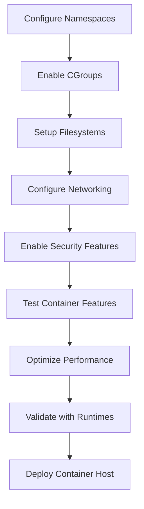

# Container Support Configuration

## Introduction

Container support in the Linux kernel provides the fundamental isolation and resource management capabilities that enable technologies like Docker, Podman, and LXC. Containers rely on several kernel subsystems working together to create lightweight, isolated environments that share the host kernel while maintaining security boundaries.

The core components of container support include:

- **Namespaces**: Provide process, network, and filesystem isolation
- **CGroups**: Enable resource limits and accounting
- **Overlay filesystems**: Support layered container images
- **Networking**: Virtual network interfaces and routing
- **Security features**: Capabilities, seccomp, and LSMs

This chapter focuses on configuring the kernel for optimal container performance and security.

## Prerequisites

- Kernel source configured with basic options (Chapters 4.1-4.3)
- Understanding of container concepts (namespaces, cgroups, etc.)
- Backup of working configuration

## Namespace Configuration

Namespaces provide the fundamental isolation mechanism for containers, allowing multiple instances of global system resources to exist simultaneously.

### Process ID Namespace (PID NS)

**Configuration Option**: `CONFIG_PID_NS`

**Purpose**: Isolates process ID numbers between containers and host.

**Technical Details**:

- Each container has its own PID 1 (init process)
- Processes in different namespaces cannot see each other
- Essential for process isolation and management

**Security Impact**: Prevents process enumeration and signaling between containers.

**Performance Impact**: Minimal

**Kernel Code References**:

- `kernel/pid_namespace.c`: PID namespace implementation
- `kernel/pid.c`: Process ID allocation and management
- Look for `create_pid_namespace()` and `alloc_pid()` functions
- `include/linux/pid_namespace.h`: PID namespace structure definitions

**Configuration**:

```
General setup  --->
    [*] Namespaces support
    [*]   PID namespace
```

### Network Namespace (Net NS)

**Configuration Option**: `CONFIG_NET_NS`

**Purpose**: Provides isolated network stacks for containers.

**Technical Details**:

- Each container has its own network interfaces, routing tables, and firewall rules
- Enables virtual networking and network isolation
- Required for container networking plugins

**Security Impact**: Prevents network-based attacks between containers.

**Performance Impact**: Low (network stack duplication)

**Kernel Code References**:

- `net/core/net_namespace.c`: Network namespace implementation
- `include/net/net_namespace.h`: Network namespace structure
- Look for `copy_net_ns()` and `setup_net()` functions
- `net/core/dev.c`: Network device namespace handling

**Configuration**:

```
[*]   Network namespace
```

### Mount Namespace (MNT NS)

**Configuration Option**: `CONFIG_MNT_NS`

**Purpose**: Isolates filesystem mount points and views.

**Technical Details**:

- Containers can have different filesystem views
- Supports bind mounts and private mount propagation
- Essential for chroot-like environments

**Security Impact**: Prevents filesystem access between containers.

**Performance Impact**: Minimal

**Kernel Code References**:

- `fs/namespace.c`: Mount namespace implementation
- Look for `copy_mnt_ns()`, `create_mnt_ns()` functions
- `fs/mount.h`: Mount namespace structures
- `fs/pnode.c`: Mount propagation implementation

**Configuration**:

```
[*]   Mount namespace
```

### User Namespace (User NS)

**Configuration Option**: `CONFIG_USER_NS`

**Purpose**: Maps user and group IDs between namespaces.

**Technical Details**:

- Allows non-root users to create containers
- Maps container root to non-privileged host user
- Essential for rootless containers (Podman)

**Security Impact**: Enables secure user isolation without privileged access.

**Performance Impact**: Low

**Kernel Code References**:

- `kernel/user_namespace.c`: User namespace implementation
- `kernel/uid16.c`: UID/GID mapping implementation
- Look for `create_user_ns()`, `map_id_range_down()` functions
- `include/linux/user_namespace.h`: User namespace definitions

**Configuration**:

```
[*]   User namespace
```

### UTS Namespace (UTS NS)

**Configuration Option**: `CONFIG_UTS_NS`

**Purpose**: Isolates hostname and domain name.

**Technical Details**:

- Each container can have its own hostname
- NIS domain name isolation
- Simple but important for container identity

**Security Impact**: Prevents hostname spoofing.

**Performance Impact**: None

**Configuration**:

```
[*]   UTS namespace
```

### IPC Namespace (IPC NS)

**Configuration Option**: `CONFIG_IPC_NS`

**Purpose**: Isolates System V IPC objects and POSIX message queues.

**Technical Details**:

- Shared memory, semaphores, and message queues are namespaced
- Prevents IPC-based communication between containers
- Important for multi-process containers

**Security Impact**: Prevents IPC-based attacks between containers.

**Performance Impact**: Minimal

**Configuration**:

```
[*]   IPC namespace
```

### CGroup Namespace (CGROUP NS)

**Configuration Option**: `CONFIG_CGROUP_NS`

**Purpose**: Isolates cgroup filesystem views.

**Technical Details**:

- Containers see only their own cgroup hierarchy
- Prevents cgroup manipulation between containers
- Advanced feature for nested containers

**Security Impact**: Prevents cgroup-based resource manipulation.

**Performance Impact**: Minimal

**Configuration**:

```
[*]   Cgroup namespace
```

## CGroups (Control Groups) Configuration

CGroups provide resource limits, accounting, and control for containers.

### Core CGroups

**Configuration Option**: `CONFIG_CGROUPS`

**Purpose**: Enables the control groups subsystem.

**Technical Details**:

- Hierarchical resource management
- Supports multiple controllers
- Foundation for container resource limits

**Security Impact**: Enables resource isolation between containers.

**Performance Impact**: Low (accounting overhead)

**Kernel Code References**:

- `kernel/cgroup/cgroup.c`: Core cgroup implementation
- `kernel/cgroup/cgroup-v1.c`: Cgroup v1 implementation
- `kernel/cgroup/cgroup-v2.c`: Cgroup v2 (unified hierarchy) implementation
- Look for `cgroup_init()`, `cgroup_attach_task()` functions
- `include/linux/cgroup.h`: Cgroup core definitions

**Configuration**:

```
General setup  --->
    [*] Control Group support  --->
        [*] Enable cgroup v2 support (recommended)
```

### Memory Controller

**Configuration Option**: `CONFIG_MEMCG`

**Purpose**: Controls memory usage per container.

**Technical Details**:

- Limits RAM and swap usage
- Memory accounting and statistics
- OOM killer control per cgroup

**Security Impact**: Prevents memory exhaustion attacks.

**Performance Impact**: Low (memory tracking)

**Kernel Code References**:

- `mm/memcontrol.c`: Memory cgroup controller implementation
- Look for `mem_cgroup_charge()`, `mem_cgroup_try_charge()` functions
- `include/linux/memcontrol.h`: Memory controller definitions
- `mm/oom_kill.c`: OOM killer integration with memory cgroups

**Configuration**:

```
Control Group support  --->
    [*] Memory controller
    [*]   Swap controller
    [*]   Memory controller statistics
```

### CPU Controller

**Configuration Option**: `CONFIG_CGROUP_SCHED`

**Purpose**: Controls CPU usage and scheduling.

**Technical Details**:

- CPU time limits and shares
- CPU affinity control
- Real-time scheduling constraints

**Security Impact**: Prevents CPU exhaustion and scheduling attacks.

**Performance Impact**: Low

**Kernel Code References**:

- `kernel/sched/core.c`: Scheduler cgroup integration
- `kernel/sched/fair.c`: CFS (Completely Fair Scheduler) cgroup support
- Look for `cpu_cgroup_attach()`, `task_group_sched_runtime()` functions
- `include/linux/sched.h`: Task group scheduling structures

**Configuration**:

```
[*] CPU controller
[*]   CPU bandwidth control for CFS tasks
[*]   CPU bandwidth control for RT tasks
```

### Block I/O Controller

**Configuration Option**: `CONFIG_BLK_CGROUP`

**Purpose**: Controls disk I/O bandwidth and priority.

**Technical Details**:

- I/O bandwidth limits
- I/O priority control
- Per-device I/O statistics

**Security Impact**: Prevents I/O starvation attacks.

**Performance Impact**: Low (I/O tracking)

**Configuration**:

```
[*] Block I/O controller
[*]   Block I/O bandwidth control
```

### Network Controller

**Configuration Option**: `CONFIG_CGROUP_NET_CLASSID`

**Purpose**: Controls network traffic classification.

**Technical Details**:

- Network packet classification
- Traffic control integration
- Network priority control

**Security Impact**: Enables network resource isolation.

**Performance Impact**: Minimal

**Configuration**:

```
[*] Network classifier cgroup
[*]   Network classid cgroup
```

### Device Controller

**Configuration Option**: `CONFIG_CGROUP_DEVICE`

**Purpose**: Controls device access permissions.

**Technical Details**:

- Device whitelist/blacklist
- Device access control
- Security device restrictions

**Security Impact**: Prevents unauthorized device access.

**Performance Impact**: None

**Configuration**:

```
[*] Device controller
```

### Freezer Controller

**Configuration Option**: `CONFIG_CGROUP_FREEZER`

**Purpose**: Allows freezing and thawing of container processes.

**Technical Details**:

- Suspend/resume container processes
- Checkpoint/restore functionality
- Container migration support

**Security Impact**: Enables secure container suspension.

**Performance Impact**: None

**Configuration**:

```
[*] Freezer controller
```

## Filesystem Support for Containers

### Overlay Filesystem

**Configuration Option**: `CONFIG_OVERLAY_FS`

**Purpose**: Enables layered filesystem for container images.

**Technical Details**:

- Supports multiple lower layers with one upper layer
- Copy-on-write semantics
- Essential for Docker/Podman image layers

**Security Impact**: Enables secure image layering.

**Performance Impact**: Low (metadata operations)

**Kernel Code References**:

- `fs/overlayfs/super.c`: OverlayFS superblock operations
- `fs/overlayfs/inode.c`: Inode operations for overlayfs
- `fs/overlayfs/dir.c`: Directory operations
- `fs/overlayfs/copy_up.c`: Copy-on-write implementation
- Look for `ovl_fill_super()`, `ovl_copy_up()` functions
- `Documentation/filesystems/overlayfs.rst`: Comprehensive documentation

**Configuration**:

```
File systems  --->
    [*] Overlay filesystem support
```

### AUFS (Alternative Union Filesystem)

**Configuration Option**: `CONFIG_AUFS_FS`

**Purpose**: Alternative to OverlayFS for container storage.

**Technical Details**:

- Branch-based filesystem union
- More mature than OverlayFS in some use cases
- Alternative for systems without OverlayFS

**Security Impact**: Similar to OverlayFS.

**Performance Impact**: Variable

**Configuration**:

```
File systems  --->
    [*] AUFS filesystem support
```

### Btrfs Support

**Configuration Option**: `CONFIG_BTRFS_FS`

**Purpose**: Advanced filesystem with snapshot and subvolume support.

**Technical Details**:

- Copy-on-write snapshots
- Subvolume management
- Good for container storage drivers

**Security Impact**: Enables advanced container storage features.

**Performance Impact**: Depends on workload

**Configuration**:

```
File systems  --->
    [*] Btrfs filesystem support
    [*]   Btrfs POSIX Access Control Lists
    [*]   Btrfs send/receive support
```

## Networking Configuration for Containers

### Bridge Support

**Configuration Option**: `CONFIG_BRIDGE`

**Purpose**: Enables Linux Ethernet bridge for container networking.

**Technical Details**:

- Virtual network bridge device
- Connects containers to virtual networks
- STP (Spanning Tree Protocol) support

**Security Impact**: Enables isolated container networks.

**Performance Impact**: Low

**Kernel Code References**:

- `net/bridge/br.c`: Bridge module initialization
- `net/bridge/br_device.c`: Bridge device operations
- `net/bridge/br_forward.c`: Packet forwarding logic
- `net/bridge/br_if.c`: Bridge interface management
- Look for `br_dev_setup()`, `br_forward()` functions

**Configuration**:

```
Networking support  --->
    Networking options  --->
        [*] 802.1d Ethernet Bridging
        [*]   IGMP/MLD snooping
```

### Virtual Ethernet (VETH)

**Configuration Option**: `CONFIG_VETH`

**Purpose**: Creates virtual Ethernet pairs for container networking.

**Technical Details**:

- Connected pair of virtual interfaces
- One end in container, one end in host
- Essential for bridge networking

**Security Impact**: Enables secure container-to-host communication.

**Performance Impact**: Minimal

**Kernel Code References**:

- `drivers/net/veth.c`: VETH driver implementation
- Look for `veth_newlink()`, `veth_xmit()` functions
- `include/linux/if_veth.h`: VETH interface definitions
- Packets sent to one end appear on the paired end

**Configuration**:

```
[*] Virtual ethernet pair device
```

### MACVLAN

**Configuration Option**: `CONFIG_MACVLAN`

**Purpose**: Creates virtual network interfaces with different MAC addresses.

**Technical Details**:

- Shares physical interface
- Each container gets unique MAC
- Layer 2 isolation

**Security Impact**: Provides network isolation without bridges.

**Performance Impact**: Low

**Configuration**:

```
[*] MAC-VLAN support
[*]   MAC-VLAN based tap driver
```

### IPvLAN

**Configuration Option**: `CONFIG_IPVLAN`

**Purpose**: Creates virtual network interfaces with different IP addresses.

**Technical Details**:

- Shares physical interface
- Layer 3 isolation
- L3 routing instead of bridging

**Security Impact**: Provides network isolation at IP level.

**Performance Impact**: Low

**Configuration**:

```
[*] IPvLAN support
[*]   IPvLAN L3 mode support
[*]   IPvLAN L3S mode support
```

### VXLAN

**Configuration Option**: `CONFIG_VXLAN`

**Purpose**: Enables VXLAN for overlay networks.

**Technical Details**:

- Layer 2 over Layer 3 tunneling
- Enables distributed container networks
- Used by Kubernetes and Docker Swarm

**Security Impact**: Enables secure multi-host networking.

**Performance Impact**: Medium (encapsulation overhead)

**Configuration**:

```
[*] Virtual eXtensible Local Area Network (VXLAN)
```

## Advanced Container Features

### Seccomp Support

**Configuration Option**: `CONFIG_SECCOMP` and `CONFIG_SECCOMP_FILTER`

**Purpose**: Enables syscall filtering for containers.

**Technical Details**:

- Filters system calls available to processes
- Used by Docker/Podman for security
- BPF-based filtering

**Security Impact**: Provides syscall-level sandboxing.

**Performance Impact**: Low

**Configuration**:

```
General setup  --->
    [*] Enable seccomp support
    [*]   Enable seccomp filter
```

### BPF Support

**Configuration Option**: `CONFIG_BPF`

**Purpose**: Enables Berkeley Packet Filter for advanced networking and security.

**Technical Details**:

- Programmable packet filtering
- Used for container networking (Cilium)
- Security policy enforcement

**Security Impact**: Enables advanced security policies.

**Performance Impact**: Variable

**Configuration**:

```
Networking support  --->
    [*] BPF-based packet filtering
```

### eBPF LSM

**Configuration Option**: `CONFIG_BPF_LSM`

**Purpose**: Enables eBPF-based Linux Security Module.

**Technical Details**:

- Programmable security policies
- Runtime security enforcement
- Advanced container security

**Security Impact**: Highly flexible security policies.

**Performance Impact**: Variable

**Configuration**:

```
Security options  --->
    [*] BPF LSM support
```

## Container Runtime Optimizations

### High-Resolution Timers

**Configuration Option**: `CONFIG_HIGH_RES_TIMERS`

**Purpose**: Improves timer accuracy for container workloads.

**Technical Details**:

- Nanosecond-resolution timers
- Better scheduling accuracy
- Important for latency-sensitive containers

**Performance Impact**: Slight increase in timer interrupts

**Configuration**:

```
General setup  --->
    [*] High-resolution timer support
```

### Preemptible Kernel

**Configuration Option**: `CONFIG_PREEMPT_VOLUNTARY`

**Purpose**: Allows kernel preemption for better responsiveness.

**Technical Details**:

- Reduces kernel latency
- Better for interactive and container workloads
- Voluntary preemption (balance of performance vs. latency)

**Performance Impact**: Slight overhead

**Configuration**:

```
Processor type and features  --->
    [*] Preemption Model (Voluntary Kernel Preemption)
```

### Timer Frequency

**Configuration Option**: `CONFIG_HZ`

**Purpose**: Sets kernel timer frequency.

**Technical Details**:

- Higher frequency = better timer resolution
- 1000Hz recommended for containers
- Affects scheduling and timeout accuracy

**Performance Impact**: Higher frequency = more interrupts

**Configuration**:

```
Processor type and features  --->
    Timer frequency (1000 HZ)
```

## Configuration Workflow

### Step-by-Step Container Setup

1. **Enable Namespaces**:

   ```
   General setup  --->
       [*] Namespaces support
       [*]   PID namespace
       [*]   User namespace
       [*]   Network namespace
       [*]   Mount namespace
       [*]   UTS namespace
       [*]   IPC namespace
       [*]   Cgroup namespace
   ```

2. **Configure CGroups**:

   ```
   [*] Control Group support  --->
       [*] Memory controller
       [*] CPU controller
       [*] Block I/O controller
       [*] Device controller
       [*] Freezer controller
   ```

3. **Enable Filesystems**:

   ```
   File systems  --->
       [*] Overlay filesystem support
   ```

4. **Configure Networking**:

   ```
   Networking support  --->
       [*] 802.1d Ethernet Bridging
       [*] Virtual ethernet pair device
       [*] MAC-VLAN support
   ```

5. **Enable Security Features**:
   ```
   General setup  --->
       [*] Enable seccomp support
       [*]   Enable seccomp filter
   ```

### Verification Commands

```bash
# Check namespace support
grep -E "CONFIG_.*_NS=y" .config

# Check cgroup controllers
grep -E "CONFIG_CGROUP.*=y" .config

# Check filesystem support
grep -E "(OVERLAY|BTRFS)" .config

# Check networking
grep -E "(BRIDGE|VETH|MACVLAN)" .config

# Runtime verification
lsns  # List namespaces
lscgroup  # List cgroups
```

## Performance Considerations

### Container-Optimized Settings

| Feature           | Performance Impact | Container Benefit   |
| ----------------- | ------------------ | ------------------- |
| Namespaces        | Low                | Essential isolation |
| CGroups           | Low                | Resource management |
| OverlayFS         | Low                | Image layering      |
| Bridge Networking | Low                | Network isolation   |
| Seccomp           | Low                | Security sandboxing |
| High-res timers   | Medium             | Better scheduling   |
| 1000Hz timer      | Medium             | Accurate timeouts   |

### Tuning Recommendations

- **For latency-sensitive containers**: Enable `CONFIG_PREEMPT_VOLUNTARY`
- **For I/O intensive containers**: Enable `CONFIG_BLK_CGROUP`
- **For network-heavy containers**: Enable `CONFIG_CGROUP_NET_CLASSID`
- **For memory-constrained environments**: Enable `CONFIG_MEMCG_SWAP`

## Security Assessment

### Container Security Checklist

- [ ] All namespaces enabled (PID, User, Network, Mount, UTS, IPC, Cgroup)
- [ ] CGroups configured (Memory, CPU, I/O, Device controllers)
- [ ] OverlayFS enabled for image security
- [ ] Bridge/VETH networking configured
- [ ] Seccomp support enabled
- [ ] User namespaces enabled for rootless containers
- [ ] SELinux/AppArmor integration ready

### Testing Container Features

```bash
# Test namespaces
unshare --pid --net --mount --uts --ipc /bin/bash

# Test cgroups
cgcreate -g memory,cpu:testgroup
cgset testgroup memory.limit_in_bytes=100000000

# Test overlay filesystem
mkdir -p /tmp/lower /tmp/upper /tmp/work /tmp/merged
mount -t overlay overlay -o lowerdir=/tmp/lower,upperdir=/tmp/upper,workdir=/tmp/work /tmp/merged

# Test networking
ip link add veth0 type veth peer name veth1
ip link set veth0 up
ip link set veth1 up
```

## Troubleshooting

### Common Container Issues

1. **Namespaces not working**:

   - Check kernel version compatibility
   - Verify all required namespaces are enabled
   - Test with `unshare` command

2. **CGroups not available**:

   - Ensure cgroup filesystem is mounted
   - Check controller availability: `cat /proc/cgroups`
   - Verify kernel config

3. **OverlayFS mount failures**:

   - Check filesystem support
   - Ensure work directory is empty
   - Verify permissions

4. **Network isolation issues**:
   - Check bridge and veth support
   - Verify network namespace creation
   - Test with `ip netns`

### Recovery Procedures

```bash
# Reset cgroups
cgdelete memory,cpu:testgroup

# Clean up network interfaces
ip link delete veth0
ip link delete veth1

# Unmount overlay
umount /tmp/merged
```

## Container Runtime Compatibility

### Docker Requirements

```
CONFIG_NAMESPACES=y
CONFIG_CGROUPS=y
CONFIG_MEMCG=y
CONFIG_OVERLAY_FS=y
CONFIG_BRIDGE=y
CONFIG_VETH=y
CONFIG_SECCOMP=y
```

### Podman Requirements

```
CONFIG_NAMESPACES=y
CONFIG_USER_NS=y
CONFIG_CGROUPS=y
CONFIG_OVERLAY_FS=y
CONFIG_SECCOMP=y
CONFIG_BPF=y
```

### LXC/LXD Requirements

```
CONFIG_NAMESPACES=y
CONFIG_CGROUPS=y
CONFIG_MEMCG=y
CONFIG_CGROUP_DEVICE=y
CONFIG_BRIDGE=y
CONFIG_VETH=y
```

## Container Support Workflow Diagram



## Exercises

### Exercise 1: Namespace Configuration

1. Navigate to "General setup" → "Namespaces support"
2. Enable all namespace options (PID, User, Network, Mount, UTS, IPC, Cgroup)
3. Save configuration and exit
4. Verify: `grep -E "CONFIG_.*_NS=y" .config`
5. Test: `lsns` (should show host namespaces)

**Expected Outcome**: All container namespaces enabled and functional

### Exercise 2: CGroups Setup

1. Navigate to "General setup" → "Control Group support"
2. Enable core cgroups and controllers (Memory, CPU, Block I/O, Device, Freezer)
3. Enable cgroup v2 support
4. Save and verify configuration
5. Test: `lscgroup` (should show cgroup hierarchy)

**Expected Outcome**: Complete cgroup subsystem configured

### Exercise 3: Container Filesystem Configuration

1. Navigate to "File systems" → "Overlay filesystem support"
2. Enable OverlayFS
3. Optionally enable Btrfs for advanced features
4. Save configuration
5. Test overlay mount (create directories and mount)

**Expected Outcome**: Container image layering support enabled

### Exercise 4: Container Networking Setup

1. Navigate to "Networking support" → "Networking options"
2. Enable 802.1d Ethernet Bridging
3. Enable Virtual ethernet pair device
4. Enable MAC-VLAN support
5. Save configuration
6. Test: Create veth pair and verify connectivity

**Expected Outcome**: Container networking infrastructure configured

### Exercise 5: Container Runtime Testing

1. Build the kernel with container support
2. Boot into the new kernel
3. Install a container runtime (Docker or Podman)
4. Test basic container operations: `podman run hello-world`
5. Test resource limits: `podman run --memory=100m stress`
6. Verify isolation: Check namespaces and cgroups

**Expected Outcome**: Full container runtime functionality verified

### Exercise 6: Security Feature Integration

1. Enable seccomp support and filtering
2. Configure SELinux/AppArmor integration
3. Test seccomp with a container: `podman run --security-opt seccomp=...`
4. Verify LSM integration
5. Test user namespace functionality

**Expected Outcome**: Container security features working correctly

## Next Steps

With container support fully configured, proceed to Chapter 4.5 for kernel compilation. Your kernel now has all the features required for running Docker, Podman, and other container runtimes with proper isolation, resource management, and security.

## References

- Container Kernel Features: `Documentation/namespaces/`
- CGroups Documentation: `Documentation/cgroup-v2.rst`
- OverlayFS Documentation: `Documentation/filesystems/overlayfs.rst`
- Container Networking: `Documentation/networking/`
- Docker Kernel Requirements: https://docs.docker.com/engine/install/linux-postinstall/#kernel-requirements
- Podman Requirements: https://podman.io/getting-started/installation#requirements
