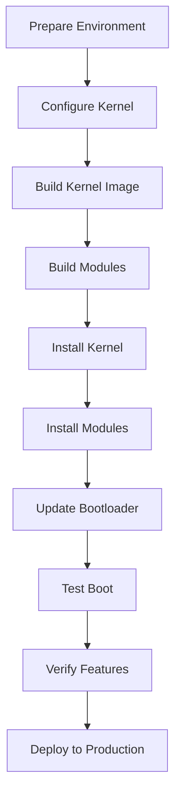

# Kernel Compilation and Installation

## Introduction

Kernel compilation transforms your configuration into a bootable Linux kernel. This process involves multiple stages: building the core kernel image, compiling loadable modules, and installing the results. For a container-ready distribution, proper compilation ensures all container features are correctly built and optimized.

The compilation process can take significant time and resources, but produces a custom kernel tailored to your specific needs. Understanding the build process helps troubleshoot issues and optimize for your use case.

## Prerequisites

- Kernel source code in `/sources/linux`
- Complete `.config` file (from Chapters 4.1-4.4)
- Build toolchain (GCC, binutils, etc.)
- Sufficient disk space (kernel source + build artifacts ~10-20GB)
- Adequate RAM (4GB+ recommended, 8GB+ for parallel builds)

## Environment Preparation

### System Requirements Check

```bash
# Check available memory
free -h

# Check available disk space
df -h /sources

# Check CPU cores for parallel builds
nproc

# Verify build tools
which gcc make bison flex
gcc --version
```

### Build Directory Setup

```bash
# Navigate to kernel source
cd /sources/linux

# Clean any previous build artifacts (optional, but recommended)
make mrproper

# Ensure configuration is valid
make oldconfig

# Create output directory for organized builds (optional)
mkdir -p ../kernel-build
make O=../kernel-build oldconfig
```

## Compilation Process

### Stage 1: Kernel Build

The core kernel compilation creates the compressed kernel image (`vmlinuz` or `bzImage`).

```bash
# Basic compilation (single-threaded, slow)
make

# Parallel compilation (recommended, uses all CPU cores)
make -j$(nproc)

# Parallel with load limiting (for systems with limited RAM)
make -j$(($(nproc) / 2))

# Verbose output (for debugging)
make V=1

# Silent build (minimal output)
make -s
```

**What happens during kernel build:**

- **Headers generation**: Creates kernel API headers
- **Core compilation**: Builds kernel core (sched, mm, fs, etc.)
- **Architecture-specific code**: Builds CPU-specific optimizations
- **Device drivers**: Compiles configured drivers
- **Linking**: Creates final kernel image

### Stage 2: Modules Build

Loadable kernel modules are compiled separately for better organization.

```bash
# Build all configured modules
make modules

# Parallel modules build
make modules -j$(nproc)

# Build specific module
make M=drivers/net/ethernet/intel/e1000

# Build modules with install preparation
make modules_prepare
```

**Module categories built:**

- **Device drivers**: Network, storage, graphics
- **Filesystem modules**: Btrfs, OverlayFS, network filesystems
- **Security modules**: SELinux, AppArmor
- **Container features**: Namespace, cgroups support

### Stage 3: Installation

Install the kernel and modules to system locations.

```bash
# Install kernel image and System.map
sudo make install

# Install modules to /lib/modules/
sudo make modules_install

# Install headers (for external module building)
sudo make headers_install INSTALL_HDR_PATH=/usr

# Install development headers
sudo make headers_install
```

**Installation locations:**

- **Kernel image**: `/boot/vmlinuz-<version>`
- **System.map**: `/boot/System.map-<version>`
- **Config**: `/boot/config-<version>`
- **Modules**: `/lib/modules/<version>/`
- **Headers**: `/usr/include/linux/`

## Build Optimization Options

### Compiler Optimizations

```bash
# Enable compiler optimizations
make KCFLAGS="-O2 -march=native"

# Enable link-time optimization (LTO)
make KCFLAGS="-flto" LDFLAGS="-flto"

# Debug build (for development)
make KCFLAGS="-O0 -g"

# Size optimization
make KCFLAGS="-Os"
```

### Parallel Build Options

```bash
# Maximum parallel jobs
make -j$(nproc)

# Limited parallel (for memory-constrained systems)
make -j4

# Load-aware parallel builds
make -l$(nproc)

# Distributed compilation (with distcc)
export CC="distcc gcc"
make -j$(distcc -j)
```

### Build Time Optimizations

```bash
# Use ccache for faster rebuilds
export CC="ccache gcc"
make

# Incremental builds (only rebuild changed files)
make

# Clean specific components
make clean  # Remove most generated files
make mrproper  # Remove all generated files + config
make distclean  # Remove everything except source
```

## Verification and Testing

### Post-Build Verification

```bash
# Check kernel image
ls -la /boot/vmlinuz-*
file /boot/vmlinuz-*

# Verify modules
ls -la /lib/modules/$(uname -r)/
find /lib/modules/$(uname -r) -name "*.ko" | wc -l

# Check kernel configuration
grep -E "(CONFIG_NAMESPACES|CONFIG_CGROUPS)" /boot/config-*

# Validate kernel image
# Extract and check kernel version
strings /boot/vmlinuz-* | grep "Linux version"
```

### Runtime Testing

```bash
# Test kernel boot (without rebooting, if possible)
kexec -l /boot/vmlinuz-* --initrd=/boot/initramfs-* --command-line="$(cat /proc/cmdline)"

# Check loaded modules
lsmod

# Verify container features
lsns  # List namespaces
lscgroup  # List cgroups

# Test module loading
modprobe overlay
lsmod | grep overlay
```

### Kernel Module Management

```bash
# List installed modules
find /lib/modules/$(uname -r) -name "*.ko" | head -10

# Check module dependencies
ls /lib/modules/$(uname -r)/modules.dep

# Verify module signatures (if enabled)
modinfo overlay | grep signature

# Test module loading/unloading
modprobe overlay
rmmod overlay
```

## Bootloader Integration

### GRUB Configuration

```bash
# Update GRUB menu
sudo grub-mkconfig -o /boot/grub/grub.cfg

# Check GRUB menu entries
grep "menuentry" /boot/grub/grub.cfg

# Manual GRUB entry for testing
cat >> /etc/grub.d/40_custom << EOF
menuentry 'LFS Custom Kernel' {
    linux /boot/vmlinuz-<version> root=/dev/sda1 ro quiet
    initrd /boot/initramfs-<version>.img
}
EOF
```

### EFI Boot Manager (for UEFI systems)

```bash
# Install kernel to EFI
sudo make install

# Update EFI boot manager
sudo efibootmgr -c -d /dev/sda -p 1 -L "LFS Kernel" -l '\vmlinuz-<version>' -u 'root=/dev/sda1 ro quiet'

# Verify EFI entries
efibootmgr -v
```

## Troubleshooting Compilation Issues

### Common Build Errors

1. **Missing dependencies**:

   ```
   ERROR: "function" undefined
   Solution: Check for missing CONFIG options or header files
   ```

2. **Compiler errors**:

   ```
   error: implicit declaration of function
   Solution: Enable required CONFIG options
   ```

3. **Linker errors**:

   ```
   undefined reference to 'symbol'
   Solution: Check for circular dependencies in config
   ```

4. **Out of memory**:
   ```
   internal compiler error: Killed
   Solution: Reduce parallel jobs or add swap space
   ```

### Debugging Techniques

```bash
# Verbose build output
make V=1 2>&1 | tee build.log

# Build specific component
make drivers/net/

# Check configuration dependencies
make menuconfig  # Check for unmet dependencies

# Clean and rebuild specific module
make M=drivers/gpu/drm/i915 clean
make M=drivers/gpu/drm/i915

# Use compiler cache for faster iteration
export CC="ccache gcc"
```

### Recovery Procedures

```bash
# Clean build and restart
make clean
make mrproper
# Reconfigure and rebuild

# Use known good config as base
cp /boot/config-$(uname -r) .config
make olddefconfig

# Bisect problematic commits (for kernel development)
git bisect start
git bisect bad
git bisect good v5.15
```

## Performance Considerations

### Build Performance

- **Parallel builds**: Use `make -j$(nproc)` for fastest builds
- **ccache**: Speeds up rebuilds significantly
- **Incremental builds**: Only rebuild changed components
- **RAM**: More RAM allows more parallel jobs

### Runtime Performance

- **Kernel size**: Smaller kernels boot faster
- **Module loading**: Built-in vs. loadable modules trade-offs
- **Optimization level**: `-O2` provides good balance
- **CPU-specific optimizations**: Use `-march=native`

### Container-Specific Optimizations

```bash
# Optimize for container workloads
make KCFLAGS="-O2 -march=native -pipe"

# Enable kernel features for containers
CONFIG_PREEMPT_VOLUNTARY=y
CONFIG_HZ=1000
CONFIG_HIGH_RES_TIMERS=y
```

## Advanced Build Options

### Cross-Compilation

```bash
# Cross-compile for different architecture
export ARCH=arm64
export CROSS_COMPILE=aarch64-linux-gnu-
make

# Cross-compile modules
make modules_install INSTALL_MOD_PATH=/tmp/arm64-modules
```

### Custom Build Targets

```bash
# Build only kernel image
make vmlinuz

# Build only modules
make modules

# Build documentation
make htmldocs

# Build perf tools
make tools/perf

# Build bpf tools
make tools/bpf
```

### Development Builds

```bash
# Debug kernel build
make KCFLAGS="-O0 -g" CONFIG_DEBUG_INFO=y

# Enable kernel tracing
CONFIG_FTRACE=y
CONFIG_FUNCTION_TRACER=y

# Enable kernel debugging
CONFIG_DEBUG_KERNEL=y
CONFIG_KGDB=y
```

## Security Considerations

### Build Security

- **Verify source integrity**: Check git tags/signatures
- **Clean build environment**: Use isolated build chroots
- **Secure compiler flags**: Enable stack protection, RELRO, etc.
- **Module signing**: Enable `CONFIG_MODULE_SIG` for production

### Runtime Security

- **Kernel lockdown**: Enable for restricted environments
- **Module loading restrictions**: Control via sysctl
- **Address space randomization**: Verify KASLR is working
- **Stack protection**: Check for stack canaries

## Build Statistics and Monitoring

### Build Time Tracking

```bash
# Time the build
time make -j$(nproc)

# Monitor build progress
make -j$(nproc) | pv

# Check build size
du -sh /sources/linux
ls -lh /boot/vmlinuz-*
```

### Resource Monitoring

```bash
# Monitor CPU usage during build
top -p $(pgrep make)

# Check memory usage
free -h

# Monitor disk I/O
iotop

# Check compiler processes
ps aux | grep -E "(gcc|ld)"
```

## Kernel Maintenance

### Updating Kernels

```bash
# Backup current kernel
cp /boot/vmlinuz-$(uname -r) /boot/vmlinuz-backup

# Install new kernel
sudo make install
sudo make modules_install

# Update bootloader
sudo grub-mkconfig -o /boot/grub/grub.cfg
```

### Kernel Module Management

```bash
# List loaded modules
lsmod

# Get module information
modinfo overlay

# Load/unload modules
modprobe overlay
rmmod overlay

# Blacklist modules
echo "blacklist broken_module" >> /etc/modprobe.d/blacklist.conf
```

## Kernel Compilation Workflow Diagram



## Exercises

### Exercise 1: Basic Kernel Compilation

1. Navigate to `/sources/linux`
2. Ensure configuration is complete: `make oldconfig`
3. Start compilation: `time make -j$(nproc)`
4. Monitor the build process and note any warnings
5. Install the kernel: `sudo make install`
6. Verify installation: `ls -la /boot/vmlinuz-*`

**Expected Outcome**: Successfully compiled and installed kernel

### Exercise 2: Module Compilation and Installation

1. Build kernel modules: `make modules -j$(nproc)`
2. Install modules: `sudo make modules_install`
3. Check module directory: `ls -la /lib/modules/$(uname -r)/`
4. Test module loading: `modprobe overlay && lsmod | grep overlay`
5. Verify container modules: `find /lib/modules -name "*namespace*"`
6. Check module dependencies: `ls /lib/modules/$(uname -r)/modules.dep`

**Expected Outcome**: All modules built and loadable

### Exercise 3: Bootloader Integration

1. Update GRUB configuration: `sudo grub-mkconfig -o /boot/grub/grub.cfg`
2. Check GRUB menu entries: `grep "menuentry" /boot/grub/grub.cfg`
3. Verify kernel is listed in GRUB menu
4. Test GRUB configuration syntax: `grub-script-check /boot/grub/grub.cfg`
5. Reboot and select the new kernel from GRUB menu

**Expected Outcome**: New kernel bootable via GRUB

### Exercise 4: Build Optimization

1. Time a single-threaded build: `time make clean && time make`
2. Time a parallel build: `time make clean && time make -j$(nproc)`
3. Compare build times and analyze the speedup
4. Experiment with different optimization levels: `make KCFLAGS="-O2"` vs `make KCFLAGS="-Os"`
5. Set up ccache and measure rebuild time improvements
6. Document your findings on build performance

**Expected Outcome**: Understanding of build optimization techniques

### Exercise 5: Troubleshooting Build Issues

1. Intentionally break the configuration (disable a required option)
2. Attempt to build and capture the error
3. Analyze the error message and identify the root cause
4. Fix the configuration and rebuild successfully
5. Document the troubleshooting process
6. Test with a clean configuration to confirm the fix

**Expected Outcome**: Proficiency in diagnosing and fixing build issues

### Exercise 6: Custom Kernel Testing

1. Boot into the new kernel
2. Verify all configured features work:
   - Namespaces: `lsns`
   - CGroups: `lscgroup`
   - OverlayFS: `modprobe overlay`
   - Security modules: `cat /sys/kernel/security/lsm`
3. Test container functionality: `podman run --rm hello-world`
4. Check kernel logs: `dmesg | grep -i "container\|namespace\|cgroup"`
5. Verify performance: Run benchmarks before/after kernel change
6. Document any issues and resolutions

**Expected Outcome**: Fully functional container-ready kernel

## Next Steps

With the kernel successfully compiled and installed, proceed to Chapter 5 for bootloader setup. Your custom kernel now includes all the container features, security hardening, and optimizations configured in the previous chapters. The next step is configuring GRUB to boot your new kernel with appropriate parameters for container workloads.

## References

- Kernel Build Documentation: `Documentation/kbuild/`
- Module Building: `Documentation/kbuild/modules.rst`
- Build Optimization: `Documentation/kbuild/kbuild.rst`
- Cross-Compilation: `Documentation/kbuild/makefiles.rst`
- Kernel Installation: `Documentation/admin-guide/kernel-parameters.rst`
