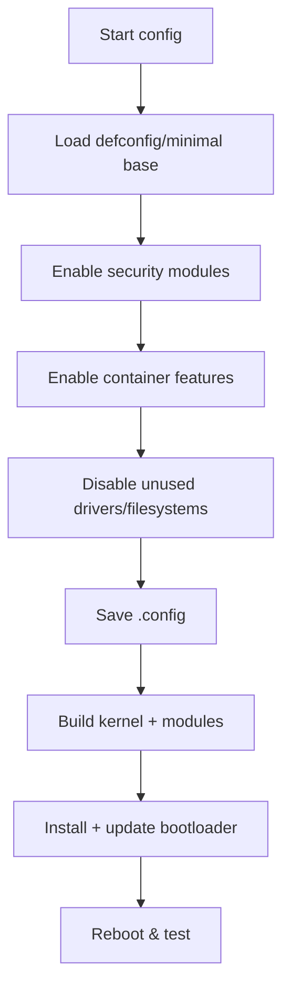

# Chapter 4: Kernel Configuration and Compilation

Configuring and compiling the Linux kernel with security hardening and container support.

## Learning objectives

- Configure the kernel for a minimal, secure, container-capable system
- Identify and enable key hardening and container options
- Build, install, and verify a custom kernel and modules

## Key Areas

- Basic kernel configuration using menuconfig
- Security hardening options (SELinux, AppArmor, etc.)
- Container features (namespaces, cgroups, overlayfs)
- Minimal driver selection for general-purpose use
- Kernel compilation and module building

## Quick start (configure and build)

```bash
# from the kernel source directory
make mrproper
make menuconfig

# recommended parallel build
make -j"$(nproc)"
sudo make modules_install
sudo make install
```

## Security Focus

- Enable security modules (SELinux/AppArmor/Lockdown) and IMA/EVM where applicable
- Disable unnecessary features and filesystems; prefer whitelist mentality
- Configure Stack Protector, CET/IBT (where supported), and hardened sysctls

## Container feature checklist

| Feature                   | Config symbol                                                                               | Status                            |
| ------------------------- | ------------------------------------------------------------------------------------------- | --------------------------------- |
| Namespaces                | CONFIG_NAMESPACES                                                                           | Required                          |
| PID/User/Net/IPC/Mount NS | CONFIG_PID_NS, CONFIG_USER_NS, CONFIG_NET_NS, CONFIG_IPC_NS, CONFIG_UTS_NS, CONFIG_MOUNT_NS | Required                          |
| cgroups v2                | CONFIG_CGROUPS, CONFIG_CGROUP_BPF, CONFIG_CGROUP_FREEZER, CONFIG_CGROUP_DEVICE              | Required                          |
| OverlayFS                 | CONFIG_OVERLAY_FS                                                                           | Required                          |
| Seccomp                   | CONFIG_SECCOMP, CONFIG_SECCOMP_FILTER                                                       | Strongly recommended              |
| BPF / cgroup-bpf          | CONFIG_BPF, CONFIG_BPF_SYSCALL                                                              | For advanced container networking |
| AppArmor/SELinux          | CONFIG_SECURITY_APPARMOR/CONFIG_SECURITY_SELINUX                                            | One or both                       |

## Configuration flow (diagram)



## Exercises

- Exercise 1: Locate and enable OverlayFS and seccomp in menuconfig.
- Exercise 2: Export the .config and annotate why each container-related option is needed.

## Next steps

- Proceed to Chapter 5 to install and configure the bootloader and initramfs with your new kernel.
