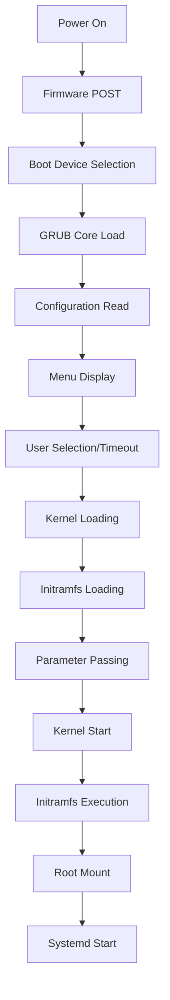

# Bootloader Basics

## Overview

The bootloader is the first software that runs when a computer starts up, responsible for loading the operating system kernel into memory and transferring control to it. For Linux systems, GRUB (GRand Unified Bootloader) is the most common bootloader, providing a flexible and powerful interface for system boot management.

In the context of a container-ready Linux distribution, the bootloader plays a crucial role in:

- Loading custom kernels with container features
- Passing boot parameters for security and container runtime configuration
- Supporting secure boot for trusted execution
- Managing multiple kernel versions for testing and rollback

## Boot Process Fundamentals

### BIOS vs UEFI Boot

**BIOS (Legacy) Boot Process:**

1. **Power-on Self Test (POST)**: Hardware initialization
2. **Master Boot Record (MBR)**: First 512 bytes of disk
3. **Bootloader Stage 1**: Loads Stage 2 from fixed location
4. **Bootloader Stage 2**: Loads kernel and initramfs
5. **Kernel Execution**: Takes control of the system

**UEFI (Modern) Boot Process:**

1. **UEFI Firmware**: Hardware initialization with advanced features
2. **EFI System Partition (ESP)**: FAT32 partition with bootloader
3. **Boot Manager**: Firmware-based boot selection
4. **Bootloader**: GRUB or similar loads kernel
5. **Secure Boot**: Optional signature verification
6. **Kernel Execution**: System control transfer

### GRUB Architecture

GRUB consists of multiple components working together:

**GRUB Core Components:**

- **grub-core**: Core functionality loaded into memory
- **grub.cfg**: Configuration file with menu entries
- **Modules**: Loadable extensions for additional features
- **Themes**: Visual customization (optional)

**File Locations:**

- **BIOS**: `/boot/grub/` (installed in MBR gap or partition)
- **UEFI**: `/boot/efi/EFI/<id>/` (ESP partition)
- **Configuration**: `/boot/grub/grub.cfg` (generated or manual)

## GRUB Operational Modes

### Normal Mode

- Displays boot menu with options
- Allows user interaction
- Supports password protection
- Default for most installations

### Rescue Mode

- Minimal GRUB shell for recovery
- Manual kernel loading when config is corrupted
- Command-line interface for troubleshooting

### Serial Console Mode

- Boot menu over serial connection
- Useful for headless servers
- Configured via `GRUB_TERMINAL=serial`

## Boot Sequence Details

### Stage 1: Firmware to Bootloader

```
Firmware → Boot Device Selection → GRUB Core Loading → Menu Display
```

### Stage 2: Bootloader to Kernel

```
Menu Selection → Kernel Loading → Initramfs Loading → Parameter Passing → Kernel Start
```

### Stage 3: Kernel to Userspace

```
Kernel Initialization → Initramfs Execution → Root Filesystem Mount → Systemd/PID 1 Start
```

## Key GRUB Files and Directories

### Configuration Files

- **`/boot/grub/grub.cfg`**: Main configuration (auto-generated)
- **`/etc/default/grub`**: Default settings
- **`/etc/grub.d/`**: Configuration snippets
  - `00_header`: GRUB header
  - `10_linux`: Linux kernel entries
  - `20_memtest86+`: Memory testing
  - `30_os-prober`: Other OS detection
  - `40_custom`: User customizations

### Boot Files

- **`/boot/vmlinuz-<version>`**: Compressed kernel image
- **`/boot/initramfs-<version>.img`**: Initial ramdisk
- **`/boot/System.map-<version>`**: Kernel symbol table
- **`/boot/config-<version>`**: Kernel configuration

## GRUB Command Line Interface

### Basic Commands

```bash
# List available commands
help

# Display menu entries
ls

# Boot specific entry
linux /boot/vmlinuz-6.1.11 root=/dev/sda1
initrd /boot/initramfs-6.1.11.img
boot
```

### Advanced Commands

```bash
# Inspect filesystem
ls (hd0,1)/
cat (hd0,1)/boot/grub/grub.cfg

# Test configuration
configfile (hd0,1)/boot/grub/grub.cfg

# Chainload other bootloaders
chainloader +1
```

## Boot Parameters for Containers

### Essential Parameters

```bash
# Basic boot
root=/dev/sda1 ro quiet

# Container-specific
cgroup_no_v1=all systemd.unified_cgroup_hierarchy=1

# Security
apparmor=1 security=apparmor
selinux=1

# Performance
threadirqs rcu_nocbs=0-7
```

### Parameter Categories

**Filesystem Parameters:**

- `root=`: Root device specification
- `ro/rw`: Mount root read-only/read-write
- `rootfstype=`: Filesystem type
- `rootflags=`: Mount options

**Security Parameters:**

- `selinux=0/1`: SELinux enable/disable
- `apparmor=0/1`: AppArmor enable/disable
- `security=`: LSM specification

**Container Parameters:**

- `cgroup_no_v1=`: Disable cgroup v1 controllers
- `systemd.unified_cgroup_hierarchy=`: Enable cgroup v2
- `namespace.unpriv_enable=`: User namespace control

**Debug Parameters:**

- `debug`: Enable kernel debugging
- `ignore_loglevel`: Show all kernel messages
- `log_buf_len=`: Kernel log buffer size

## Initramfs Concepts

### Purpose

The initial ramdisk provides a minimal root filesystem in RAM during boot, containing:

- Essential kernel modules
- Device drivers for root filesystem
- Basic utilities for mounting real root
- Container-specific modules (overlay, namespaces)

### Creation Tools

- **dracut**: Modern, systemd-aware (recommended)
- **mkinitcpio**: Arch Linux tool
- **initramfs-tools**: Debian/Ubuntu tool
- **custom**: Manual creation for specialized needs

### Container-Aware Initramfs

```bash
# Include container modules
echo 'add_drivers+="overlay"' >> /etc/dracut.conf.d/container.conf
dracut --regenerate-all --force
```

## Security Features

### Password Protection

```bash
# Generate password hash
grub-mkpasswd-pbkdf2

# Configure in /etc/grub.d/40_custom
set superusers="root"
password_pbkdf2 root <hash>
```

### Secure Boot Integration

- **UEFI Secure Boot**: Requires signed bootloader and kernel
- **Shim**: Microsoft-signed first-stage bootloader
- **MOK (Machine Owner Key)**: Custom key enrollment
- **Kernel Signing**: Self-signed or CA-signed kernels

### Boot Attestation

- **TPM (Trusted Platform Module)**: Hardware-based measurement
- **IMA (Integrity Measurement Architecture)**: File integrity checking
- **Remote Attestation**: Prove system integrity to remote parties

## Troubleshooting Boot Issues

### Common Problems

1. **GRUB not found**

   - Check boot order in firmware
   - Verify GRUB installation location
   - Test with bootable USB

2. **Kernel panic**

   - Check kernel parameters
   - Verify initramfs contents
   - Test with minimal config

3. **Filesystem not found**

   - Check root parameter
   - Verify device naming (/dev/sda1 vs UUID)
   - Test with initramfs shell

4. **Module loading failures**
   - Check initramfs for required modules
   - Verify kernel module dependencies
   - Test manual module loading

### Recovery Techniques

```bash
# GRUB rescue mode
ls  # List devices
set root=(hd0,1)
linux /boot/vmlinuz-6.1.11 root=/dev/sda1
initrd /boot/initramfs-6.1.11.img
boot

# Initramfs emergency shell
# (Drop to shell if root mount fails)
ls /dev
mount /dev/sda1 /mnt
chroot /mnt
```

### Diagnostic Commands

```bash
# Check GRUB installation
grub-install --version
efibootmgr -v  # For UEFI

# Validate configuration
grub-script-check /boot/grub/grub.cfg

# Test kernel loading
kexec -l /boot/vmlinuz --initrd=/boot/initramfs.img --command-line="test"

# Check boot logs
dmesg | grep -i grub
journalctl -b | grep -i grub
```

## Performance Considerations

### Boot Time Optimization

- **Parallel module loading**: `threadirqs` parameter
- **Minimal initramfs**: Only essential modules
- **Fast boot options**: `fastboot quiet` parameters
- **SSD alignment**: Proper partition alignment

### Container Boot Optimization

- **Pre-loaded modules**: Include container modules in initramfs
- **Optimized kernel**: Minimal kernel with required features
- **Fast networking**: Quick network initialization
- **Parallel service startup**: systemd optimization

## Bootloader Alternatives

### For Different Use Cases

**Systemd-boot (sd-boot):**

- Simpler UEFI-only bootloader
- Integrated with systemd
- Limited scripting capabilities

**SYSLINUX/EXTLINUX:**

- Lightweight for embedded systems
- Simple configuration
- Limited feature set

**rEFInd:**

- Modern UEFI bootloader
- Graphical interface
- Good for multi-OS setups

**U-Boot:**

- For embedded systems
- Extensive hardware support
- Complex configuration

## Boot Process Monitoring

### Boot Time Analysis

```bash
# systemd-analyze
systemd-analyze time
systemd-analyze blame
systemd-analyze plot > boot.svg

# GRUB boot time
grub-install --debug
# Check /var/log/syslog for timing info
```

### Container Boot Metrics

```bash
# Container startup time
time podman run --rm hello-world

# Kernel boot time with containers
dmesg | grep -E "(Booting|mounted|started)"
```

## Bootloader Maintenance

### Updates and Upgrades

```bash
# Update GRUB configuration
update-grub

# Reinstall GRUB (BIOS)
grub-install /dev/sda

# Reinstall GRUB (UEFI)
grub-install --target=x86_64-efi --efi-directory=/boot/efi

# Update initramfs
dracut --regenerate-all
```

### Backup and Recovery

```bash
# Backup GRUB configuration
cp /boot/grub/grub.cfg /boot/grub/grub.cfg.backup

# Backup EFI partition
dd if=/dev/sda1 of=/boot/efi.backup bs=1M

# Create rescue USB
dd if=/path/to/iso of=/dev/sdb bs=4M status=progress
```

## Bootloader Workflow Diagram



## Exercises

### Exercise 1: Bootloader Architecture Exploration

1. Examine your system's boot configuration
2. Identify whether you're using BIOS or UEFI
3. Locate GRUB installation: `find /boot -name "*grub*" -type f`
4. Check GRUB version: `grub-install --version`
5. Examine GRUB configuration: `cat /boot/grub/grub.cfg | head -20`
6. Document your system's boot setup

**Expected Outcome**: Understanding of your system's bootloader configuration

### Exercise 2: GRUB Command Line Interface

1. Reboot your system and enter GRUB menu
2. Press 'c' to enter command line
3. Explore available commands: `help`
4. List devices: `ls`
5. Examine filesystem contents: `ls (hd0,1)/`
6. Read GRUB config: `cat (hd0,1)/boot/grub/grub.cfg`
7. Exit without booting: `exit`

**Expected Outcome**: Familiarity with GRUB command-line interface

### Exercise 3: Boot Parameter Configuration

1. Examine current kernel parameters: `cat /proc/cmdline`
2. Edit `/etc/default/grub` to add container parameters
3. Add: `GRUB_CMDLINE_LINUX_DEFAULT="quiet cgroup_no_v1=all systemd.unified_cgroup_hierarchy=1"`
4. Regenerate GRUB config: `grub-mkconfig -o /boot/grub/grub.cfg`
5. Verify changes: `grep "cgroup" /boot/grub/grub.cfg`
6. Reboot and check new parameters: `cat /proc/cmdline`

**Expected Outcome**: Custom kernel parameters for container support

### Exercise 4: Initramfs Analysis

1. Examine current initramfs: `ls -la /boot/initramfs-*`
2. Extract initramfs contents: `mkdir /tmp/initrd && cd /tmp/initrd && zcat /boot/initramfs-*.img | cpio -id`
3. Explore initramfs structure: `find . | head -20`
4. Check for container modules: `find . -name "*overlay*" -o -name "*namespace*"`
5. Regenerate initramfs with container support
6. Compare sizes and contents

**Expected Outcome**: Understanding of initramfs contents and container module inclusion

### Exercise 5: Secure Boot Setup

1. Check Secure Boot status: `mokutil --sb-state`
2. If enabled, examine key management: `mokutil --list-enrolled`
3. Configure GRUB for Secure Boot compatibility
4. Test kernel signing (if applicable)
5. Document Secure Boot configuration
6. Test boot with Secure Boot enabled/disabled

**Expected Outcome**: Secure Boot awareness and configuration

### Exercise 6: Boot Failure Recovery

1. Create a backup of working GRUB config
2. Intentionally break GRUB config (remove menuentry)
3. Attempt boot and enter GRUB rescue mode
4. Manually boot system using GRUB commands:
   ```
   set root=(hd0,1)
   linux /boot/vmlinuz root=/dev/sda1
   initrd /boot/initramfs.img
   boot
   ```
5. Restore working configuration
6. Test recovery procedure

**Expected Outcome**: Proficiency in GRUB rescue and manual booting

## Next Steps

With a solid understanding of bootloader fundamentals, proceed to Chapter 5.2 for detailed GRUB installation. The bootloader is critical for loading your custom kernel with container features, so proper configuration ensures reliable system startup and optimal container performance.

## References

- GRUB Manual: https://www.gnu.org/software/grub/manual/grub/
- UEFI Specification: https://uefi.org/specifications
- systemd-boot Documentation: https://www.freedesktop.org/software/systemd/man/systemd-boot.html
- Dracut Manual: https://man7.org/linux/man-pages/man8/dracut.8.html
- Secure Boot Documentation: https://docs.microsoft.com/en-us/windows-hardware/manufacture/desktop/secure-boot-overview
