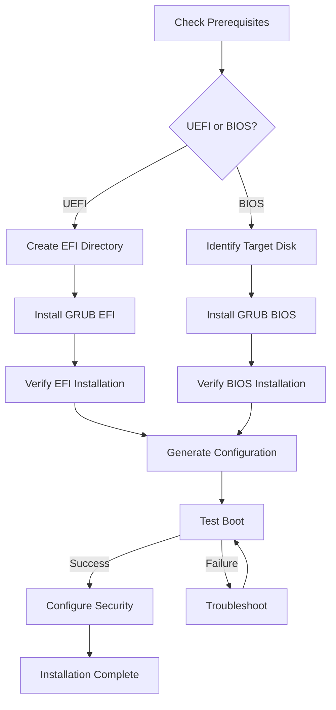

# Installing GRUB

## Overview

GRUB installation is a critical step that places the bootloader in the correct location for your system's firmware to locate and execute it. The installation process differs significantly between BIOS (legacy) and UEFI (modern) systems, and proper installation ensures reliable boot capability for your container-ready Linux distribution.

## Prerequisites and Preparation

### System Requirements

- **Kernel**: Successfully compiled and installed (Chapter 4)
- **Firmware Type**: Identified as BIOS or UEFI
- **Storage**: Adequate space in `/boot` (minimum 100MB recommended)
- **Permissions**: Root access for installation

### Pre-Installation Checks

```bash
# Verify kernel installation
ls -la /boot/vmlinuz-*
ls -la /boot/initramfs-*.img

# Check available space
df -h /boot

# Identify firmware type
[ -d /sys/firmware/efi ] && echo "UEFI System" || echo "BIOS System"

# Check for existing bootloaders
efibootmgr -v 2>/dev/null || echo "No EFI boot manager found"
```

### Directory Structure Setup

```bash
# Create EFI directory if needed (UEFI)
mkdir -p /boot/efi/EFI

# Ensure proper permissions
chmod 755 /boot
chmod 755 /boot/efi 2>/dev/null || true
```

## UEFI Installation Process

### Standard UEFI Installation

```bash
# Install GRUB for UEFI systems
grub-install --target=x86_64-efi \
             --efi-directory=/boot/efi \
             --bootloader-id=LFS \
             --recheck \
             --boot-directory=/boot
```

**Parameter Explanations:**

- `--target=x86_64-efi`: Target architecture (x86_64 for 64-bit systems)
- `--efi-directory=/boot/efi`: Location of EFI System Partition mount point
- `--bootloader-id=LFS`: Identifier for bootloader (appears in firmware menu)
- `--recheck`: Force rechecking of device map
- `--boot-directory=/boot`: Location of GRUB directory

### Alternative UEFI Installation Methods

**Removable Media Installation:**

```bash
# For installation on removable media
grub-install --target=x86_64-efi \
             --efi-directory=/boot/efi \
             --removable \
             --boot-directory=/boot
```

**Custom EFI Directory:**

```bash
# If ESP is mounted elsewhere
grub-install --target=x86_64-efi \
             --efi-directory=/mnt/esp \
             --bootloader-id=LFS
```

### UEFI Verification Steps

```bash
# Check EFI bootloader entry
efibootmgr -v | grep LFS

# Verify GRUB files
ls -la /boot/efi/EFI/LFS/
# Expected: grubx64.efi

# Test GRUB EFI file
file /boot/efi/EFI/LFS/grubx64.efi
# Should show: PE32+ executable (EFI application) x86-64
```

## BIOS Installation Process

### Standard BIOS Installation

```bash
# Install GRUB for BIOS systems
grub-install --target=i386-pc \
             --boot-directory=/boot \
             --recheck \
             /dev/sda
```

**Parameter Explanations:**

- `--target=i386-pc`: Target for 32-bit PC BIOS
- `--boot-directory=/boot`: GRUB directory location
- `--recheck`: Force device map update
- `/dev/sda`: Target disk device

### BIOS with Specific Partition

```bash
# Install to specific partition (not recommended for production)
grub-install --target=i386-pc \
             --boot-directory=/boot \
             --force \
             /dev/sda1
```

### BIOS Verification Steps

```bash
# Check MBR for GRUB signature
dd if=/dev/sda bs=512 count=1 2>/dev/null | grep -o "GRUB"

# Verify core.img exists
ls -la /boot/grub/i386-pc/core.img

# Check partition table
fdisk -l /dev/sda | head -10
```

## Advanced Installation Options

### Secure Boot Compatible Installation

```bash
# Install with Secure Boot support
grub-install --target=x86_64-efi \
             --efi-directory=/boot/efi \
             --bootloader-id=LFS \
             --modules="tpm" \
             --sbat
```

### Custom Module Installation

```bash
# Include additional GRUB modules
grub-install --target=x86_64-efi \
             --efi-directory=/boot/efi \
             --bootloader-id=LFS \
             --modules="normal test morse regexp serial extcmd"
```

### Installation with Debug Information

```bash
# Verbose installation with debug output
grub-install --target=x86_64-efi \
             --efi-directory=/boot/efi \
             --bootloader-id=LFS \
             --debug \
             --verbose
```

## Post-Installation Configuration

### Generate Initial Configuration

```bash
# Create basic GRUB configuration
grub-mkconfig -o /boot/grub/grub.cfg

# Verify configuration syntax
grub-script-check /boot/grub/grub.cfg
```

### EFI Boot Manager Registration

```bash
# Register with EFI boot manager
efibootmgr -c -d /dev/sda -p 1 \
           -L "LFS Linux" \
           -l "\EFI\LFS\grubx64.efi"
```

### BIOS Bootloader Testing

```bash
# Test GRUB core loading (BIOS)
grub-install --target=i386-pc --grub-setup=/bin/true /dev/sda
```

## Troubleshooting Installation Issues

### Common UEFI Problems

**EFI Directory Not Found:**

```bash
# Create EFI directory structure
mkdir -p /boot/efi/EFI
mount /dev/sda1 /boot/efi  # Mount ESP if not mounted

# Check ESP filesystem
ls -la /boot/efi/
file /boot/efi/EFI  # Should be directory
```

**EFI Variables Not Accessible:**

```bash
# Check EFI variables
efibootmgr -v 2>&1
# If "EFI variables are not supported", system may be in legacy mode

# Force UEFI mode (if supported)
# Reboot and enter firmware setup to enable UEFI/CSM
```

**Secure Boot Issues:**

```bash
# Check Secure Boot status
mokutil --sb-state 2>/dev/null || echo "Secure Boot not available"

# Disable Secure Boot in firmware if needed
# Or sign GRUB with MOK (Machine Owner Key)
```

### Common BIOS Problems

**Device Not Found:**

```bash
# Verify disk device exists
ls -la /dev/sda
fdisk -l /dev/sda

# Check for RAID or LVM
lsblk
pvdisplay 2>/dev/null || echo "No LVM found"
```

**MBR Write Protected:**

```bash
# Check disk write protection
blockdev --getro /dev/sda

# Remove write protection if needed
blockdev --setrw /dev/sda
```

**Insufficient Space:**

```bash
# Check available space in /boot
df -h /boot

# Clean up old kernels if needed
ls -la /boot/vmlinuz-*
rm /boot/vmlinuz-old-version
```

### Installation Verification Issues

**GRUB Files Missing:**

```bash
# Reinstall GRUB modules
grub-install --target=x86_64-efi \
             --efi-directory=/boot/efi \
             --bootloader-id=LFS \
             --recheck

# Check GRUB directory contents
ls -la /boot/grub/
ls -la /boot/grub/x86_64-efi/  # UEFI
ls -la /boot/grub/i386-pc/     # BIOS
```

**Configuration Errors:**

```bash
# Validate GRUB config syntax
grub-script-check /boot/grub/grub.cfg

# Check for missing kernel
ls -la /boot/vmlinuz-*
ls -la /boot/initramfs-*.img
```

## Security Considerations

### Password Protection Setup

```bash
# Generate password hash
grub-mkpasswd-pbkdf2

# Add to GRUB config (/etc/grub.d/40_custom)
cat >> /etc/grub.d/40_custom << EOF
set superusers="root"
password_pbkdf2 root grub.pbkdf2.sha512.10000.XXXXXXXXXXXXXXXXXXXXXXXXXXXXXXXXXXXXXXXXXXXXXXXXXXXXXXXXXXXXXXXXXXXXXXXXXXXXXXXXXXXXXXXXXXXXXXXXXXXXXXXXXXXXXXXXXXXXXXXXXXXXXXXXXXXXXXXXXXXXXXXXXXXXXXXXXXXXXXXXXXXXXXXXXXXXXXXXXXXXXXXXXXXXXXXXXXXXXXXXXXXXXXXXXXXXXXXXXXXXXXXXXXXXXXXXXXXXXXXXXXXXXXXXXXXXXXXXXXXXXXXXXXXXXXXXXXXXXXXXXXXXXXXXXXXXXXXXXXXXXXXXXXXXXXXXXXXXXXXXXXXXXXXXXXXXXXXXXXXXXXXXXXXXXXXXXXXXXXXXXXXXXXXXXXXXXXXXXXXXXXXXXXXXXXXXXXXXXXXXXXXXXXXXXXXXXXXXXXXXXXXXXXXXXXXXXXXXXXXXXXXXXXXXXXXXXXXXXXXXXXXXXXXXXXXXXXXXXXXXXXXXXXXXXXXXXXXXXXXXXXXXXXXXXXXX
EOF

# Regenerate config
grub-mkconfig -o /boot/grub/grub.cfg
```

### Secure Boot Configuration

```bash
# Install shim (if using signed boot)
# Requires additional packages and signing setup
# This is advanced and requires external signing infrastructure
```

### EFI Secure Boot Keys

```bash
# Check enrolled keys
mokutil --list-enrolled

# Enroll custom keys (advanced)
mokutil --import /path/to/key.der
```

## Multi-Boot Configurations

### Dual Boot with Windows

```bash
# Install GRUB without overwriting Windows bootloader
grub-install --target=x86_64-efi \
             --efi-directory=/boot/efi \
             --bootloader-id=LFS \
             --no-nvram

# Manually add Windows entry to GRUB config
cat >> /etc/grub.d/40_custom << EOF
menuentry "Windows 10" {
    insmod part_gpt
    insmod fat
    insmod search_fs_uuid
    insmod chain
    search --fs-uuid --set=root $hints_string $fs_uuid
    chainloader /EFI/Microsoft/Boot/bootmgfw.efi
}
EOF
```

### Multiple Linux Distributions

```bash
# Use os-prober to detect other OSes
grub-mkconfig -o /boot/grub/grub.cfg

# Manual configuration for specific kernels
cat >> /etc/grub.d/40_custom << EOF
menuentry "Other Linux" {
    linux /boot/vmlinuz-other root=/dev/sda2
    initrd /boot/initramfs-other.img
}
EOF
```

## Installation Testing

### Boot Testing Procedures

**UEFI Boot Test:**

```bash
# Reboot and select LFS from EFI menu
# If system boots directly, check EFI boot order
efibootmgr -o
efibootmgr -n XXXX  # Set LFS as first boot option
```

**BIOS Boot Test:**

```bash
# Reboot system
# GRUB menu should appear automatically
# If not, check BIOS boot order
```

### Rescue Boot Preparation

```bash
# Create rescue entry
cat >> /etc/grub.d/40_custom << EOF
menuentry "LFS Rescue" {
    linux /boot/vmlinuz root=/dev/sda1 rw init=/bin/bash
    initrd /boot/initramfs.img
}
EOF

# Regenerate config
grub-mkconfig -o /boot/grub/grub.cfg
```

## Performance Optimization

### Fast Boot Configuration

```bash
# Reduce GRUB timeout
echo 'GRUB_TIMEOUT=1' >> /etc/default/grub
echo 'GRUB_TIMEOUT_STYLE=hidden' >> /etc/default/grub

# Regenerate config
grub-mkconfig -o /boot/grub/grub.cfg
```

### Minimal Installation

```bash
# Install only essential modules
grub-install --target=x86_64-efi \
             --efi-directory=/boot/efi \
             --bootloader-id=LFS \
             --modules="normal linux chain"
```

## Backup and Recovery

### Backup Procedures

```bash
# Backup GRUB configuration
cp /boot/grub/grub.cfg /boot/grub/grub.cfg.backup

# Backup EFI partition (UEFI)
dd if=/dev/sda1 of=/root/efi-partition.backup bs=1M

# Backup MBR (BIOS)
dd if=/dev/sda of=/root/mbr.backup bs=512 count=1
```

### Recovery Procedures

**UEFI Recovery:**

```bash
# Boot from live USB
mount /dev/sda1 /mnt
mount /dev/sda2 /mnt/boot  # If separate boot partition

# Reinstall GRUB
grub-install --target=x86_64-efi \
             --efi-directory=/mnt/boot/efi \
             --boot-directory=/mnt/boot \
             --bootloader-id=LFS

# Restore config
cp /mnt/boot/grub/grub.cfg.backup /mnt/boot/grub/grub.cfg
```

**BIOS Recovery:**

```bash
# Boot from live USB
mount /dev/sda1 /mnt

# Reinstall GRUB
grub-install --target=i386-pc \
             --boot-directory=/mnt/boot \
             /dev/sda

# Restore MBR if needed
dd if=/root/mbr.backup of=/dev/sda
```

## Installation Workflow Diagram



## Exercises

### Exercise 1: System Firmware Detection

1. Determine if your system uses UEFI or BIOS
2. Check for existing bootloader installations
3. Verify EFI partition (if UEFI) or MBR (if BIOS)
4. Document your system's boot configuration

**Expected Outcome**: Clear understanding of system firmware type and current boot setup

### Exercise 2: GRUB EFI Installation

1. Ensure EFI directory exists: `mkdir -p /boot/efi/EFI`
2. Install GRUB for UEFI: `grub-install --target=x86_64-efi --efi-directory=/boot/efi --bootloader-id=LFS`
3. Verify installation: `ls -la /boot/efi/EFI/LFS/`
4. Check EFI boot manager: `efibootmgr -v | grep LFS`
5. Generate configuration: `grub-mkconfig -o /boot/grub/grub.cfg`

**Expected Outcome**: Successfully installed GRUB EFI with verified files

### Exercise 3: GRUB BIOS Installation

1. Identify target disk: `lsblk`
2. Install GRUB for BIOS: `grub-install --target=i386-pc /dev/sda`
3. Verify core image: `ls -la /boot/grub/i386-pc/core.img`
4. Check MBR signature: `dd if=/dev/sda bs=512 count=1 | hexdump -C | head -2`
5. Generate configuration: `grub-mkconfig -o /boot/grub/grub.cfg`

**Expected Outcome**: Successfully installed GRUB BIOS with verified installation

### Exercise 4: Troubleshooting Failed Installation

1. Attempt installation with verbose output
2. Check system logs for errors: `dmesg | grep -i grub`
3. Verify all prerequisites are met
4. Test with alternative installation parameters
5. Document the issue and resolution steps

**Expected Outcome**: Ability to diagnose and resolve GRUB installation problems

### Exercise 5: Secure GRUB Configuration

1. Generate password hash: `grub-mkpasswd-pbkdf2`
2. Add password protection to `/etc/grub.d/40_custom`
3. Regenerate GRUB config: `grub-mkconfig -o /boot/grub/grub.cfg`
4. Test password protection by rebooting
5. Document security configuration

**Expected Outcome**: Password-protected GRUB with secure boot options

### Exercise 6: Multi-Boot Setup

1. Install second Linux distribution or create test kernel
2. Configure GRUB to detect multiple OSes: `os-prober`
3. Add manual menu entries for additional kernels
4. Test booting into different configurations
5. Verify each boot option works correctly

**Expected Outcome**: Functional multi-boot system with GRUB menu

### Exercise 7: Backup and Recovery

1. Create backup of working GRUB configuration
2. Create backup of EFI partition or MBR
3. Intentionally break GRUB configuration
4. Boot from live USB and restore configuration
5. Test recovery procedure works

**Expected Outcome**: Reliable backup and recovery process for GRUB

## Next Steps

With GRUB successfully installed, proceed to Chapter 5.3 for detailed configuration. Proper GRUB installation ensures your container-ready Linux distribution will boot reliably with all the custom kernel features you've configured.

## References

- GRUB Installation Guide: https://www.gnu.org/software/grub/manual/grub/html_node/Installing-GRUB-using-grub_002dinstall.html
- UEFI Specification: https://uefi.org/specifications
- EFI Boot Manager Documentation: https://man7.org/linux/man-pages/man8/efibootmgr.8.html
- Secure Boot Documentation: https://docs.microsoft.com/en-us/windows-hardware/manufacture/desktop/secure-boot-overview
- GRUB Security: https://www.gnu.org/software/grub/manual/grub/html_node/Security.html
