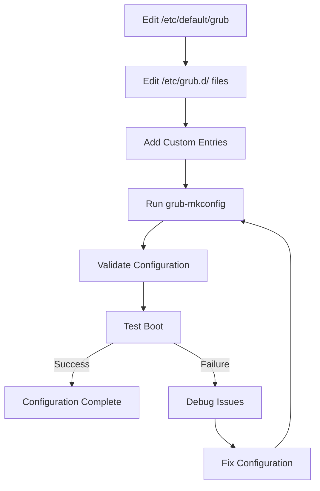

# GRUB Configuration

## Overview

GRUB configuration is the process of creating menu entries, setting boot parameters, and customizing the bootloader behavior for your container-ready Linux distribution. Proper configuration ensures reliable booting with optimal container performance and security features.

## Configuration Architecture

### Configuration Files Hierarchy

**Primary Configuration Files:**

- **`/boot/grub/grub.cfg`**: Main configuration (auto-generated)
- **`/etc/default/grub`**: Default settings and variables
- **`/etc/grub.d/`**: Configuration snippets directory
  - `00_header`: GRUB environment and setup
  - `05_debian_theme`: Visual theme (if applicable)
  - `10_linux`: Linux kernel entries
  - `20_memtest86+`: Memory testing utilities
  - `30_os-prober`: Other OS detection
  - `40_custom`: User customizations
  - `41_custom`: Additional customizations

### Configuration Generation Process

```bash
# Generate complete GRUB configuration
grub-mkconfig -o /boot/grub/grub.cfg

# Preview configuration without writing
grub-mkconfig | head -50

# Validate configuration syntax
grub-script-check /boot/grub/grub.cfg
```

## Default Settings Configuration

### `/etc/default/grub` Parameters

**Basic Settings:**

```bash
# Boot menu timeout (seconds)
GRUB_TIMEOUT=5

# Default menu entry (0 = first entry)
GRUB_DEFAULT=0

# Hide menu unless Shift is held
GRUB_TIMEOUT_STYLE=hidden

# Disable submenu display
GRUB_DISABLE_SUBMENU=y
```

**Display Settings:**

```bash
# Resolution settings
GRUB_GFXMODE=1920x1080
GRUB_GFXPAYLOAD_LINUX=keep

# Theme settings
GRUB_THEME=/boot/grub/themes/starfield/theme.txt

# Terminal output
GRUB_TERMINAL=console
```

**Container-Specific Settings:**

```bash
# Kernel parameters for container support
GRUB_CMDLINE_LINUX_DEFAULT="quiet cgroup_no_v1=all systemd.unified_cgroup_hierarchy=1"

# Additional parameters
GRUB_CMDLINE_LINUX="apparmor=1 security=apparmor selinux=1"
```

## Menu Entry Configuration

### Automatic Menu Entry Generation

**Linux Kernel Detection:**

```bash
# GRUB automatically detects kernels in /boot/
# Generated entries include:
# - Current kernel with latest initramfs
# - Previous kernel versions (if available)
# - Recovery mode entries
```

**Generated Menu Entry Example:**

```bash
menuentry 'LFS GNU/Linux' --class gnu-linux --class gnu --class os $menuentry_id_option 'gnulinux-6.1.11-advanced-agnostic' {
    load_video
    insmod gzio
    if [ x$grub_platform = xxen ]; then insmod xzio; insmod lzopio; fi
    insmod part_gpt
    insmod ext2
    search --no-floppy --fs-uuid --set=root 12345678-1234-1234-1234-123456789012
    echo 'Loading Linux 6.1.11 ...'
    linux /boot/vmlinuz-6.1.11 root=UUID=12345678-1234-1234-1234-123456789012 ro quiet cgroup_no_v1=all systemd.unified_cgroup_hierarchy=1
    echo 'Loading initial ramdisk ...'
    initrd /boot/initramfs-6.1.11.img
}
```

### Manual Menu Entry Creation

**Basic Manual Entry:**

```bash
# Add to /etc/grub.d/40_custom
menuentry 'LFS Container System' --class gnu-linux {
    insmod gzio
    insmod part_msdos
    search --set=root --fs-uuid 12345678-1234-1234-1234-123456789012
    linux /boot/vmlinuz-6.1.11 root=UUID=12345678-1234-1234-1234-123456789012 ro quiet
    initrd /boot/initramfs-6.1.11.img
}
```

**Advanced Manual Entry with Container Features:**

```bash
menuentry 'LFS Container System (Advanced)' --class gnu-linux {
    insmod gzio
    insmod part_gpt
    insmod ext2
    search --no-floppy --fs-uuid --set=root 12345678-1234-1234-1234-123456789012
    echo 'Loading LFS with container support...'
    linux /boot/vmlinuz-6.1.11 root=UUID=12345678-1234-1234-1234-123456789012 ro quiet \
          cgroup_no_v1=all systemd.unified_cgroup_hierarchy=1 \
          apparmor=1 security=apparmor selinux=1 \
          threadirqs rcu_nocbs=0-7
    echo 'Loading container-aware initramfs...'
    initrd /boot/initramfs-6.1.11.img
}
```

## Container-Specific Boot Parameters

### Core Container Parameters

**Cgroup Configuration:**

```bash
# Enable cgroup v2 only
cgroup_no_v1=all systemd.unified_cgroup_hierarchy=1

# Legacy cgroup v1 support (if needed)
cgroup_enable=memory swapaccount=1

# Cgroup delegation
systemd.unified_cgroup_hierarchy=1
```

**Namespace Support:**

```bash
# User namespace support
namespace.unpriv_enable=1

# Network namespace isolation
netns=1
```

**Security Modules:**

```bash
# AppArmor
apparmor=1 security=apparmor

# SELinux
selinux=1 security=selinux

# LSM stacking
security=apparmor,selinux
```

### Performance Parameters

**Container Runtime Optimization:**

```bash
# Memory management
transparent_hugepage=always

# I/O scheduling
elevator=noop

# Network optimization
net.core.somaxconn=1024
```

**Resource Limits:**

```bash
# Increase limits for containers
kernel.pid_max=65536
vm.max_map_count=262144
```

### Debugging Parameters

**Container Debugging:**

```bash
# Enable debugging
debug ignore_loglevel

# Verbose container logging
cgroup_debug

# Namespace debugging
namespace_debug=1
```

## Security Configuration

### Password Protection

**Superuser Setup:**

```bash
# Generate password hash
HASH=$(grub-mkpasswd-pbkdf2 | grep "PBKDF2 hash" | cut -d' ' -f7)

# Add to /etc/grub.d/40_custom
cat >> /etc/grub.d/40_custom << EOF
set superusers="root"
password_pbkdf2 root $HASH
EOF
```

**Menu Entry Protection:**

```bash
# Protect specific entries
menuentry 'LFS Admin' --users root {
    linux /boot/vmlinuz root=/dev/sda1
    initrd /boot/initramfs.img
}
```

### Secure Boot Integration

**UEFI Secure Boot:**

```bash
# Check Secure Boot status
mokutil --sb-state

# Configure for Secure Boot
GRUB_ENABLE_CRYPTODISK=n  # Disable if causing issues
```

**Kernel Module Signing:**

```bash
# Ensure modules are signed
find /lib/modules -name "*.ko" | head -5 | xargs modinfo | grep -i sign
```

## Multi-Boot Configuration

### Multiple Kernel Versions

```bash
# Add to /etc/grub.d/40_custom
menuentry 'LFS Kernel 6.1.11 (Stable)' {
    linux /boot/vmlinuz-6.1.11-stable root=/dev/sda1 ro quiet
    initrd /boot/initramfs-6.1.11-stable.img
}

menuentry 'LFS Kernel 6.1.11 (Experimental)' {
    linux /boot/vmlinuz-6.1.11-exp root=/dev/sda1 ro quiet
    initrd /boot/initramfs-6.1.11-exp.img
}
```

### Dual Boot with Other Systems

**Windows Dual Boot:**

```bash
menuentry 'Windows 10' {
    insmod part_gpt
    insmod fat
    insmod search_fs_uuid
    insmod chain
    search --fs-uuid --set=root $hints_string $fs_uuid
    chainloader /EFI/Microsoft/Boot/bootmgfw.efi
}
```

**Other Linux Distributions:**

```bash
menuentry 'Ubuntu' {
    insmod part_gpt
    insmod ext2
    search --fs-uuid --set=root 87654321-4321-4321-4321-210987654321
    linux /boot/vmlinuz-5.15.0-50-generic root=UUID=87654321-4321-4321-4321-210987654321
    initrd /boot/initrd.img-5.15.0-50-generic
}
```

## Advanced Configuration Options

### Theme Customization

**Custom Theme Setup:**

```bash
# Create theme directory
mkdir -p /boot/grub/themes/lfs

# Download or create theme files
# theme.txt, background.png, etc.

# Configure theme
echo 'GRUB_THEME="/boot/grub/themes/lfs/theme.txt"' >> /etc/default/grub
```

### Serial Console Configuration

**Serial Boot Menu:**

```bash
# Enable serial console
echo 'GRUB_TERMINAL="serial console"' >> /etc/default/grub
echo 'GRUB_SERIAL_COMMAND="serial --speed=115200 --unit=0 --word=8 --parity=no --stop=1"' >> /etc/default/grub
```

### Network Boot (PXE)

**PXE Configuration:**

```bash
# Enable network modules
echo 'GRUB_MODULES="net tftp http"' >> /etc/default/grub

# Configure network boot
menuentry 'LFS Network Boot' {
    insmod net
    insmod efinet
    insmod tftp
    net_bootp
    linux (tftp)/vmlinuz root=/dev/nfs nfsroot=192.168.1.100:/srv/nfs/lfs
    initrd (tftp)/initramfs.img
}
```

## Configuration Validation and Testing

### Syntax Validation

```bash
# Check configuration syntax
grub-script-check /boot/grub/grub.cfg

# Validate specific entries
grub-script-check /etc/grub.d/10_linux

# Test configuration loading
grub-mkconfig | grub-script-check
```

### Boot Testing

**Configuration Testing:**

```bash
# Test menu entry without rebooting
grub-mkconfig -o /tmp/grub.cfg.test
grub-script-check /tmp/grub.cfg.test

# Simulate boot process
qemu-system-x86_64 -kernel /boot/vmlinuz -initrd /boot/initramfs.img -append "root=/dev/sda1"
```

### Parameter Verification

```bash
# Check current kernel parameters
cat /proc/cmdline

# Verify container parameters are active
grep cgroup /proc/cmdline
grep apparmor /proc/cmdline

# Check security modules
cat /sys/kernel/security/lsm
```

## Troubleshooting Configuration Issues

### Common Configuration Problems

**Menu Not Appearing:**

```bash
# Check timeout settings
grep TIMEOUT /etc/default/grub

# Verify GRUB_TIMEOUT_STYLE
# Set to 'menu' for always visible menu
```

**Kernel Not Found:**

```bash
# Check kernel location
ls -la /boot/vmlinuz-*

# Verify GRUB can read filesystem
grub-probe --target=fs /boot

# Check device mapping
grub-mkdevicemap
```

**Initramfs Issues:**

```bash
# Verify initramfs exists
ls -la /boot/initramfs-*.img

# Check initramfs contents
lsinitrd /boot/initramfs-6.1.11.img | head -20

# Regenerate initramfs
dracut --regenerate-all --force
```

**Parameter Not Applied:**

```bash
# Check parameter syntax
# Ensure parameters are properly quoted
GRUB_CMDLINE_LINUX_DEFAULT="param1 param2=value"

# Regenerate configuration
grub-mkconfig -o /boot/grub/grub.cfg
```

### Debug Configuration

**Verbose Boot:**

```bash
# Enable verbose output
echo 'GRUB_CMDLINE_LINUX_DEFAULT="debug ignore_loglevel"' >> /etc/default/grub

# Check boot logs
dmesg | grep -i grub
journalctl -b | grep -i grub
```

**Configuration Debug:**

```bash
# Enable GRUB debug
echo 'GRUB_CMDLINE_LINUX_DEFAULT="grub.debug=all"' >> /etc/default/grub

# Test configuration generation
grub-mkconfig --debug
```

## Performance Optimization

### Boot Speed Optimization

**Reduce Timeout:**

```bash
echo 'GRUB_TIMEOUT=1' >> /etc/default/grub
echo 'GRUB_TIMEOUT_STYLE=hidden' >> /etc/default/grub
```

**Minimize Modules:**

```bash
# Load only essential modules
echo 'GRUB_PRELOAD_MODULES="part_gpt ext2"' >> /etc/default/grub
```

**Fast Boot Parameters:**

```bash
echo 'GRUB_CMDLINE_LINUX_DEFAULT="quiet fastboot"' >> /etc/default/grub
```

### Memory Optimization

**Minimal Configuration:**

```bash
# Reduce GRUB memory usage
echo 'GRUB_BADRAM="0x01234567,0x89abcdef"' >> /etc/default/grub  # If bad RAM exists
```

## Backup and Recovery

### Configuration Backup

```bash
# Backup current configuration
cp /etc/default/grub /etc/default/grub.backup
cp /boot/grub/grub.cfg /boot/grub/grub.cfg.backup

# Backup custom entries
cp /etc/grub.d/40_custom /etc/grub.d/40_custom.backup
```

### Recovery Procedures

**Restore Configuration:**

```bash
# Restore from backup
cp /etc/default/grub.backup /etc/default/grub
cp /boot/grub/grub.cfg.backup /boot/grub/grub.cfg

# Regenerate if needed
grub-mkconfig -o /boot/grub/grub.cfg
```

**Emergency Boot:**

```bash
# Boot from GRUB command line
grub> linux /boot/vmlinuz root=/dev/sda1 ro
grub> initrd /boot/initramfs.img
grub> boot
```

## Configuration Workflow Diagram



## Exercises

### Exercise 1: Basic GRUB Configuration

1. Examine `/etc/default/grub` and understand each setting
2. Generate GRUB configuration: `grub-mkconfig -o /boot/grub/grub.cfg`
3. Examine generated `/boot/grub/grub.cfg` and identify key sections
4. Change boot timeout to 10 seconds and regenerate config
5. Verify changes take effect on reboot

**Expected Outcome**: Understanding of GRUB configuration files and generation process

### Exercise 2: Container-Specific Parameters

1. Add container support parameters to `/etc/default/grub`:
   ```
   GRUB_CMDLINE_LINUX_DEFAULT="quiet cgroup_no_v1=all systemd.unified_cgroup_hierarchy=1"
   ```
2. Add security parameters:
   ```
   GRUB_CMDLINE_LINUX="apparmor=1 security=apparmor selinux=1"
   ```
3. Regenerate configuration: `grub-mkconfig -o /boot/grub/grub.cfg`
4. Verify parameters in generated config: `grep cgroup /boot/grub/grub.cfg`
5. Reboot and check active parameters: `cat /proc/cmdline`

**Expected Outcome**: GRUB configured with container and security parameters

### Exercise 3: Manual Menu Entry Creation

1. Create a custom menu entry in `/etc/grub.d/40_custom`:
   ```bash
   menuentry 'LFS Container System' --class gnu-linux {
       linux /boot/vmlinuz root=/dev/sda1 ro quiet
       initrd /boot/initramfs.img
   }
   ```
2. Regenerate configuration
3. Verify entry appears in GRUB menu on boot
4. Test booting with the custom entry
5. Add additional parameters for container testing

**Expected Outcome**: Custom GRUB menu entry for container system

### Exercise 4: Security Configuration

1. Generate password hash: `grub-mkpasswd-pbkdf2`
2. Add superuser configuration to `/etc/grub.d/40_custom`
3. Protect the main menu entry with password
4. Regenerate configuration
5. Test password protection on boot
6. Document security configuration

**Expected Outcome**: Password-protected GRUB with secure configuration

### Exercise 5: Multi-Kernel Setup

1. Create multiple kernel entries (simulate different versions)
2. Add entries for "stable" and "testing" kernels
3. Configure different parameters for each entry
4. Test booting into each configuration
5. Verify different parameters are applied

**Expected Outcome**: Multi-kernel GRUB configuration with different boot options

### Exercise 6: Configuration Troubleshooting

1. Intentionally create syntax error in GRUB config
2. Attempt to generate configuration: `grub-mkconfig -o /boot/grub/grub.cfg`
3. Use `grub-script-check` to identify the error
4. Fix the error and regenerate configuration
5. Test that configuration loads correctly

**Expected Outcome**: Ability to troubleshoot and fix GRUB configuration errors

### Exercise 7: Performance Optimization

1. Measure current boot time: `systemd-analyze time`
2. Optimize GRUB timeout and parameters for faster boot
3. Regenerate configuration with performance settings
4. Reboot and measure improvement: `systemd-analyze time`
5. Document performance optimizations applied

**Expected Outcome**: Optimized GRUB configuration for faster boot times

## Next Steps

With GRUB properly configured for container support, proceed to Chapter 5.4 for initramfs creation. The initramfs will include the necessary modules for container runtimes and filesystem overlays.

## References

- GRUB Configuration Manual: https://www.gnu.org/software/grub/manual/grub/html_node/Configuration.html
- Kernel Parameters Documentation: https://www.kernel.org/doc/html/latest/admin-guide/kernel-parameters.html
- systemd Boot Parameters: https://www.freedesktop.org/software/systemd/man/systemd.html
- AppArmor Documentation: https://apparmor.net/
- SELinux Documentation: https://selinuxproject.org/page/Main_Page
