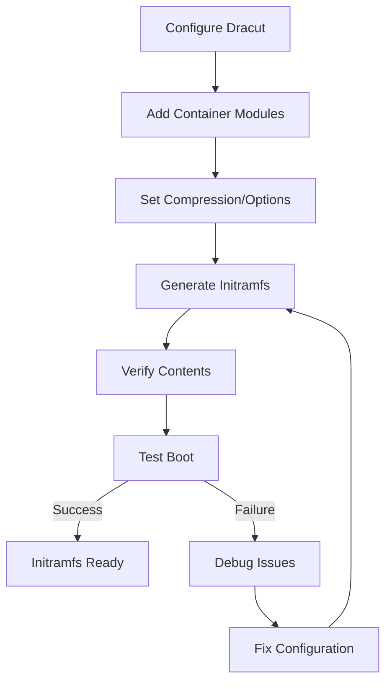

# Creating Initramfs

## Overview

The initial RAM filesystem (initramfs) is a temporary root filesystem loaded into memory during the boot process. It provides essential drivers, modules, and utilities needed to mount the real root filesystem, especially critical for systems with complex storage configurations or container runtimes requiring specific kernel modules.

## Initramfs Concepts

### Purpose and Function

**Boot Sequence Role:**

1. **Early Boot**: Loaded by bootloader after kernel
2. **Hardware Detection**: Contains drivers for storage, network, etc.
3. **Filesystem Mounting**: Mounts real root filesystem
4. **Module Loading**: Loads necessary kernel modules
5. **System Transition**: Hands control to real init system

**Container-Specific Requirements:**

- **Overlay Filesystem**: For layered container images
- **Namespace Modules**: User, network, and PID namespaces
- **Cgroup Support**: Control group filesystem mounting
- **Security Modules**: AppArmor/SELinux policy loading
- **Network Drivers**: For container networking

### Initramfs vs Initrd

**Initrd (Legacy):**

- Image format: Filesystem image (ext2)
- Size: Larger, less efficient
- Flexibility: Limited customization
- Tools: mkinitrd, mkinitramfs

**Initramfs (Modern):**

- Image format: cpio archive (compressed)
- Size: Smaller, more efficient
- Flexibility: Highly customizable
- Tools: dracut, mkinitcpio, initramfs-tools

## Initramfs Generation Tools

### Dracut (Recommended for LFS)

**Installation and Setup:**

```bash
# Install dracut (if not already available)
# For LFS, ensure dependencies: bash, coreutils, util-linux, kmod

# Basic initramfs generation
dracut --kver 6.1.11 --force /boot/initramfs-6.1.11.img
```

**Dracut Architecture:**

- **Modules**: Pluggable components for different functionalities
- **Configuration**: `/etc/dracut.conf` and `/etc/dracut.conf.d/`
- **Hooks**: Pre and post-generation customization points

### Alternative Tools

**mkinitcpio (Arch Linux style):**

```bash
# Configuration in /etc/mkinitcpio.conf
# Generate initramfs
mkinitcpio -k 6.1.11 -g /boot/initramfs-6.1.11.img
```

**initramfs-tools (Debian/Ubuntu style):**

```bash
# Update configuration in /etc/initramfs-tools/
update-initramfs -k 6.1.11 -c
```

## Container-Aware Initramfs Configuration

### Essential Container Modules

**Filesystem Modules:**

```bash
# Create container configuration
cat > /etc/dracut.conf.d/container.conf << EOF
# Overlay filesystem for containers
add_drivers+="overlay"

# Alternative union filesystems
add_drivers+="aufs"

# Btrfs for advanced container storage
add_drivers+="btrfs"
EOF
```

**Namespace and Cgroup Modules:**

```bash
# Add to container.conf
# User namespaces
add_drivers+="namespace"

# Control groups
add_drivers+="cgroup"

# Network namespaces
add_drivers+="netns"
```

**Security Modules:**

```bash
# AppArmor support
add_drivers+="apparmor"

# SELinux support
add_drivers+="selinux"

# Integrity measurement
add_drivers+="ima"
```

### Advanced Container Configuration

**Docker/Podman Support:**

```bash
cat > /etc/dracut.conf.d/docker.conf << EOF
# Docker-specific modules
add_drivers+="bridge"
add_drivers+="veth"
add_drivers+="iptable_nat"
add_drivers+="xt_conntrack"

# Storage drivers
add_drivers+="dm_thin_pool"
add_drivers+="dm_snapshot"
EOF
```

**Kubernetes/Container Runtime Support:**

```bash
cat > /etc/dracut.conf.d/kubernetes.conf << EOF
# Kubernetes networking
add_drivers+="ip_vs"
add_drivers+="nf_conntrack"
add_drivers+="br_netfilter"

# Container runtime interface
add_drivers+="crio"
add_drivers+="containerd"
EOF
```

## Dracut Configuration Files

### Main Configuration (`/etc/dracut.conf`)

**Basic Settings:**

```bash
# Compression method (recommended: zstd for speed, xz for size)
compress="zstd"

# Host-only mode (include only current system drivers)
hostonly="yes"

# Include host-specific modules
hostonly_cmdline="yes"

# Verbose output
verbose="yes"
```

**Module Configuration:**

```bash
# Essential modules
dracutmodules+="bash systemd systemd-initrd kernel-modules fs-lib"

# Container-specific modules
dracutmodules+="container"

# Omit unnecessary modules for minimal size
omit_dracutmodules+="plymouth"
```

### Module-Specific Configuration

**Filesystem Configuration:**

```bash
# Filesystem support
filesystems+="ext4 xfs btrfs overlay"

# LVM support
add_device+=" /dev/mapper/* "

# RAID support
mdadmconf="yes"
```

**Network Configuration:**

```bash
# Network modules for container networking
add_drivers+="e1000 igb ixgbe"

# iSCSI support
add_drivers+="iscsi_tcp"

# NFS root support
add_drivers+="nfs"
```

## Initramfs Generation Process

### Standard Generation

```bash
# Generate for specific kernel
dracut --kver 6.1.11 --force

# Generate for all kernels
dracut --regenerate-all --force

# Verbose generation with debug info
dracut --kver 6.1.11 --force --verbose --debug
```

### Custom Generation Options

**Minimal Initramfs:**

```bash
# For embedded/container systems
dracut --kver 6.1.11 \
       --modules "bash systemd kernel-modules fs-lib" \
       --no-hostonly \
       --force
```

**Full-Featured Initramfs:**

```bash
# Include all modules for maximum compatibility
dracut --kver 6.1.11 \
       --no-kernel \
       --add "container network lvm crypt" \
       --force
```

**Emergency Initramfs:**

```bash
# For recovery situations
dracut --kver 6.1.11 \
       --modules "bash kernel-modules fs-lib debug" \
       --include /bin/bash /bin/bash \
       --force
```

## Initramfs Content Analysis

### Examining Initramfs Contents

```bash
# List contents
lsinitrd /boot/initramfs-6.1.11.img | head -50

# Extract to temporary directory
mkdir /tmp/initrd-extract
cd /tmp/initrd-extract
zcat /boot/initramfs-6.1.11.img | cpio -id

# Explore structure
find . | head -20
ls -la usr/lib/modules/
```

### Container Module Verification

```bash
# Check for overlay module
lsinitrd /boot/initramfs-6.1.11.img | grep overlay

# Verify namespace support
lsinitrd /boot/initramfs-6.1.11.img | grep namespace

# Check security modules
lsinitrd /boot/initramfs-6.1.11.img | grep -E "(apparmor|selinux)"
```

### Size Optimization

```bash
# Compare sizes
ls -lh /boot/initramfs-*

# Analyze module contributions
dracut --kver 6.1.11 --printsize

# Strip unnecessary files
echo 'omit_drivers+="floppy parport_pc"' >> /etc/dracut.conf.d/minimal.conf
```

## Troubleshooting Initramfs Issues

### Common Problems

**Missing Modules:**

```bash
# Check what modules are included
lsinitrd /boot/initramfs-6.1.11.img | grep modules

# Add missing modules
echo 'add_drivers+="your_module"' >> /etc/dracut.conf.d/fix.conf
dracut --regenerate-all --force
```

**Filesystem Not Found:**

```bash
# Check filesystem drivers
lsinitrd /boot/initramfs-6.1.11.img | grep ext4

# Add filesystem support
echo 'filesystems+="ext4"' >> /etc/dracut.conf.d/fs.conf
dracut --regenerate-all --force
```

**Container Runtime Failures:**

```bash
# Verify overlay support
lsmod | grep overlay
modinfo overlay

# Check initramfs for overlay
lsinitrd /boot/initramfs-6.1.11.img | grep overlay.ko
```

### Debug Mode

**Enable Debug Initramfs:**

```bash
# Add debug modules
echo 'add_dracutmodules+="debug"' >> /etc/dracut.conf.d/debug.conf

# Regenerate with debug
dracut --kver 6.1.11 --force

# Check debug output during boot
# Look for "dracut:" messages in dmesg
```

**Emergency Shell:**

```bash
# Drop to shell if initramfs fails
# Add to kernel parameters: rd.shell rd.debug
echo 'GRUB_CMDLINE_LINUX_DEFAULT="rd.shell rd.debug"' >> /etc/default/grub
grub-mkconfig -o /boot/grub/grub.cfg
```

### Recovery Procedures

**Rebuild Initramfs:**

```bash
# Force complete rebuild
rm /boot/initramfs-6.1.11.img
dracut --kver 6.1.11 --force

# Verify new initramfs
ls -la /boot/initramfs-6.1.11.img
file /boot/initramfs-6.1.11.img
```

**Boot with Alternative Initramfs:**

```bash
# Create minimal initramfs for recovery
dracut --kver 6.1.11 \
       --modules "bash kernel-modules fs-lib" \
       --no-hostonly \
       --force /boot/initramfs-recovery.img

# Boot with recovery initramfs
# Edit GRUB menu to use initramfs-recovery.img
```

## Performance Optimization

### Size Reduction

**Minimal Configuration:**

```bash
# Omit unnecessary modules
omit_dracutmodules+="plymouth dash i18n"

# Use faster compression
compress="lz4"

# Host-only mode
hostonly="yes"
```

### Boot Speed Optimization

**Parallel Module Loading:**

```bash
# Enable parallel module loading
echo 'rd.loops.max=8' >> /etc/dracut.conf.d/parallel.conf
```

**Pre-loaded Modules:**

```bash
# Load critical modules early
early_microcode="yes"
```

## Advanced Features

### Encrypted Root Support

```bash
# LUKS encryption support
echo 'add_drivers+="dm_crypt"' >> /etc/dracut.conf.d/luks.conf
echo 'install_items+=" /etc/crypttab "' >> /etc/dracut.conf.d/luks.conf
```

### Network Boot Support

```bash
# iSCSI root
echo 'add_drivers+="iscsi_tcp"' >> /etc/dracut.conf.d/iscsi.conf

# NFS root
echo 'filesystems+="nfs"' >> /etc/dracut.conf.d/nfs.conf
```

### Custom Scripts Integration

```bash
# Add custom initialization scripts
mkdir -p /usr/lib/dracut/modules.d/99custom
cat > /usr/lib/dracut/modules.d/99custom/module-setup.sh << 'EOF'
#!/bin/bash
# Custom initramfs setup
check() {
    return 0
}

depends() {
    echo bash
}

install() {
    # Add custom files/scripts
    inst /path/to/custom/script.sh
}
EOF
```

## Initramfs Testing

### Offline Testing

**QEMU Test:**

```bash
# Test initramfs with QEMU
qemu-system-x86_64 \
    -kernel /boot/vmlinuz-6.1.11 \
    -initrd /boot/initramfs-6.1.11.img \
    -append "root=/dev/sda1 rd.shell" \
    -hda /dev/sda
```

**Dracut Built-in Test:**

```bash
# Test initramfs generation
dracut --kver 6.1.11 --print-cmdline

# Validate module dependencies
dracut --kver 6.1.11 --list-modules
```

### Runtime Verification

**Boot Time Checks:**

```bash
# Check initramfs was used
dmesg | grep initrd

# Verify modules loaded
lsmod | grep -E "(overlay|namespace)"

# Check container filesystem
mount | grep overlay
```

## Initramfs Workflow Diagram



## Exercises

### Exercise 1: Basic Initramfs Generation

1. Install dracut if not available
2. Generate initramfs for current kernel: `dracut --force`
3. Verify initramfs creation: `ls -la /boot/initramfs-*.img`
4. Examine initramfs contents: `lsinitrd /boot/initramfs-*.img | head -20`
5. Test boot with new initramfs

**Expected Outcome**: Successfully generated and verified initramfs

### Exercise 2: Container Module Integration

1. Create container configuration: `/etc/dracut.conf.d/container.conf`
2. Add overlay and namespace modules:
   ```
   add_drivers+="overlay"
   add_drivers+="namespace"
   ```
3. Regenerate initramfs: `dracut --regenerate-all --force`
4. Verify modules included: `lsinitrd /boot/initramfs-*.img | grep overlay`
5. Test container functionality after reboot

**Expected Outcome**: Initramfs with container support modules

### Exercise 3: Initramfs Size Optimization

1. Check current initramfs size: `ls -lh /boot/initramfs-*.img`
2. Create minimal configuration:
   ```
   omit_dracutmodules+="plymouth i18n"
   compress="zstd"
   ```
3. Regenerate and compare sizes
4. Verify functionality still works
5. Document size reduction achieved

**Expected Outcome**: Optimized initramfs with reduced size

### Exercise 4: Custom Initramfs Scripts

1. Create custom dracut module directory
2. Write module-setup.sh script for custom initialization
3. Add custom files or scripts to initramfs
4. Regenerate initramfs
5. Verify custom content is included
6. Test custom functionality

**Expected Outcome**: Initramfs with custom initialization scripts

### Exercise 5: Initramfs Debugging

1. Enable debug mode in dracut configuration
2. Add rd.shell to kernel parameters
3. Regenerate initramfs
4. Boot and examine initramfs shell
5. Check loaded modules and drivers
6. Document debugging findings

**Expected Outcome**: Ability to debug initramfs issues

### Exercise 6: Emergency Initramfs

1. Create minimal initramfs for recovery:
   ```
   dracut --modules "bash kernel-modules fs-lib" --no-hostonly --force /boot/initramfs-emergency.img
   ```
2. Add GRUB entry for emergency boot
3. Test emergency boot scenario
4. Verify recovery capabilities
5. Document emergency procedures

**Expected Outcome**: Functional emergency initramfs for recovery

### Exercise 7: Performance Analysis

1. Measure boot time with current initramfs: `systemd-analyze time`
2. Optimize compression and module loading
3. Regenerate initramfs
4. Measure boot time improvement
5. Analyze initramfs contents for further optimization
6. Document performance improvements

**Expected Outcome**: Optimized initramfs with improved boot performance

## Next Steps

With initramfs properly configured for container support, proceed to Chapter 6 for system configuration. The system configuration will integrate the bootloader and initramfs with the core system services and container runtime environment.

## References

- Dracut Documentation: https://man7.org/linux/man-pages/man8/dracut.8.html
- Initramfs Concepts: https://www.kernel.org/doc/html/latest/filesystems/ramfs-rootfs-initramfs.html
- Container Storage: https://github.com/containers/storage
- Overlay Filesystem: https://www.kernel.org/doc/html/latest/filesystems/overlayfs.html
- Cgroups Documentation: https://www.kernel.org/doc/html/latest/admin-guide/cgroup-v2.html
