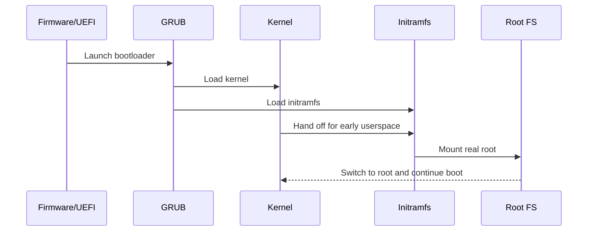

# Chapter 5: Bootloader Setup

Installing and configuring GRUB bootloader with secure boot options.

## Learning objectives

- Install GRUB and create a minimal, secure boot configuration
- Generate an initramfs compatible with your kernel features
- Understand optional Secure Boot flow

## Components

- GRUB installation
- Boot configuration
- Initramfs creation
- Secure boot setup (if applicable)

## Quick start (GRUB + initramfs)

```bash
# Example paths may vary by distro
sudo grub-install --target=x86_64-efi --efi-directory=/boot/efi --bootloader-id=LFS
sudo grub-mkconfig -o /boot/grub/grub.cfg

# initramfs (example using dracut)
sudo dracut --kver "$(uname -r)" --force
```

## Security Considerations

- Password-protect GRUB menu entries (superuser + pbkdf2 hashed password)
- Prefer encrypted root (LUKS) and signed kernel/initramfs for Secure Boot
- Keep minimalistic kernel command line (reduce info leaks)

## Boot flow (diagram)



## Example GRUB menu entry (snippet)

```bash
menuentry 'LFS Custom Kernel' --class gnu-linux {
		linux /boot/vmlinuz-<version> root=/dev/mapper/vg0-root ro quiet apparmor=1 security=apparmor
		initrd /boot/initramfs-<version>.img
}
```

## Exercises

- Exercise 1: Add a GRUB superuser and generate a pbkdf2 password; apply to the default menuentry.
- Exercise 2: Regenerate initramfs including OverlayFS and LUKS modules and confirm it boots.

## Next steps

- Continue to Chapter 6 to configure users, networking, logging and essential services.
