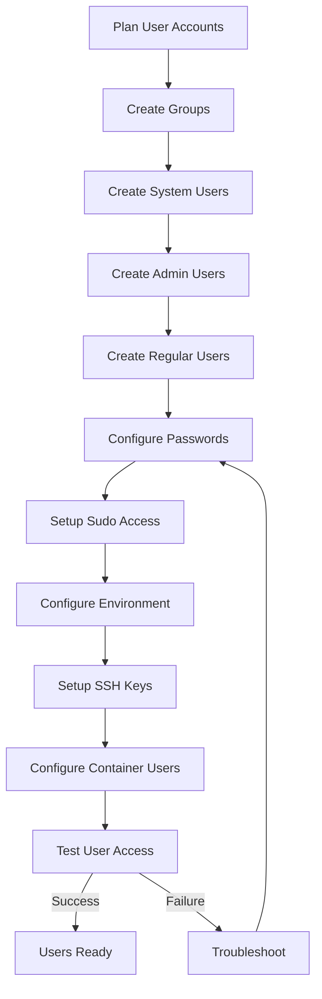

# Users and Groups Setup

## Overview

User and group management forms the foundation of system security and access control in Linux systems. Proper user configuration ensures secure access, audit trails, and appropriate privilege separation for containerized environments where multiple services and users may coexist.

## User and Group Concepts

### User Types

**System Users:**

- **UID Range**: 1-999 (typically)
- **Purpose**: Run system services and daemons
- **Login**: Usually disabled (nologin shell)
- **Examples**: daemon, bin, sys, mail

**Regular Users:**

- **UID Range**: 1000+ (configurable)
- **Purpose**: Human users and applications
- **Login**: Interactive shells allowed
- **Examples**: admin, developer, container users

**Service Users:**

- **Purpose**: Run specific applications/services
- **Privileges**: Minimal required permissions
- **Examples**: www-data, redis, docker

### Group Types

**Primary Groups:**

- **Purpose**: File ownership for new files
- **Naming**: Usually matches username
- **GID**: Same as UID for regular users

**Secondary Groups:**

- **Purpose**: Additional access permissions
- **Examples**: wheel, sudo, docker, admin

**System Groups:**

- **Purpose**: System resource access
- **Examples**: audio, video, disk, network

## User Account Planning

### Security Principles

**Principle of Least Privilege:**

- Users get minimum permissions needed
- Separate accounts for different roles
- Regular privilege escalation via sudo

**Account Separation:**

- No shared accounts
- Unique accounts for services
- Separate admin and user roles

### Container-Specific Considerations

**Container Users:**

- **Unprivileged**: Non-root container users
- **Service Accounts**: For containerized applications
- **Mapped UIDs**: Host-container UID mapping

**Namespace Isolation:**

- User namespaces for container security
- UID/GID mapping between host and containers
- Subordinate UID/GID ranges

## User Creation Process

### Prerequisites

```bash
# Verify required packages
which useradd groupadd passwd
ls /etc/passwd /etc/group /etc/shadow

# Check current users
cat /etc/passwd | tail -10
getent passwd | wc -l
```

### Creating Groups First

**System Groups:**

```bash
# Core system groups
groupadd -g 1 daemon
groupadd -g 2 bin
groupadd -g 3 sys
groupadd -g 4 adm
groupadd -g 6 disk
groupadd -g 10 wheel
groupadd -g 11 floppy
groupadd -g 18 dialout
groupadd -g 19 cdrom
groupadd -g 26 tape
groupadd -g 27 sudo
groupadd -g 50 lock
```

**Container-Specific Groups:**

```bash
# Docker/Podman group
groupadd -g 1001 docker

# Container admin group
groupadd -g 1002 container-admin

# Build user group
groupadd -g 1003 builders
```

### Creating System Users

**Service Users:**

```bash
# Web server user
useradd -r -s /sbin/nologin -d /var/www -c "Web Server" -g www-data www-data

# Database user
useradd -r -s /sbin/nologin -d /var/lib/mysql -c "MySQL Server" -g mysql mysql

# Container runtime user
useradd -r -s /sbin/nologin -d /var/lib/containers -c "Container Runtime" -g docker docker
```

**Build User:**

```bash
# LFS build user
useradd -c "LFS Builder" \
        -g lfs \
        -G wheel \
        -m \
        -s /bin/bash \
        -k /dev/null \
        lfs

# Set password
passwd lfs
```

### Creating Administrative Users

**Primary Admin User:**

```bash
# Create admin group
groupadd -g 1000 admin

# Create admin user
useradd -c "System Administrator" \
        -g admin \
        -G wheel,sudo,docker,container-admin \
        -m \
        -s /bin/bash \
        -u 1000 \
        admin

# Set strong password
passwd admin

# Verify user creation
id admin
groups admin
```

**Additional Admin Users:**

```bash
# Security admin
useradd -c "Security Administrator" \
        -g admin \
        -G wheel,sudo,audit \
        -m \
        -s /bin/bash \
        -u 1001 \
        secadmin

# Container admin
useradd -c "Container Administrator" \
        -g container-admin \
        -G docker,podman \
        -m \
        -s /bin/bash \
        -u 1002 \
        container-admin
```

### Creating Regular Users

**Developer User:**

```bash
# Create developer group
groupadd -g 2000 developers

# Create developer user
useradd -c "Software Developer" \
        -g developers \
        -G docker,builders \
        -m \
        -s /bin/bash \
        -u 2000 \
        developer

# Set password
passwd developer
```

**Container User:**

```bash
# Unprivileged container user
useradd -c "Container User" \
        -g users \
        -G docker \
        -m \
        -s /bin/bash \
        -u 3000 \
        container-user
```

## Password Management

### Password Policies

**Strong Password Requirements:**

```bash
# Configure PAM password policy (/etc/pam.d/system-auth)
# Minimum length, complexity requirements
password requisite pam_pwquality.so retry=3 minlen=12 difok=3
password requisite pam_unix.so use_authtok nullok sha512 shadow
```

**Password Aging:**

```bash
# Set password expiration
chage -m 7 -M 90 -W 7 admin  # Min 7, max 90, warn 7 days

# Check password status
chage -l admin
```

### Password Security

**Password Hashing:**

```bash
# Verify SHA-512 hashing
grep "^admin:" /etc/shadow  # Should show $6$ (SHA-512)

# Upgrade old hashes
usermod -p "$(openssl passwd -6 -salt $(openssl rand -hex 8) 'newpassword')" username
```

## Sudo Configuration

### Basic Sudo Setup

**Install Sudo:**

```bash
# Verify sudo is available
which sudo
sudo --version
```

**Configure Admin Access:**

```bash
# Create sudoers.d directory
mkdir -p /etc/sudoers.d

# Configure admin sudo access
echo "admin ALL=(ALL) ALL" > /etc/sudoers.d/admin
echo "secadmin ALL=(ALL) ALL" > /etc/sudoers.d/secadmin

# Set proper permissions
chmod 440 /etc/sudoers.d/admin
chmod 440 /etc/sudoers.d/secadmin
```

### Advanced Sudo Configuration

**Granular Permissions:**

```bash
# Container admin permissions
cat > /etc/sudoers.d/container-admin << EOF
container-admin ALL=(ALL) NOPASSWD: /usr/bin/docker, /usr/bin/podman
container-admin ALL=(ALL) /usr/bin/systemctl * docker*, /usr/bin/systemctl * podman*
EOF

# Developer permissions
cat > /etc/sudoers.d/developers << EOF
%developers ALL=(ALL) NOPASSWD: /usr/bin/docker build, /usr/bin/docker run
EOF
```

**Sudo Logging:**

```bash
# Enable sudo logging
echo 'Defaults logfile="/var/log/sudo.log"' >> /etc/sudoers
echo 'Defaults log_input,log_output' >> /etc/sudoers

# Create log file
touch /var/log/sudo.log
chmod 600 /var/log/sudo.log
```

## User Environment Setup

### Shell Configuration

**Bash Profile Setup:**

```bash
# Create .bashrc for admin user
cat > /home/admin/.bashrc << 'EOF'
# User specific environment
export PATH="$HOME/bin:$PATH"
export EDITOR="vim"
export PAGER="less"

# Container aliases
alias dps='docker ps'
alias dlogs='docker logs'
alias k='kubectl'

# Prompt customization
PS1='\u@\h:\w\$ '
EOF

chown admin:admin /home/admin/.bashrc
```

**Global Bash Configuration:**

```bash
# System-wide bashrc
cat >> /etc/bash.bashrc << 'EOF'
# System-wide aliases
alias ll='ls -alF'
alias la='ls -A'
alias l='ls -CF'

# Container functions
dexec() {
    docker exec -it "$1" /bin/bash
}

# Security reminder
echo "Remember: Use sudo for administrative tasks"
EOF
```

### SSH Key Setup

**Generate SSH Keys:**

```bash
# Switch to admin user
su - admin

# Generate key pair
ssh-keygen -t ed25519 -C "admin@lfs-system"

# Copy public key
cat ~/.ssh/id_ed25519.pub >> ~/.ssh/authorized_keys
chmod 600 ~/.ssh/authorized_keys
```

## Container User Management

### UID/GID Mapping

**Subordinate ID Configuration:**

```bash
# Configure subordinate UIDs/GIDs for admin user
usermod --add-subuids 100000-165535 admin
usermod --add-subgids 100000-165535 admin

# Verify mapping
grep admin /etc/subuid /etc/subgid
```

**Container User Creation:**

```bash
# Create users for container isolation
for i in {1..10}; do
    useradd -M -N -s /sbin/nologin container$i
done

# Verify users
getent passwd | grep container
```

### Rootless Container Setup

**Enable Rootless Containers:**

```bash
# Add users to subuid/subgid
echo "admin:100000:65536" >> /etc/subuid
echo "admin:100000:65536" >> /etc/subgid

# Configure linger for systemd user services
loginctl enable-linger admin

# Test rootless podman
su - admin -c "podman run --rm hello-world"
```

## Security Hardening

### Account Security

**Disable Unused Accounts:**

```bash
# Lock system accounts
usermod -L daemon
usermod -L bin

# Remove shell access
usermod -s /sbin/nologin games
```

**Password Policies:**

```bash
# Configure login.defs
cat >> /etc/login.defs << EOF
PASS_MAX_DAYS   90
PASS_MIN_DAYS   7
PASS_WARN_AGE   7
UID_MIN         1000
GID_MIN         1000
EOF
```

### Audit User Activity

**Enable User Auditing:**

```bash
# Configure audit for user actions
cat > /etc/audit/rules.d/user-audit.rules << EOF
-w /etc/passwd -p wa -k passwd_changes
-w /etc/shadow -p wa -k shadow_changes
-w /etc/sudoers -p wa -k sudo_changes
EOF

# Restart audit
systemctl restart auditd
```

## User Management Tools

### User Information Commands

```bash
# List all users
getent passwd | cut -d: -f1

# List all groups
getent group | cut -d: -f1

# User details
id admin
groups admin

# Last login information
lastlog
last admin
```

### User Modification

**Change User Properties:**

```bash
# Change username
usermod -l newname oldname

# Change home directory
usermod -d /new/home -m username

# Add to groups
usermod -aG docker,builders username

# Change shell
usermod -s /bin/zsh username
```

**User Deletion:**

```bash
# Remove user and home directory
userdel -r olduser

# Remove user but keep home
userdel olduser
```

## Troubleshooting

### Common Issues

**User Creation Failures:**

```bash
# Check UID/GID conflicts
getent passwd | grep ":1000:"
getent group | grep ":1000:"

# Verify filesystem permissions
ls -ld /home
```

**Sudo Access Problems:**

```bash
# Check sudoers syntax
visudo -c

# Verify group membership
groups admin | grep sudo

# Check sudo logs
tail /var/log/sudo.log
```

**Container User Issues:**

```bash
# Check subordinate IDs
cat /etc/subuid /etc/subgid

# Verify namespace support
grep CONFIG_USER_NS /boot/config-*
```

### Recovery Procedures

**Reset Root Password:**

```bash
# Boot into single user mode
# At GRUB menu, edit entry and add: init=/bin/bash
# Mount root read-write: mount -o remount,rw /
# Reset password: passwd root
# Reboot
```

**Restore Sudo Access:**

```bash
# Boot as root or single user
# Edit sudoers: visudo
# Add: admin ALL=(ALL) ALL
# Save and exit
```

## User Management Workflow Diagram



## Exercises

### Exercise 1: Basic User Creation

1. Create necessary system groups (wheel, sudo, docker)
2. Create an admin user with appropriate group memberships
3. Set a strong password for the admin user
4. Verify user creation with `id` and `groups` commands
5. Test login as the new user

**Expected Outcome**: Functional admin user with proper group memberships

### Exercise 2: Sudo Configuration

1. Install and configure sudo
2. Create sudoers configuration for admin user
3. Test sudo access: `sudo whoami`
4. Configure sudo logging
5. Review sudo logs after test commands

**Expected Outcome**: Working sudo configuration with logging

### Exercise 3: Container User Setup

1. Create container-specific groups (docker, container-admin)
2. Create container admin user with appropriate permissions
3. Configure subordinate UIDs/GIDs for rootless containers
4. Test rootless container execution
5. Verify container user isolation

**Expected Outcome**: Container-ready user environment with proper isolation

### Exercise 4: Password Security

1. Configure password policies in PAM
2. Set password aging for admin user
3. Test password complexity requirements
4. Verify password hashing (SHA-512)
5. Document password security measures

**Expected Outcome**: Secure password configuration and policies

### Exercise 5: User Environment Setup

1. Configure global bash settings
2. Create user-specific bash profiles
3. Set up useful aliases and functions
4. Configure SSH key authentication
5. Test environment customizations

**Expected Outcome**: Customized user environment for productivity

### Exercise 6: User Audit and Monitoring

1. Configure audit rules for user actions
2. Monitor user login/logout events
3. Set up sudo logging
4. Review audit logs
5. Create user activity reports

**Expected Outcome**: Comprehensive user activity monitoring

### Exercise 7: Recovery Procedures

1. Practice password reset procedure
2. Test account lockout recovery
3. Create backup user for emergencies
4. Document recovery procedures
5. Test recovery scenarios

**Expected Outcome**: Reliable user account recovery procedures

## Next Steps

With users and groups properly configured, proceed to Chapter 6.2 for networking setup. The networking configuration will enable communication between containers and external services while maintaining security boundaries.

## References

- User Management: https://man7.org/linux/man-pages/man8/useradd.8.html
- Sudo Configuration: https://man7.org/linux/man-pages/man5/sudoers.5.html
- PAM Configuration: https://linux-pam.org/
- Container User Namespaces: https://man7.org/linux/man-pages/man7/user_namespaces.7.html
- Rootless Containers: https://rootlesscontaine.rs/
