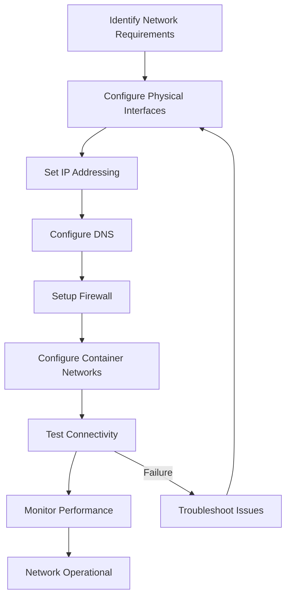

# Networking Setup

## Overview

Network configuration is critical for a container-ready Linux distribution, enabling connectivity between containers, external services, and the host system. Proper networking ensures secure communication, efficient resource utilization, and seamless container orchestration.

## Network Architecture

### Network Stack Components

**Core Components:**

- **Network Interfaces**: Physical/virtual network devices
- **IP Addressing**: IPv4/IPv6 address assignment
- **Routing**: Traffic path determination
- **DNS Resolution**: Name to IP address translation
- **Firewall**: Network traffic filtering
- **Network Namespaces**: Container network isolation

**Kernel Network Stack - Code References**:

- `net/core/dev.c`: Network device management
  - `netdev_register()`: Register network devices
  - `netif_receive_skb()`: Packet reception
  - `dev_queue_xmit()`: Packet transmission

- `net/ipv4/ip_input.c`: IPv4 packet processing
  - `ip_rcv()`: IPv4 packet reception
  - `ip_forward()`: Packet forwarding

- `net/ipv4/route.c`: IPv4 routing
  - `ip_route_input()`: Routing decision for incoming packets
  - `fib_lookup()`: Routing table lookup

- `net/core/rtnetlink.c`: Network configuration via netlink
  - Used by `ip` command for interface configuration

- `net/core/net_namespace.c`: Network namespace implementation
  - `copy_net_ns()`: Create network namespace for containers

**Container Networking:**

- **Bridge Networks**: Docker-style bridged networking
  - `net/bridge/`: Linux bridge implementation
  - `net/bridge/br_forward.c`: Bridge packet forwarding

- **Overlay Networks**: Multi-host container networking
  - `net/openvswitch/`: Open vSwitch for overlay networks
  - `drivers/net/vxlan.c`: VXLAN tunneling

- **Host Networks**: Direct host network access
- **None Networks**: Isolated networking

### Network Configuration Tools

**Traditional Tools:**

- **ifconfig/ip**: Interface configuration
- **route/ip route**: Routing table management
- **resolv.conf**: DNS configuration

**Modern Tools:**

- **NetworkManager**: Dynamic network management
- **systemd-networkd**: Declarative configuration
- **nftables**: Next-generation firewall
- **WireGuard**: VPN and secure networking

## Basic Network Configuration

### Interface Identification

```bash
# List network interfaces
ip link show
ls /sys/class/net/

# Interface details
ip addr show
ip route show

# Hardware information
lspci | grep -i network
lsusb | grep -i network
```

### DHCP Configuration

**Using dhcpcd:**

```bash
# Install dhcpcd
pacman -S dhcpcd

# Configure for specific interface
cat > /etc/dhcpcd.conf << EOF
# DHCP client configuration
hostname
duid
persistent
option rapid_commit
option domain_name_servers, domain_name, domain_search
option classless_static_routes
option ntp_servers
require dhcp_server_identifier
slaac private
EOF

# Enable for interface
systemctl enable dhcpcd@eth0
systemctl start dhcpcd@eth0
```

**Using systemd-networkd:**

```bash
# Create DHCP network configuration
cat > /etc/systemd/network/20-dhcp.network << EOF
[Match]
Name=en*

[Network]
DHCP=yes

[DHCP]
UseDNS=yes
UseNTP=yes
EOF

# Enable systemd-networkd
systemctl enable systemd-networkd
systemctl start systemd-networkd
```

### Static IP Configuration

**systemd-networkd Static Configuration:**

```bash
cat > /etc/systemd/network/10-static-eth0.network << EOF
[Match]
Name=eth0

[Network]
Address=192.168.1.100/24
Gateway=192.168.1.1
DNS=192.168.1.1
DNS=8.8.8.8
Domains=localdomain

[Route]
Gateway=192.168.1.1
Destination=192.168.0.0/16
EOF

systemctl restart systemd-networkd
```

**NetworkManager Static Configuration:**

```bash
# Create connection
nmcli connection add type ethernet con-name static-eth0 ifname eth0

# Configure IP settings
nmcli connection modify static-eth0 ipv4.addresses 192.168.1.100/24
nmcli connection modify static-eth0 ipv4.gateway 192.168.1.1
nmcli connection modify static-eth0 ipv4.dns 192.168.1.1,8.8.8.8
nmcli connection modify static-eth0 ipv4.method manual

# Activate connection
nmcli connection up static-eth0
```

## Advanced Network Features

### IPv6 Configuration

**IPv6 with systemd-networkd:**

```bash
cat > /etc/systemd/network/10-ipv6.network << EOF
[Match]
Name=eth0

[Network]
Address=2001:db8::100/64
Gateway=2001:db8::1
DNS=2001:db8::1
EOF

# Enable IPv6 forwarding if needed
echo "net.ipv6.conf.all.forwarding=1" >> /etc/sysctl.d/99-ipv6.conf
sysctl -p /etc/sysctl.d/99-ipv6.conf
```

**IPv6 Privacy Extensions:**

```bash
# Enable privacy addresses
cat > /etc/systemd/network/ipv6-privacy.network << EOF
[Match]
Name=eth0

[Network]
IPv6PrivacyExtensions=yes
EOF
```

### Bonding and Teaming

**Network Bonding:**

```bash
# Create bond interface
ip link add bond0 type bond
ip link set eth0 master bond0
ip link set eth1 master bond0

# Configure bonding
echo "+bond0" > /sys/class/net/bonding_masters
echo "802.3ad" > /sys/class/net/bond0/bonding/mode
echo "100" > /sys/class/net/bond0/bonding/miimon

# systemd-networkd bonding
cat > /etc/systemd/network/30-bond0.netdev << EOF
[NetDev]
Name=bond0
Kind=bond

[Bond]
Mode=802.3ad
MIIMonitorSec=100ms
EOF
```

### VLAN Configuration

**VLAN Setup:**

```bash
# Create VLAN interface
ip link add link eth0 name eth0.100 type vlan id 100
ip addr add 192.168.100.100/24 dev eth0.100
ip link set eth0.100 up

# systemd-networkd VLAN
cat > /etc/systemd/network/25-vlan100.netdev << EOF
[NetDev]
Name=vlan100
Kind=vlan

[VLAN]
Id=100
EOF

cat > /etc/systemd/network/25-vlan100.network << EOF
[Match]
Name=vlan100

[Network]
Address=192.168.100.100/24
EOF
```

## DNS Configuration

### Local DNS Resolution

**systemd-resolved:**

```bash
# Enable systemd-resolved
systemctl enable systemd-resolved
systemctl start systemd-resolved

# Configure DNS
cat > /etc/systemd/resolved.conf << EOF
[Resolve]
DNS=192.168.1.1 8.8.8.8 1.1.1.1
Domains=localdomain
LLMNR=yes
MulticastDNS=yes
EOF

systemctl restart systemd-resolved
```

**Custom resolv.conf:**

```bash
cat > /etc/resolv.conf << EOF
nameserver 192.168.1.1
nameserver 8.8.8.8
nameserver 1.1.1.1
search localdomain
options timeout:2 attempts:3 rotate
EOF
```

### DNS Caching and Forwarding

**Unbound DNS Resolver:**

```bash
# Install unbound
pacman -S unbound

# Configure caching resolver
cat > /etc/unbound/unbound.conf << EOF
server:
    interface: 127.0.0.1
    do-tcp: yes
    do-udp: yes
    access-control: 127.0.0.0/8 allow
    access-control: 192.168.0.0/16 allow
    cache-max-ttl: 14400
    cache-min-ttl: 1200
    prefetch: yes
    num-threads: 2

forward-zone:
    name: "."
    forward-addr: 8.8.8.8
    forward-addr: 1.1.1.1
EOF

systemctl enable unbound
systemctl start unbound
```

## Firewall Configuration

### nftables Setup

**Basic Firewall Rules:**

```bash
# Create nftables configuration
cat > /etc/nftables.conf << EOF
#!/usr/sbin/nft -f

flush ruleset

table inet filter {
    chain input {
        type filter hook input priority 0; policy drop;

        # Allow loopback
        iif lo accept

        # Allow established connections
        ct state established,related accept

        # Allow ICMP
        ip protocol icmp accept
        ip6 nexthdr icmpv6 accept

        # Allow SSH
        tcp dport 22 accept

        # Allow HTTP/HTTPS for containers
        tcp dport { 80, 443 } accept

        # Allow Docker networks
        iif docker0 accept
        iif docker_gwbridge accept

        # Log dropped packets
        log prefix "nftables-dropped: " drop
    }

    chain forward {
        type filter hook forward priority 0; policy accept;

        # Container forwarding rules
        iif docker0 oif eth0 accept
        iif eth0 oif docker0 ct state established,related accept
    }

    chain output {
        type filter hook output priority 0; policy accept;
    }
}

table inet nat {
    chain prerouting {
        type nat hook prerouting priority -100; policy accept;
    }

    chain postrouting {
        type nat hook postrouting priority 100; policy accept;

        # Masquerade for containers
        oif eth0 masquerade
    }
}
EOF

# Enable nftables
systemctl enable nftables
systemctl start nftables
```

### Container Network Security

**Docker Network Security:**

```bash
# Create secure Docker network
docker network create --driver bridge \
                      --subnet 172.20.0.0/16 \
                      --opt com.docker.network.bridge.name=docker1 \
                      --opt com.docker.network.bridge.enable_icc=false \
                      --opt com.docker.network.bridge.enable_ip_masquerade=true \
                      secure-net

# Run container with network restrictions
docker run --network secure-net \
           --cap-drop ALL \
           --read-only \
           --tmpfs /tmp \
           nginx:latest
```

**Podman Network Security:**

```bash
# Create podman network with isolation
podman network create --driver bridge \
                      --subnet 10.89.0.0/24 \
                      --gateway 10.89.0.1 \
                      --disable-dns \
                      isolated-net

# Run podman container
podman run --network isolated-net \
           --security-opt no-new-privileges \
           --read-only \
           nginx:latest
```

## Container Networking

### Docker Networking

**Network Types:**

```bash
# Bridge network (default)
docker network create my-bridge-net

# Overlay network for swarm
docker network create --driver overlay my-overlay-net

# Host network (no isolation)
docker run --network host nginx

# None network (isolated)
docker run --network none nginx
```

**Docker Compose Networking:**

```yaml
version: "3.8"
services:
  web:
    image: nginx
    networks:
      - frontend
  db:
    image: postgres
    networks:
      - backend
networks:
  frontend:
    driver: bridge
  backend:
    driver: bridge
    internal: true
```

### Podman Networking

**Podman Networks:**

```bash
# Create custom network
podman network create --driver bridge \
                      --subnet 10.89.1.0/24 \
                      my-podman-net

# Run container on network
podman run --network my-podman-net \
           --name web \
           -p 8080:80 \
           nginx

# Pod networking
podman pod create --name mypod -p 8080:80
podman run --pod mypod --name web nginx
podman run --pod mypod --name db postgres
```

### Advanced Container Networking

**CNI Configuration:**

```bash
# Install CNI plugins
pacman -S cni-plugins

# Configure CNI network
cat > /etc/cni/net.d/10-mynet.conf << EOF
{
    "cniVersion": "0.4.0",
    "name": "mynet",
    "type": "bridge",
    "bridge": "cni0",
    "isGateway": true,
    "ipMasq": true,
    "ipam": {
        "type": "host-local",
        "subnet": "10.88.0.0/16",
        "routes": [
            { "dst": "0.0.0.0/0" }
        ]
    }
}
EOF
```

## Network Monitoring and Troubleshooting

### Network Diagnostics

```bash
# Interface status
ip addr show
ip link show

# Routing table
ip route show
ip -6 route show

# ARP table
ip neigh show

# DNS resolution
nslookup google.com
dig @8.8.8.8 google.com

# Connectivity tests
ping -c 4 8.8.8.8
traceroute google.com
```

### Container Network Troubleshooting

**Docker Networking:**

```bash
# List networks
docker network ls

# Inspect network
docker network inspect bridge

# Container network info
docker exec web cat /etc/resolv.conf
docker exec web ip route

# Network connectivity
docker exec web ping google.com
```

**Podman Networking:**

```bash
# Network inspection
podman network ls
podman network inspect podman

# Container networking
podman exec web ip addr
podman exec web ip route
```

### Firewall Troubleshooting

```bash
# Check nftables rules
nft list ruleset

# Monitor dropped packets
journalctl -f | grep nftables-dropped

# Test connectivity
curl -v google.com
telnet google.com 80
```

## Network Security

### Network Hardening

**TCP Hardening:**

```bash
# Kernel network security
cat > /etc/sysctl.d/99-network-security.conf << EOF
# Disable IP forwarding
net.ipv4.ip_forward=0
net.ipv6.conf.all.forwarding=0

# Disable source routing
net.ipv4.conf.all.accept_source_route=0
net.ipv6.conf.all.accept_source_route=0

# Enable SYN cookies
net.ipv4.tcp_syncookies=1

# Disable ICMP redirects
net.ipv4.conf.all.accept_redirects=0
net.ipv6.conf.all.accept_redirects=0

# Enable reverse path filtering
net.ipv4.conf.all.rp_filter=1
EOF

sysctl -p /etc/sysctl.d/99-network-security.conf
```

**Container Network Security:**

```bash
# Docker daemon security
cat > /etc/docker/daemon.json << EOF
{
  "icc": false,
  "iptables": true,
  "userns-remap": "default",
  "no-new-privileges": true,
  "live-restore": true
}
EOF
```

### VPN and Secure Networking

**WireGuard Setup:**

```bash
# Install WireGuard
pacman -S wireguard-tools

# Generate keys
wg genkey | tee privatekey | wg pubkey > publickey

# Configure interface
cat > /etc/systemd/network/30-wg0.netdev << EOF
[NetDev]
Name=wg0
Kind=wireguard

[WireGuard]
PrivateKey=PRIVATE_KEY_HERE
ListenPort=51820

[WireGuardPeer]
PublicKey=PEER_PUBLIC_KEY
AllowedIPs=10.0.0.2/32
Endpoint=peer.example.com:51820
EOF

cat > /etc/systemd/network/30-wg0.network << EOF
[Match]
Name=wg0

[Network]
Address=10.0.0.1/24
EOF

systemctl restart systemd-networkd
```

## Network Performance Optimization

### TCP Optimization

```bash
cat > /etc/sysctl.d/99-tcp-optimization.conf << EOF
# TCP optimizations
net.core.somaxconn=1024
net.core.netdev_max_backlog=5000
net.ipv4.tcp_max_syn_backlog=1024

# Buffer sizes
net.core.rmem_default=1048576
net.core.rmem_max=16777216
net.core.wmem_default=1048576
net.core.wmem_max=16777216
net.ipv4.tcp_rmem=4096 87380 16777216
net.ipv4.tcp_wmem=4096 65536 16777216

# Keepalive settings
net.ipv4.tcp_keepalive_time=600
net.ipv4.tcp_keepalive_intvl=60
net.ipv4.tcp_keepalive_probes=3
EOF

sysctl -p /etc/sysctl.d/99-tcp-optimization.conf
```

### Container Network Performance

**Docker Performance:**

```bash
# Optimize Docker networking
cat >> /etc/docker/daemon.json << EOF
{
  "mtu": 1450,
  "default-address-pools": [
    {"base": "172.80.0.0/16", "size": 24}
  ]
}
EOF

# Use host networking for performance-critical apps
docker run --network host --cap-drop ALL nginx
```

## Network Workflow Diagram



## Exercises

### Exercise 1: Basic Network Configuration

1. Identify available network interfaces: `ip link show`
2. Configure DHCP networking using systemd-networkd
3. Set up static IP configuration
4. Configure DNS resolution with systemd-resolved
5. Test connectivity: `ping 8.8.8.8` and `curl google.com`

**Expected Outcome**: System connected to network with proper IP and DNS

### Exercise 2: Firewall Setup

1. Install and configure nftables
2. Create basic firewall rules for SSH and HTTP
3. Add container network rules
4. Test firewall functionality
5. Monitor dropped packets: `journalctl -f | grep nftables`

**Expected Outcome**: Secure firewall protecting the system

### Exercise 3: Container Networking

1. Create custom Docker network with isolation
2. Run containers on the custom network
3. Configure Podman networking
4. Test inter-container communication
5. Verify network isolation: `docker network inspect`

**Expected Outcome**: Containers running on secure, isolated networks

### Exercise 4: Advanced Network Features

1. Configure IPv6 networking
2. Set up VLAN interfaces
3. Configure network bonding
4. Test advanced configurations
5. Verify functionality: `ip addr show`

**Expected Outcome**: Advanced networking features working correctly

### Exercise 5: Network Security Hardening

1. Apply network kernel security settings
2. Configure TCP hardening
3. Set up secure container networking
4. Test security measures
5. Verify configurations: `sysctl -a | grep net`

**Expected Outcome**: Network security properly hardened

### Exercise 6: VPN Configuration

1. Install WireGuard
2. Generate cryptographic keys
3. Configure WireGuard interface
4. Set up peer connections
5. Test VPN connectivity

**Expected Outcome**: Secure VPN connection established

### Exercise 7: Network Monitoring and Troubleshooting

1. Set up network monitoring tools
2. Configure log monitoring for network events
3. Test network troubleshooting procedures
4. Create network diagnostic scripts
5. Document troubleshooting procedures

**Expected Outcome**: Comprehensive network monitoring and troubleshooting setup

## Next Steps

With networking properly configured, proceed to Chapter 6.3 for system services setup. The services will utilize this network configuration for communication and container orchestration.

## References

- systemd-networkd: https://www.freedesktop.org/software/systemd/man/systemd.network.html
- nftables: https://wiki.nftables.org/
- Docker Networking: https://docs.docker.com/network/
- Podman Networking: https://docs.podman.io/en/latest/markdown/podman-network.1.html
- WireGuard: https://www.wireguard.com/
