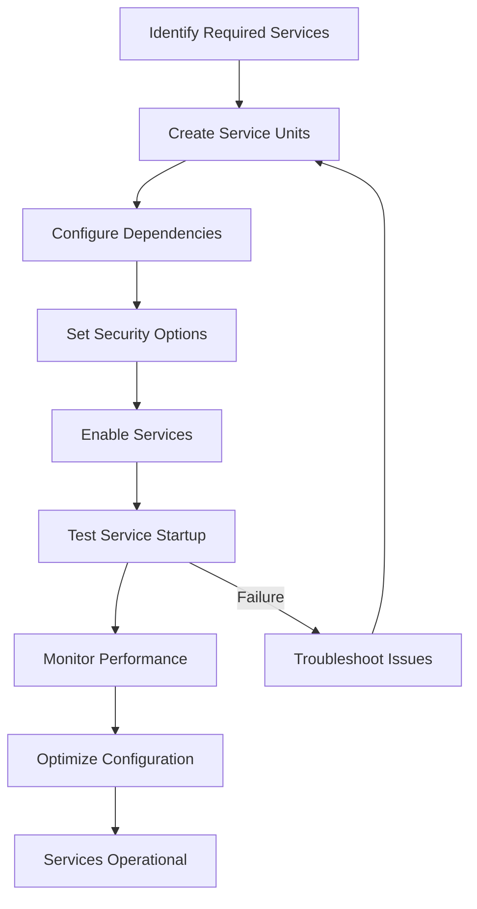

# System Services

## Overview

System services form the backbone of a Linux distribution, providing essential functionality for system management, networking, security, and container orchestration. In a container-ready Linux distribution, services must be carefully configured to support container runtimes while maintaining security and performance.

## Systemd Architecture

### Service Types

**Service Units:**

- **.service**: Traditional daemons and applications
- **.socket**: Socket-based activation
- **.timer**: Scheduled tasks (cron replacement)
- **.path**: Filesystem-based activation
- **.target**: Synchronization points

**Container-Related Units:**

- **.container**: systemd-nspawn containers
- **.pod**: Podman pod units
- **.network**: Network configuration
- **.mount**: Filesystem mounts

### Service Lifecycle

```
Created → Loaded → Active → Running/Degraded/Failed → Stopped → Dead
```

### Unit Dependencies

**Requires vs Wants:**

- **Requires**: Hard dependency - failure prevents startup
- **Wants**: Soft dependency - failure allows startup
- **Before/After**: Ordering constraints

## Essential System Services

### Core System Services

**System Logging (rsyslog/systemd-journald):**

```bash
# Enable persistent logging
mkdir -p /var/log/journal
systemctl enable systemd-journald
systemctl start systemd-journald

# Configure journal limits
cat > /etc/systemd/journald.conf << EOF
[Journal]
Storage=persistent
Compress=yes
Seal=yes
SplitMode=uid
RateLimitInterval=30s
RateLimitBurst=1000
EOF

systemctl restart systemd-journald
```

**Time Synchronization (systemd-timesyncd):**

```bash
# Enable NTP
systemctl enable systemd-timesyncd
systemctl start systemd-timesyncd

# Configure NTP servers
cat > /etc/systemd/timesyncd.conf << EOF
[Time]
NTP=0.pool.ntp.org 1.pool.ntp.org
FallbackNTP=2.pool.ntp.org 3.pool.ntp.org
RootDistanceMaxSec=5
PollIntervalMinSec=32
PollIntervalMaxSec=2048
EOF

systemctl restart systemd-timesyncd
timedatectl set-ntp true
```

**D-Bus System Bus:**

```bash
# Enable D-Bus for inter-process communication
systemctl enable dbus
systemctl start dbus

# Verify D-Bus functionality
dbus-send --system --dest=org.freedesktop.DBus \
          --type=method_call \
          --print-reply \
          /org/freedesktop/DBus \
          org.freedesktop.DBus.ListNames
```

### Security Services

**Audit Daemon:**

```bash
# Enable system auditing
systemctl enable auditd
systemctl start auditd

# Configure audit rules
cat > /etc/audit/rules.d/system.rules << EOF
# System integrity
-w /etc/passwd -p wa -k identity
-w /etc/group -p wa -k identity
-w /etc/shadow -p wa -k identity
-w /etc/sudoers -p wa -k sudo

# Network configuration
-w /etc/network/ -p wa -k network

# Service changes
-w /etc/systemd/system/ -p wa -k systemd
EOF

systemctl restart auditd
```

**Security Modules:**

```bash
# AppArmor
systemctl enable apparmor
systemctl start apparmor

# SELinux (if enabled)
# systemctl enable selinux-autorelabel
# systemctl start selinux-autorelabel
```

### Networking Services

**Network Manager:**

```bash
# Enable NetworkManager for dynamic networking
systemctl enable NetworkManager
systemctl start NetworkManager

# Configure basic network
nmcli connection add type ethernet con-name eth0 ifname eth0
nmcli connection modify eth0 ipv4.method auto
nmcli connection up eth0
```

**SSH Daemon:**

```bash
# Install and configure SSH
pacman -S openssh

# Configure SSH server
cat > /etc/ssh/sshd_config << EOF
# Security hardening
PermitRootLogin no
PasswordAuthentication no
PubkeyAuthentication yes
PermitEmptyPasswords no
ChallengeResponseAuthentication no
UsePAM yes
X11Forwarding no
PrintMotd no
AcceptEnv LANG LC_*
Subsystem sftp /usr/lib/openssh/sftp-server
EOF

# Generate host keys
ssh-keygen -A

# Enable and start SSH
systemctl enable sshd
systemctl start sshd
```

### Container Runtime Services

**Docker Service:**

```bash
# Enable Docker daemon
systemctl enable docker
systemctl start docker

# Configure Docker daemon
cat > /etc/docker/daemon.json << EOF
{
  "log-driver": "journald",
  "storage-driver": "overlay2",
  "iptables": true,
  "bridge": "docker0",
  "default-ulimits": {
    "nofile": {
      "Name": "nofile",
      "Hard": 64000,
      "Soft": 64000
    }
  }
}
EOF

systemctl restart docker
```

**Podman Service:**

```bash
# Enable Podman socket for rootless containers
systemctl enable --user podman.socket
systemctl start --user podman.socket

# Configure registries
cat > /etc/containers/registries.conf << EOF
[registries.search]
registries = ['docker.io', 'registry.fedoraproject.org']

[registries.insecure]
registries = []

[registries.block]
registries = []
EOF
```

**Container Registry:**

```bash
# Enable container registry service
systemctl enable docker-registry
systemctl start docker-registry

# Configure registry
cat > /etc/docker/registry/config.yml << EOF
version: 0.1
log:
  fields:
    service: registry
storage:
  cache:
    blobdescriptor: inmemory
  filesystem:
    rootdirectory: /var/lib/registry
http:
  addr: :5000
  tls:
    certificate: /etc/ssl/docker-registry.crt
    key: /etc/ssl/docker-registry.key
EOF
```

## Service Management Commands

### Basic Service Control

```bash
# Check service status
systemctl status sshd
systemctl is-active sshd
systemctl is-enabled sshd

# Start/stop services
systemctl start sshd
systemctl stop sshd
systemctl restart sshd

# Enable/disable at boot
systemctl enable sshd
systemctl disable sshd
```

### Advanced Service Management

**Service Analysis:**

```bash
# Show service details
systemctl show sshd

# List all services
systemctl list-units --type=service

# Show failed services
systemctl --failed

# Show service dependencies
systemctl list-dependencies sshd
```

**Service Logs:**

```bash
# View service logs
journalctl -u sshd
journalctl -u sshd --since "1 hour ago"
journalctl -u sshd -f  # Follow logs

# System logs
journalctl -b  # Current boot
journalctl --vacuum-time=2weeks  # Clean old logs
```

### Service Customization

**Creating Custom Services:**

```bash
# Create custom service unit
cat > /etc/systemd/system/myapp.service << EOF
[Unit]
Description=My Application
After=network.target

[Service]
Type=simple
User=myapp
ExecStart=/usr/local/bin/myapp
Restart=always
RestartSec=5

[Install]
WantedBy=multi-user.target
EOF

# Reload systemd and enable
systemctl daemon-reload
systemctl enable myapp
systemctl start myapp
```

**Timer Units (Cron Replacement):**

```bash
# Create timer for daily backup
cat > /etc/systemd/system/backup.timer << EOF
[Unit]
Description=Daily backup timer

[Timer]
OnCalendar=daily
Persistent=true

[Install]
WantedBy=timers.target
EOF

cat > /etc/systemd/system/backup.service << EOF
[Unit]
Description=Daily backup

[Service]
Type=oneshot
ExecStart=/usr/local/bin/backup-script
EOF

systemctl enable backup.timer
systemctl start backup.timer
```

## Container Integration

### Podman Quadlet Files

**Container Units:**

```bash
# Create container quadlet
cat > ~/.config/containers/systemd/mycontainer.container << EOF
[Unit]
Description=My Container App

[Container]
Image=docker.io/myapp:latest
PublishPort=8080:80
Volume=/host/data:/container/data:Z

[Install]
WantedBy=default.target
EOF

# Generate and start
systemctl --user daemon-reload
systemctl --user enable mycontainer.service
systemctl --user start mycontainer.service
```

**Pod Units:**

```bash
# Create pod quadlet
cat > ~/.config/containers/systemd/mypod.pod << EOF
[Unit]
Description=My Application Pod

[Pod]
PublishPort=8080:80

[Install]
WantedBy=default.target
EOF

# Create containers in pod
cat > ~/.config/containers/systemd/web.container << EOF
[Unit]
Description=Web Server
BindsTo=mypod.service

[Container]
Image=nginx:latest
Pod=mypod

[Install]
WantedBy=default.target
EOF
```

### Docker Compose Integration

**Systemd Service for Compose:**

```bash
cat > /etc/systemd/system/docker-compose-app.service << EOF
[Unit]
Description=Docker Compose Application
Requires=docker.service
After=docker.service

[Service]
Type=oneshot
RemainAfterExit=yes
WorkingDirectory=/path/to/compose/dir
ExecStart=/usr/bin/docker-compose up -d
ExecStop=/usr/bin/docker-compose down
TimeoutStartSec=0

[Install]
WantedBy=multi-user.target
EOF

systemctl enable docker-compose-app
```

## Security Hardening

### Service Isolation

**User/Service Isolation:**

```bash
# Run service as unprivileged user
cat > /etc/systemd/system/secure-app.service << EOF
[Unit]
Description=Secure Application

[Service]
Type=simple
User=appuser
Group=appgroup
NoNewPrivileges=yes
ProtectHome=yes
ProtectSystem=strict
ReadWritePaths=/var/lib/myapp
PrivateTmp=yes
PrivateDevices=yes
ProtectKernelTunables=yes
ProtectControlGroups=yes
ExecStart=/usr/local/bin/myapp
EOF
```

**Kernel Code References for Systemd Security Features**:

- **NoNewPrivileges**: Uses `prctl(PR_SET_NO_NEW_PRIVS)` syscall
  - `kernel/sys.c`: `prctl()` implementation
  - `include/linux/sched.h`: `no_new_privs` flag in task struct

- **PrivateNetwork**: Creates network namespace
  - `net/core/net_namespace.c`: Network namespace creation
  - Uses `unshare(CLONE_NEWNET)` syscall

- **ProtectKernelTunables**: Makes `/proc/sys` read-only
  - `fs/proc/proc_sysctl.c`: Sysctl filesystem implementation
  - Uses mount namespace with read-only bind mounts

- **PrivateTmp**: Creates private `/tmp` mount
  - `fs/namespace.c`: Mount namespace and tmpfs setup

- **CGroups**: Resource limits enforced by cgroups
  - `kernel/cgroup/cgroup.c`: Cgroup resource limits

**Network Isolation:**

```bash
# Network namespace isolation
cat > /etc/systemd/system/isolated-app.service << EOF
[Unit]
Description=Network Isolated App

[Service]
Type=simple
User=isolated
PrivateNetwork=yes
ExecStart=/usr/local/bin/myapp

[Install]
WantedBy=multi-user.target
EOF
```

### Resource Limits

**CPU and Memory Limits:**

```bash
cat > /etc/systemd/system/limited-app.service << EOF
[Unit]
Description=Resource Limited App

[Service]
Type=simple
CPUQuota=50%
MemoryLimit=512M
TasksMax=100
ExecStart=/usr/local/bin/myapp

[Install]
WantedBy=multi-user.target
EOF
```

**Kernel Code References for Resource Limits**:

- **CPUQuota**: Uses CPU cgroup controller
  - `kernel/sched/core.c`: CPU bandwidth enforcement
  - `kernel/cgroup/cgroup.c`: Cgroup attachment and limits

- **MemoryLimit**: Uses memory cgroup controller
  - `mm/memcontrol.c`: Memory limit enforcement
  - `mm/oom_kill.c`: OOM killer triggered when limit exceeded

- **TasksMax**: Uses PID cgroup controller
  - `kernel/cgroup/pids.c`: Process count limiting
  - Prevents fork bombs and resource exhaustion

- **IOWeight/IODeviceWeight**: Block I/O cgroup
  - `block/blk-cgroup.c`: I/O bandwidth control
  - `block/blk-throttle.c`: I/O throttling implementation

## Monitoring and Troubleshooting

### Service Monitoring

**Systemd Monitoring:**

```bash
# Monitor service states
systemctl status
watch systemctl list-units --failed

# Service health checks
systemctl is-system-running
systemctl --failed --no-pager
```

**Performance Monitoring:**

```bash
# Service resource usage
systemd-cgtop
systemd-cgls /user.slice/user-1000.slice

# Analyze boot performance
systemd-analyze blame
systemd-analyze critical-chain
```

### Troubleshooting Common Issues

**Service Startup Failures:**

```bash
# Check service status and logs
systemctl status failed-service
journalctl -u failed-service --no-pager | tail -50

# Check dependencies
systemctl list-dependencies failed-service

# Test service manually
sudo -u serviceuser /path/to/executable --test
```

**Permission Issues:**

```bash
# Check service credentials
id serviceuser
groups serviceuser

# Verify file permissions
ls -la /path/to/service/files

# Check SELinux/AppArmor
ausearch -m avc -ts recent | grep serviceuser
```

**Resource Exhaustion:**

```bash
# Check system resources
free -h
df -h
systemctl status user-1000.slice

# Service-specific limits
systemctl show failed-service | grep -E "(Memory|CPU|Tasks)"
```

## Service Optimization

### Boot Optimization

**Parallel Startup:**

```bash
# Allow more concurrent jobs
cat > /etc/systemd/system.conf << EOF
[Manager]
DefaultTimeoutStartSec=30s
DefaultTimeoutStopSec=30s
DefaultRestartSec=100ms
DefaultStartLimitInterval=10s
DefaultStartLimitBurst=5
EOF
```

**Lazy Loading:**

```bash
# Socket activation for better startup
cat > /etc/systemd/system/lazy-app.socket << EOF
[Unit]
Description=Lazy App Socket

[Socket]
ListenStream=8080
Accept=yes

[Install]
WantedBy=sockets.target
EOF
```

### Performance Tuning

**I/O Scheduling:**

```bash
# Optimize for SSD
cat > /etc/systemd/system/ssd-optimization.service << EOF
[Unit]
Description=SSD Optimization
Before=basic.target

[Service]
Type=oneshot
ExecStart=/bin/bash -c 'echo deadline > /sys/block/sda/queue/scheduler'

[Install]
WantedBy=basic.target
EOF
```

## Service Backup and Recovery

### Configuration Backup

```bash
# Backup service configurations
tar -czf /backup/systemd-services-$(date +%Y%m%d).tar.gz \
    /etc/systemd/system/ \
    /etc/systemd/user/

# Backup service logs
journalctl --since "1 week ago" > /backup/system-logs-$(date +%Y%m%d).txt
```

### Recovery Procedures

**Service Recovery:**

```bash
# Reset failed service
systemctl reset-failed
systemctl restart failed-service

# Reinstall service files
cp /backup/systemd-services.tar.gz /tmp/
cd /
tar -xzf /tmp/systemd-services.tar.gz
systemctl daemon-reload
```

## Service Workflow Diagram



## Exercises

### Exercise 1: Essential Service Setup

1. Enable and start core system services (logging, NTP, D-Bus)
2. Configure SSH with security hardening
3. Set up audit daemon with basic rules
4. Verify all services are running: `systemctl --failed`
5. Check service logs: `journalctl -b | head -20`

**Expected Outcome**: Core system services properly configured and running

### Exercise 2: Container Runtime Services

1. Install and configure Docker daemon
2. Set up Podman socket for rootless operation
3. Configure container registries
4. Create a test container service using systemd
5. Verify container services: `systemctl status docker podman.socket`

**Expected Outcome**: Container runtimes integrated with systemd

### Exercise 3: Custom Service Creation

1. Create a custom systemd service unit
2. Configure service dependencies and security options
3. Add resource limits (CPU, memory)
4. Enable and test the service
5. Monitor service performance: `systemctl status custom-service`

**Expected Outcome**: Custom service running with proper configuration

### Exercise 4: Service Security Hardening

1. Configure services to run as unprivileged users
2. Add systemd security options (NoNewPrivileges, ProtectSystem)
3. Set up network isolation for sensitive services
4. Configure resource limits
5. Test security measures: `systemctl show service | grep Private`

**Expected Outcome**: Services running with enhanced security

### Exercise 5: Timer and Scheduled Tasks

1. Create a systemd timer unit for daily backups
2. Configure the associated service
3. Enable and start the timer
4. Verify timer status: `systemctl list-timers`
5. Check execution logs: `journalctl -u backup.service`

**Expected Outcome**: Automated scheduled tasks using systemd timers

### Exercise 6: Podman Quadlet Configuration

1. Create a container quadlet file
2. Configure container networking and volumes
3. Generate systemd service from quadlet
4. Enable and start the container service
5. Verify container operation: `podman ps`

**Expected Outcome**: Container managed as systemd service

### Exercise 7: Service Monitoring and Troubleshooting

1. Set up monitoring for critical services
2. Create health check scripts
3. Configure service restart policies
4. Test failure scenarios and recovery
5. Analyze service performance: `systemd-analyze blame`

**Expected Outcome**: Comprehensive service monitoring and troubleshooting setup

## Next Steps

With system services properly configured, proceed to Chapter 6.4 for logging setup. The logging configuration will integrate with these services to provide comprehensive system monitoring and audit trails.

## References

- Systemd Documentation: https://www.freedesktop.org/wiki/Software/systemd/
- Podman Quadlets: https://docs.podman.io/en/latest/markdown/podman-systemd.unit.5.html
- Docker Systemd Integration: https://docs.docker.com/engine/admin/systemd/
- Systemd Security: https://www.freedesktop.org/software/systemd/man/systemd.exec.html
