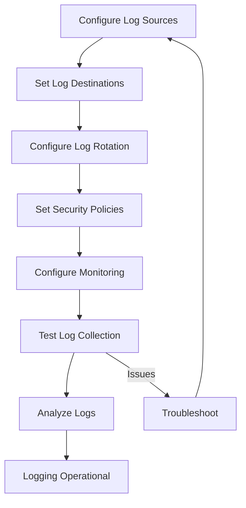

# Logging Setup

## Overview

Comprehensive logging is essential for system administration, security monitoring, troubleshooting, and compliance in a container-ready Linux distribution. Proper logging captures system events, security incidents, application behavior, and container activities for analysis and auditing.

## Logging Architecture

### Logging Components

**System Logging:**

- **rsyslog**: Traditional syslog daemon with advanced filtering
- **systemd-journald**: Modern binary logging with structured data
- **syslog-ng**: Advanced logging daemon with SQL/database support

**Container Logging:**

- **Docker Logging Drivers**: json-file, journald, syslog, fluentd
- **Podman Logging**: systemd journal integration
- **Container Runtime Logs**: CRI-O, containerd logging

**Security Logging:**

- **Audit Daemon**: Security event logging
- **SELinux/AppArmor**: Access control logging
- **Firewall Logging**: Network traffic monitoring

### Log Types and Purposes

**System Logs:**

- **Application Logs**: Program execution and errors
- **Security Logs**: Authentication and authorization events
- **System Logs**: Kernel and hardware events
- **Audit Logs**: Security-relevant events

**Container Logs:**

- **Application Logs**: Containerized application output
- **Runtime Logs**: Container lifecycle events
- **Network Logs**: Container networking events
- **Security Logs**: Container security events

## Rsyslog Configuration

### Basic Rsyslog Setup

```bash
# Install rsyslog
pacman -S rsyslog

# Basic configuration
cat > /etc/rsyslog.conf << EOF
# Modules
module(load="imuxsock") # local system logging
module(load="imklog")   # kernel logging

# Global directives
global(workDirectory="/var/lib/rsyslog")
global(maxMessageSize="64k")

# Templates
template(name="TraditionalFormat" type="string"
         string="%timegenerated% %hostname% %syslogtag% %msg%\n")

# Rules
# Kernel messages
kern.* /var/log/kern.log

# Authentication messages
auth,authpriv.* /var/log/auth.log

# Mail system
mail.* /var/log/mail.log

# All messages
*.*;auth,authpriv.none /var/log/syslog

# Emergency messages to all users
*.emerg :omusrmsg:*
EOF

# Create log files
touch /var/log/kern.log /var/log/auth.log /var/log/mail.log /var/log/syslog
chmod 640 /var/log/auth.log

# Enable and start rsyslog
systemctl enable rsyslog
systemctl start rsyslog
```

### Advanced Rsyslog Features

**Remote Logging:**

```bash
# Server configuration (receiving logs)
cat >> /etc/rsyslog.conf << EOF
# Load TCP/UDP modules
module(load="imtcp")
module(load="imudp")

# TCP input
input(type="imtcp" port="514")

# UDP input
input(type="imudp" port="514")

# Rules for remote logs
if $fromhost-ip startswith '192.168.' then /var/log/remote.log
EOF

# Client configuration (sending logs)
cat >> /etc/rsyslog.conf << EOF
# Send logs to remote server
*.* @@192.168.1.100:514  # TCP
*.* @192.168.1.100:514   # UDP
EOF

# Restart rsyslog
systemctl restart rsyslog
```

**Database Logging:**

```bash
# Install required packages
pacman -S rsyslog libdbi-drivers

# Configure database logging
cat >> /etc/rsyslog.conf << EOF
module(load="ommysql")

# Template for MySQL
template(name="sql" type="string"
         string="INSERT INTO logs (timestamp, hostname, facility, priority, message) VALUES ('%timestamp:::date-mysql%', '%hostname%', '%syslogfacility-text%', '%syslogpriority-text%', '%msg%')")

# Send auth logs to database
auth.* :ommysql:127.0.0.1,syslog,user,password;sql
EOF
```

## Systemd Journal Configuration

### Journald Setup

```bash
# Configure journald
cat > /etc/systemd/journald.conf << EOF
[Journal]
# Storage settings
Storage=persistent
Compress=yes
Seal=yes
SplitMode=uid

# Size limits
SystemMaxUse=100M
SystemKeepFree=50M
SystemMaxFileSize=10M
RuntimeMaxUse=50M

# Time limits
MaxRetentionSec=1month
MaxFileSec=1week

# Forwarding
ForwardToSyslog=yes
ForwardToKMsg=no
ForwardToConsole=no
ForwardToWall=no

# Security
Audit=yes
EOF

# Create journal directory
mkdir -p /var/log/journal
chmod 2755 /var/log/journal

# Restart journald
systemctl restart systemd-journald
```

### Journal Management

```bash
# View journal logs
journalctl

# Filter by service
journalctl -u sshd
journalctl -u docker

# Filter by time
journalctl --since "1 hour ago"
journalctl --since "2024-01-01" --until "2024-01-02"

# Filter by priority
journalctl -p err
journalctl -p warning..err

# Follow logs
journalctl -f
journalctl -u docker -f

# Export logs
journalctl -u sshd > /var/log/sshd-journal.log
journalctl --since "1 day ago" -o export > /backup/journal-export.txt
```

## Container Logging

### Docker Logging Configuration

**Docker Daemon Logging:**

```bash
# Configure Docker logging
cat > /etc/docker/daemon.json << EOF
{
  "log-driver": "journald",
  "log-opts": {
    "tag": "{{.Name}}/{{.ID}}",
    "labels": "production_status"
  },
  "log-level": "info"
}
EOF

# Restart Docker
systemctl restart docker
```

**Container Logging Options:**

```bash
# JSON file logging (default)
docker run --log-driver json-file \
           --log-opt max-size=10m \
           --log-opt max-file=3 \
           nginx

# Syslog logging
docker run --log-driver syslog \
           --log-opt syslog-address=tcp://192.168.1.100:514 \
           --log-opt tag=docker/{{.Name}} \
           nginx

# Journald logging
docker run --log-driver journald \
           --log-opt tag=docker \
           nginx
```

### Podman Logging

**Podman Journal Integration:**

```bash
# Podman uses journald by default
podman run --name web \
           --log-driver journald \
           nginx

# View container logs
podman logs web
journalctl -u podman-web.service

# Follow logs
podman logs -f web
```

**Podman Log Configuration:**

```bash
# Configure podman logging
cat > /etc/containers/containers.conf << EOF
[engine]
log_driver = "journald"

[engine.logging]
log_level = "info"
EOF
```

## Security Logging and Monitoring

### Audit Daemon Configuration

```bash
# Install audit
pacman -S audit

# Configure audit rules
cat > /etc/audit/rules.d/audit.rules << EOF
# Delete all existing rules
-D

# Buffer size
-b 8192

# Failure mode
-f 1

# System integrity
-w /etc/passwd -p wa -k identity
-w /etc/group -p wa -k identity
-w /etc/shadow -p wa -k identity
-w /etc/sudoers -p wa -k sudo

# Network configuration
-w /etc/network/ -p wa -k network

# Service changes
-w /etc/systemd/system/ -p wa -k systemd

# Container security
-w /var/lib/docker/ -p wa -k docker
-w /etc/containers/ -p wa -k containers

# Kernel modules
-w /etc/modprobe.d/ -p wa -k modules

# Make rules immutable
-e 2
EOF

# Enable audit
systemctl enable auditd
systemctl start auditd
```

### SELinux/AppArmor Logging

**SELinux Audit:**

```bash
# View SELinux denials
ausearch -m avc -ts recent | head -10

# Generate SELinux policy from logs
ausearch -m avc -ts recent | audit2allow -M mypolicy
semodule -i mypolicy.pp
```

**AppArmor Logging:**

```bash
# Check AppArmor status
apparmor_status

# View AppArmor logs
journalctl | grep apparmor
dmesg | grep apparmor
```

## Log Rotation and Management

### Logrotate Configuration

```bash
# Install logrotate
pacman -S logrotate

# Main configuration
cat > /etc/logrotate.conf << EOF
# Global options
weekly
rotate 4
create
compress
include /etc/logrotate.d

# System logs
/var/log/syslog
/var/log/auth.log
/var/log/kern.log
/var/log/mail.log {
    weekly
    rotate 7
    compress
    delaycompress
    missingok
    postrotate
        systemctl reload rsyslog
    endscript
}

# Journal logs
/var/log/journal/*/* {
    monthly
    rotate 12
    compress
    delaycompress
    missingok
    postrotate
        systemctl restart systemd-journald
    endscript
}
EOF

# Test configuration
logrotate -d /etc/logrotate.conf
```

### Advanced Log Management

**Log Archiving:**

```bash
# Create log archive script
cat > /usr/local/bin/archive-logs.sh << 'EOF'
#!/bin/bash
DATE=$(date +%Y%m%d)
ARCHIVE_DIR="/var/log/archive/$DATE"

mkdir -p "$ARCHIVE_DIR"

# Archive system logs
tar -czf "$ARCHIVE_DIR/system-logs.tar.gz" /var/log/*.log

# Archive journal
journalctl --since "1 week ago" > "$ARCHIVE_DIR/journal.txt"

# Compress old logs
find /var/log -name "*.log.1" -exec gzip {} \;

echo "Logs archived to $ARCHIVE_DIR"
EOF

chmod +x /usr/local/bin/archive-logs.sh
```

**Log Monitoring:**

```bash
# Install monitoring tools
pacman -S logwatch swatch

# Configure logwatch
cat > /etc/logwatch/conf/logwatch.conf << EOF
Detail = High
MailTo = root
MailFrom = logwatch
EOF

# Schedule daily reports
cat > /etc/systemd/system/logwatch.service << EOF
[Unit]
Description=Logwatch daily report

[Service]
Type=oneshot
ExecStart=/usr/sbin/logwatch
EOF

cat > /etc/systemd/system/logwatch.timer << EOF
[Unit]
Description=Run logwatch daily

[Timer]
OnCalendar=daily
Persistent=true

[Install]
WantedBy=timers.target
EOF

systemctl enable logwatch.timer
```

## Log Analysis and Monitoring

### Log Analysis Tools

**Basic Analysis:**

```bash
# Count log entries by service
journalctl -u sshd | wc -l
journalctl -u docker | wc -l

# Find error patterns
journalctl -p err | grep -i "failed\|error"

# Analyze authentication failures
journalctl -u ssh | grep -i "failed password"

# Container error analysis
docker logs --tail 100 web 2>&1 | grep -i error
```

**Advanced Analysis:**

```bash
# Install log analysis tools
pacman -S goaccess elasticsearch

# Parse logs with goaccess
goaccess /var/log/apache2/access.log -o /var/www/html/report.html --log-format=COMBINED

# Search logs with journalctl queries
journalctl -u nginx --grep="error\|warn" --since "1 hour ago"
```

### Real-time Monitoring

**Swatch Configuration:**

```bash
# Configure swatch for real-time monitoring
cat > /etc/swatch.conf << EOF
watchfor /Failed password/
    echo
    mail=root,subject="SSH Login Failure"

watchfor /docker.*error/i
    echo
    exec="/usr/local/bin/alert-docker-error.sh"

watchfor /kernel.*panic/i
    echo
    exec="/usr/local/bin/kernel-panic-alert.sh"
EOF

# Start swatch
swatch --config-file=/etc/swatch.conf --tail-file=/var/log/syslog
```

**Custom Monitoring Scripts:**

```bash
cat > /usr/local/bin/log-monitor.sh << 'EOF'
#!/bin/bash
# Monitor logs for security events

# Check for SSH brute force
SSH_FAILS=$(journalctl -u ssh --since "1 hour ago" | grep "Failed password" | wc -l)
if [ "$SSH_FAILS" -gt 10 ]; then
    echo "SSH brute force detected: $SSH_FAILS attempts" | mail -s "Security Alert" root
fi

# Check for Docker container failures
DOCKER_FAILS=$(journalctl -u docker --since "1 hour ago" | grep -i "failed\|error" | wc -l)
if [ "$DOCKER_FAILS" -gt 5 ]; then
    echo "Docker failures detected: $DOCKER_FAILS errors" | mail -s "Docker Alert" root
fi

# Check disk space for logs
LOG_USAGE=$(df /var/log | tail -1 | awk '{print $5}' | sed 's/%//')
if [ "$LOG_USAGE" -gt 90 ]; then
    echo "Log disk usage high: $LOG_USAGE%" | mail -s "Disk Alert" root
fi
EOF

chmod +x /usr/local/bin/log-monitor.sh

# Add to cron
echo "*/15 * * * * root /usr/local/bin/log-monitor.sh" > /etc/cron.d/log-monitor
```

## Log Security and Compliance

### Log Integrity

**Journal Sealing:**

```bash
# Enable FSS (Forward Secure Sealing)
cat >> /etc/systemd/journald.conf << EOF
[Journal]
Seal=yes
EOF

# Verify sealing
journalctl --verify
```

**Log Encryption:**

```bash
# Encrypt log archives
cat > /usr/local/bin/encrypt-logs.sh << 'EOF'
#!/bin/bash
# Encrypt sensitive logs

LOGS="/var/log/auth.log /var/log/audit/audit.log"
KEYFILE="/etc/log-encryption.key"

# Generate key if not exists
[ -f "$KEYFILE" ] || openssl rand -hex 32 > "$KEYFILE"

for log in $LOGS; do
    if [ -f "$log" ]; then
        openssl enc -aes-256-cbc -salt -in "$log" -out "${log}.enc" -kfile "$KEYFILE"
        shred -u "$log"
    fi
done
EOF

chmod +x /usr/local/bin/encrypt-logs.sh
```

### Compliance Logging

**PCI DSS Compliance:**

```bash
# Configure PCI-relevant logging
cat >> /etc/audit/rules.d/pci.rules << EOF
# File integrity monitoring
-w /etc/ -p wa -k pci-config
-w /var/www/ -p wa -k pci-web

# Network monitoring
-a always,exit -F arch=b64 -S socket -F a0=2 -k pci-network
EOF

systemctl restart auditd
```

**SOX Compliance:**

```bash
# Financial system logging
cat >> /etc/rsyslog.conf << EOF
# SOX compliance logging
if $programname == 'financial-app' then /var/log/sox/financial.log
& stop
EOF

mkdir -p /var/log/sox
chmod 700 /var/log/sox
```

## Log Workflow Diagram



## Exercises

### Exercise 1: Basic Logging Setup

1. Install and configure rsyslog
2. Set up systemd journald with persistent storage
3. Configure basic log rotation
4. Generate test log entries
5. View logs: `journalctl -b` and `tail /var/log/syslog`

**Expected Outcome**: System logging properly configured and collecting events

### Exercise 2: Container Logging

1. Configure Docker to use journald logging
2. Run containers with different log drivers
3. Configure Podman logging
4. View container logs through journalctl
5. Test log rotation for containers

**Expected Outcome**: Container logs integrated with system logging

### Exercise 3: Security Logging

1. Configure audit daemon with security rules
2. Set up SELinux/AppArmor logging
3. Monitor authentication events
4. Configure log monitoring alerts
5. Test security event logging

**Expected Outcome**: Comprehensive security event logging

### Exercise 4: Log Analysis and Monitoring

1. Install log analysis tools
2. Configure real-time log monitoring
3. Create log analysis scripts
4. Set up automated log reports
5. Test log monitoring alerts

**Expected Outcome**: Automated log analysis and monitoring system

### Exercise 5: Log Archiving and Compliance

1. Configure log archiving procedures
2. Set up log encryption for sensitive data
3. Configure compliance logging
4. Test log integrity verification
5. Create compliance reports

**Expected Outcome**: Secure log archiving and compliance logging

### Exercise 6: Remote Logging

1. Configure rsyslog for remote logging
2. Set up log server and clients
3. Configure secure log transport
4. Test remote log collection
5. Monitor remote logging performance

**Expected Outcome**: Centralized logging infrastructure

### Exercise 7: Log Troubleshooting

1. Create log troubleshooting procedures
2. Set up log debugging tools
3. Configure log filtering and searching
4. Test log recovery procedures
5. Document troubleshooting workflows

**Expected Outcome**: Comprehensive log troubleshooting capabilities

## Next Steps

With logging properly configured, proceed to Chapter 7 for package management. The logging system will monitor package installations, updates, and system changes for security and troubleshooting purposes.

## References

- Rsyslog Documentation: https://www.rsyslog.com/doc/
- Systemd Journal: https://www.freedesktop.org/software/systemd/man/journald.conf.html
- Docker Logging: https://docs.docker.com/config/containers/logging/
- Audit Framework: https://man7.org/linux/man-pages/man8/auditd.8.html
- Logrotate: https://man7.org/linux/man-pages/man8/logrotate.8.html
