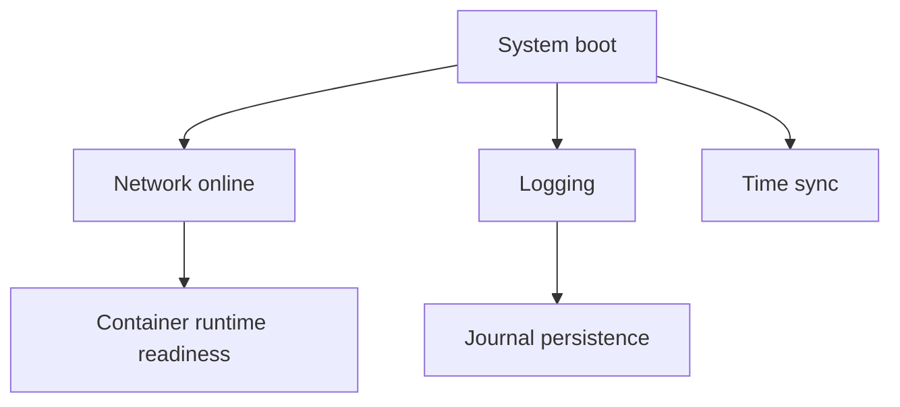

# Chapter 6: System Configuration

Setting up the basic system configuration for users, networking, and services.

## Learning objectives

- Create essential users and groups with secure defaults
- Configure networking (hostname, DHCP/static, DNS) and time sync
- Enable minimal, container-friendly services and logging

## Areas Covered

- User and group management
- Network configuration
- System services setup
- Logging configuration
- Basic security policies

## Quick start (users, hostname, services)

```bash
# users and groups
groupadd -g 10 wheel || true
useradd -m -G wheel -s /bin/bash builder || true
passwd -l root

# hostname and hosts
echo lfs > /etc/hostname
printf "127.0.0.1\tlocalhost\n::1\tlocalhost\n127.0.1.1\tlfs\n" | tee /etc/hosts

# time sync (systemd-timesyncd example)
timedatectl set-ntp true

# minimal logging (rsyslog or systemd-journald)
systemctl enable systemd-journald || true
```

## Minimalist Approach

- Only essential services
- Secure defaults (no passworded root login, sudo for admin)
- Container-ready configuration (cgroups, mounts, kernel params)

## Authentication & SSH hardening

- Disable password authentication for SSH; use keys only.
- Deny root login via SSH; use a sudo-capable user.
- Enforce strong umask and sudo logging.

Example `/etc/ssh/sshd_config.d/10-hardening.conf`:

```conf
PasswordAuthentication no
PermitRootLogin no
PubkeyAuthentication yes
KbdInteractiveAuthentication no
ChallengeResponseAuthentication no
AllowTcpForwarding no
X11Forwarding no
ClientAliveInterval 300
ClientAliveCountMax 2
```

Reload sshd and verify:

```bash
sudo systemctl reload sshd || sudo service ssh restart
sshd -T | grep -E "passwordauthentication|permitrootlogin"
```

## System diagram (services)



## Exercises

- Exercise 1: Create a non-root admin user and disable root password logins.
- Exercise 2: Configure a static IP and DNS, then confirm networking with ping and curl.

## Next steps

- Move to Chapter 7 to establish your package manager and repository layout.
