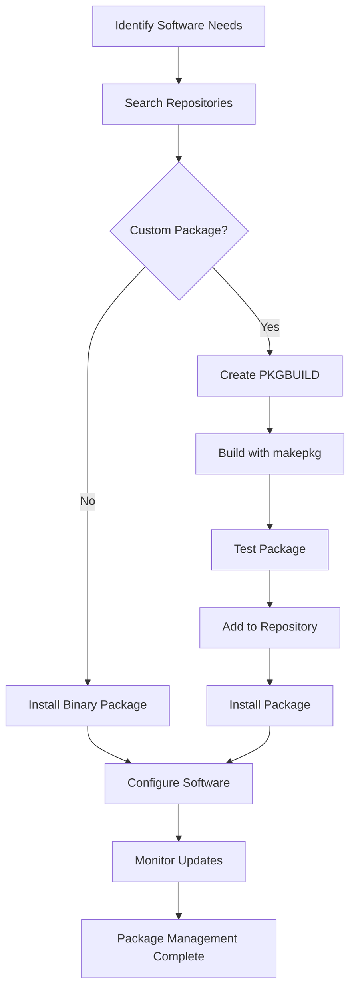

# Package Management Introduction

## Overview

Package management is the cornerstone of software distribution and maintenance in Linux systems. For a container-ready Linux distribution, effective package management ensures secure, reliable, and efficient software deployment across the host system and containerized applications. This chapter explores pacman, the package manager for Arch Linux and its derivatives, adapted for our custom LFS distribution.

## Package Management Fundamentals

### Core Concepts

**Package**: A compressed archive containing software, metadata, and installation scripts
**Repository**: A collection of packages stored on servers
**Dependency**: Software required by another package to function
**PKGBUILD**: Script describing how to build a package from source
**Package Database**: Local record of installed packages and their files

### Package Types

**Binary Packages:**

- Pre-compiled software ready for installation
- Fast installation, maintained by distribution
- Limited customization options

**Source Packages:**

- Original source code with build instructions
- Full customization and optimization
- Build-time dependency resolution
- Used for custom packages and security patches

**Meta Packages:**

- Virtual packages containing only dependencies
- Group related software together
- Simplify complex installations

### Package States

**Installed**: Package files extracted and configured
**Explicit**: Manually installed by user
**Dependency**: Installed automatically as requirement
**Orphan**: No longer needed by any installed package
**Outdated**: Newer version available in repository

## Pacman Architecture

### Core Components

**pacman**: Command-line package manager

- Install, remove, upgrade packages
- Dependency resolution and conflict detection
- Package database management
- Repository synchronization

**makepkg**: Package building tool

- Reads PKGBUILD files
- Downloads and compiles source code
- Creates package archives
- Handles build dependencies

**pacman-key**: GPG key management

- Manages package signing keys
- Verifies package authenticity
- Manages keyring trust levels

**repo-add/repo-remove**: Repository management

- Add/remove packages from custom repositories
- Generate repository databases
- Manage repository metadata

### File Locations

**Configuration Files:**

- `/etc/pacman.conf`: Main configuration
- `/etc/pacman.d/`: Repository configurations
- `/etc/makepkg.conf`: Build configuration

**Package Storage:**

- `/var/cache/pacman/pkg/`: Downloaded packages
- `/var/lib/pacman/`: Package database
- `/var/lib/pacman/sync/`: Repository databases

**Custom Repository:**

- `/opt/custom-repo/`: Local repository storage
- `/opt/custom-repo/custom.db.tar.gz`: Repository database

## Package Security

### GPG Signature Verification

**Package Signing:**

```bash
# Initialize pacman keyring
pacman-key --init

# Populate with Arch Linux keys (for LFS adaptation)
pacman-key --populate archlinux

# Verify package signatures
pacman -S --needed archlinux-keyring

# Check signature status
pacman -Qkk  # Verify all installed packages
```

**Key Management:**

```bash
# List trusted keys
pacman-key --list-keys

# Add custom key for local repository
pacman-key --add /path/to/custom-key.asc
pacman-key --lsign-key KEYID

# Update keyring
pacman-key --refresh-keys
```

### Repository Security

**Mirror Selection:**

```bash
# Rank mirrors by speed
pacman-mirrors --fasttrack

# Test mirror connectivity
pacman-mirrors --geoip

# Manual mirror configuration
echo 'Server = https://mirror.example.com/archlinux/$repo/os/$arch' >> /etc/pacman.d/mirrorlist
```

**Repository Validation:**

```bash
# Check repository integrity
pacman -Syy  # Force refresh with verification

# Verify database integrity
pacman -Dk  # Check database health

# Clean package cache securely
paccache -rk2 -ruk0  # Keep 2 versions, remove uninstalled
```

## Dependency Management

### Dependency Resolution

**Forward Dependencies:**

```bash
# Show what a package provides
pacman -Si package-name | grep -E "(Depends|Provides|Conflicts)"

# Check reverse dependencies
pacman -Qi package-name | grep "Required By"

# Find which package owns a file
pacman -Qo /path/to/file
```

**Circular Dependencies:**

- Pacman handles circular dependencies automatically
- May require multiple passes for complex cases
- Use `--asdeps` for dependency packages

### Orphan Package Management

```bash
# Find orphan packages
pacman -Qdtq

# Remove orphans
pacman -Qdtq | pacman -Rns -

# Prevent important packages from being orphaned
pacman -D --asexplicit package-name
```

## Custom Package Building

### PKGBUILD Structure

**Basic PKGBUILD:**

```bash
# PKGBUILD example
pkgname=myapp
pkgver=1.0.0
pkgrel=1
pkgdesc="My custom application"
arch=('x86_64')
url="https://github.com/user/myapp"
license=('GPL')
depends=('glibc' 'gtk3')
makedepends=('git' 'meson' 'ninja')
source=("$pkgname-$pkgver.tar.gz::https://github.com/user/myapp/archive/v$pkgver.tar.gz")
sha256sums=('SKIP')

prepare() {
    cd "$pkgname-$pkgver"
    # Apply patches, configure build
}

build() {
    cd "$pkgname-$pkgver"
    meson --prefix=/usr build
    ninja -C build
}

package() {
    cd "$pkgname-$pkgver"
    DESTDIR="$pkgdir" ninja -C build install
}
```

### Build Process

**makepkg Workflow:**

```bash
# Download and build package
makepkg -s  # Install missing dependencies

# Build without installing dependencies
makepkg -S  # Sync dependencies only

# Build with custom flags
CFLAGS="-O3 -march=native" makepkg

# Build for different architecture
makepkg -A  # Build for all architectures

# Skip integrity checks
makepkg -skipinteg
```

### Package Installation

**Local Package Installation:**

```bash
# Install local package
pacman -U package-name.pkg.tar.zst

# Install with dependency check
pacman -U --asdeps package-name.pkg.tar.zst

# Force installation (dangerous)
pacman -U --force package-name.pkg.tar.zst
```

## Repository Management

### Custom Repository Setup

**Repository Creation:**

```bash
# Create repository directory
mkdir -p /opt/custom-repo

# Add packages to repository
cp *.pkg.tar.zst /opt/custom-repo/

# Generate repository database
repo-add /opt/custom-repo/custom.db.tar.gz /opt/custom-repo/*.pkg.tar.zst

# Sign repository database
gpg --detach-sign /opt/custom-repo/custom.db.tar.gz
```

**Repository Configuration:**

```bash
# Add to pacman.conf
cat >> /etc/pacman.conf << EOF
[custom]
SigLevel = Required DatabaseRequired
Server = file:///opt/custom-repo
EOF

# Update package database
pacman -Sy
```

### Repository Synchronization

**Sync Operations:**

```bash
# Update all repositories
pacman -Syu

# Update without upgrading
pacman -Sy

# Force refresh
pacman -Syy

# Check for updates
pacman -Qu
```

## Container Package Management

### Container Image Packages

**Docker Image Packages:**

```bash
# Create package for Docker image
cat > docker-myapp/PKGBUILD << EOF
pkgname=docker-myapp
pkgver=1.0.0
pkgrel=1
pkgdesc="Docker container for myapp"
arch=('x86_64')
depends=('docker')
source=('Dockerfile')

package() {
    install -Dm644 Dockerfile "$pkgdir/usr/share/docker-myapp/Dockerfile"
    install -Dm755 build-container.sh "$pkgdir/usr/bin/docker-myapp-build"
}
EOF
```

**Podman Image Management:**

```bash
# Build container image
podman build -t myapp:latest .

# Save image as tarball
podman save myapp:latest > myapp.tar

# Create package from image
cat > podman-myapp/PKGBUILD << EOF
pkgname=podman-myapp
pkgver=1.0.0
pkgrel=1
pkgdesc="Podman container for myapp"
arch=('x86_64')
depends=('podman')

package() {
    install -Dm644 myapp.tar "$pkgdir/usr/share/podman-myapp/image.tar"
    install -Dm755 run-container.sh "$pkgdir/usr/bin/podman-myapp-run"
}
EOF
```

### Container Runtime Dependencies

**Runtime Package Management:**

```bash
# Install container runtime
pacman -S docker podman containerd

# Install container tools
pacman -S buildah skopeo

# Install container networking
pacman -S cni-plugins slirp4netns

# Install security tools
pacman -S apparmor
```

## Package Maintenance

### System Maintenance

**Package Database Integrity:**

```bash
# Check database health
pacman -Dk

# Rebuild package database
pacman -Scc  # Clean cache
pacman -Syy  # Force refresh

# Verify package files
pacman -Qkk | grep -v "0 altered files"
```

**Cache Management:**

```bash
# Clean package cache
paccache -r  # Remove all cached versions except 3
paccache -rk1 -ruk0  # Keep 1 version, remove uninstalled

# Show cache size
du -sh /var/cache/pacman/pkg/

# Move cache to different location
sed -i 's|CacheDir.*|CacheDir = /mnt/cache/pacman/pkg|' /etc/pacman.conf
```

### Update Management

**Safe Updating:**

```bash
# Check for updates
pacman -Qu

# Update system
pacman -Syu

# Update specific package
pacman -S package-name

# Ignore package updates
pacman -Syu --ignore package-name

# Hold package at current version
pacman -S --asexplicit package-name
```

**Rollback Capabilities:**

```bash
# Install downgrade utility
pacman -S downgrade

# Downgrade package
downgrade package-name

# View package history
pacman -Q --date package-name
```

## Security Best Practices

### Package Verification

**Signature Verification:**

```bash
# Enable signature checking
sed -i 's/SigLevel.*/SigLevel = Required DatabaseRequired/' /etc/pacman.conf

# Verify all packages
pacman -Qkk

# Check for unsigned packages
pacman -Q | xargs pacman -Qi | grep -B1 "NOT OK"
```

### Repository Security

**Trusted Repositories:**

```bash
# Only use trusted repositories
# Verify repository URLs
grep "^\[.*\]" /etc/pacman.conf

# Check repository signatures
pacman-key --list-sigs | grep -E "(repo|trusted)"
```

### Build Security

**Secure Building:**

```bash
# Use isolated build environment
makepkg --cleanbuild

# Verify source integrity
makepkg --verifysource

# Build as unprivileged user
chown builduser:builduser -R .
su builduser -c "makepkg"
```

## Troubleshooting

### Common Issues

**Dependency Conflicts:**

```bash
# Check conflicts
pacman -Si package-name | grep Conflicts

# Force installation
pacman -S --force package-name

# Remove conflicting package
pacman -Rdd conflicting-package
```

**Package Corruption:**

```bash
# Clear package cache
pacman -Scc

# Reinstall corrupted package
pacman -S --force package-name

# Check filesystem
pacman -Qk | grep -v "0 altered files"
```

**Repository Issues:**

```bash
# Refresh repositories
pacman -Syy

# Check mirror status
curl -s mirror-url/core/os/x86_64/core.db | head -c 100

# Switch mirrors
pacman-mirrors --country United_States
```

### Recovery Procedures

**Broken System Recovery:**

```bash
# Boot from live USB
mount /dev/sda1 /mnt
pacman -r /mnt -Syu  # Chroot update

# Fix broken packages
pacman -r /mnt -Qk | grep -v "0 altered files"
pacman -r /mnt -S --force broken-package
```

## Package Management Workflow



## Exercises

### Exercise 1: Pacman Basics

1. Install pacman and initialize package database
2. Update package lists: `pacman -Sy`
3. Search for packages: `pacman -Ss vim`
4. Install a package: `pacman -S vim`
5. List installed packages: `pacman -Q`
6. Check package information: `pacman -Qi vim`

**Expected Outcome**: Basic pacman operations working correctly

### Exercise 2: Package Building

1. Examine a sample PKGBUILD file
2. Create a simple PKGBUILD for a basic script
3. Build the package: `makepkg`
4. Install the local package: `pacman -U package.pkg.tar.zst`
5. Verify installation: `pacman -Q | grep package-name`

**Expected Outcome**: Custom package built and installed successfully

### Exercise 3: Repository Management

1. Create a local repository directory
2. Build multiple packages and add to repository
3. Generate repository database: `repo-add`
4. Configure pacman to use local repository
5. Install packages from local repository
6. Update repository with new packages

**Expected Outcome**: Functional local package repository

### Exercise 4: Dependency Management

1. Install a package with dependencies
2. Check package dependencies: `pacman -Qi package | grep Depends`
3. Find reverse dependencies: `pacman -Qi package | grep Required`
4. Identify orphan packages: `pacman -Qdtq`
5. Remove orphans safely
6. Analyze dependency tree

**Expected Outcome**: Understanding of package dependencies and relationships

### Exercise 5: Security Configuration

1. Initialize pacman keyring: `pacman-key --init`
2. Configure signature verification in pacman.conf
3. Add trusted keys for repositories
4. Verify package signatures: `pacman -Qkk`
5. Test package verification on updates
6. Document security configuration

**Expected Outcome**: Secure package management with signature verification

### Exercise 6: Container Package Integration

1. Create PKGBUILD for container image package
2. Build and install container package
3. Configure container runtime dependencies
4. Test container package installation
5. Integrate with systemd services
6. Verify container functionality

**Expected Outcome**: Container applications packaged and managed through pacman

### Exercise 7: Maintenance and Troubleshooting

1. Perform system update: `pacman -Syu`
2. Clean package cache: `paccache -r`
3. Check package database integrity: `pacman -Dk`
4. Troubleshoot a package installation failure
5. Recover from a broken package state
6. Document maintenance procedures

**Expected Outcome**: Comprehensive package management maintenance skills

## Next Steps

With package management fundamentals established, proceed to Chapter 7.2 for detailed pacman setup. The package management system will be crucial for distributing your custom Linux distribution and managing containerized applications.

## References

- Pacman Documentation: https://man.archlinux.org/man/pacman.8
- PKGBUILD Documentation: https://man.archlinux.org/man/PKGBUILD.5
- Arch Linux Packaging: https://wiki.archlinux.org/title/Arch_package_guidelines
- Makepkg Documentation: https://man.archlinux.org/man/makepkg.8
- Pacman-key Documentation: https://man.archlinux.org/man/pacman-key.8
