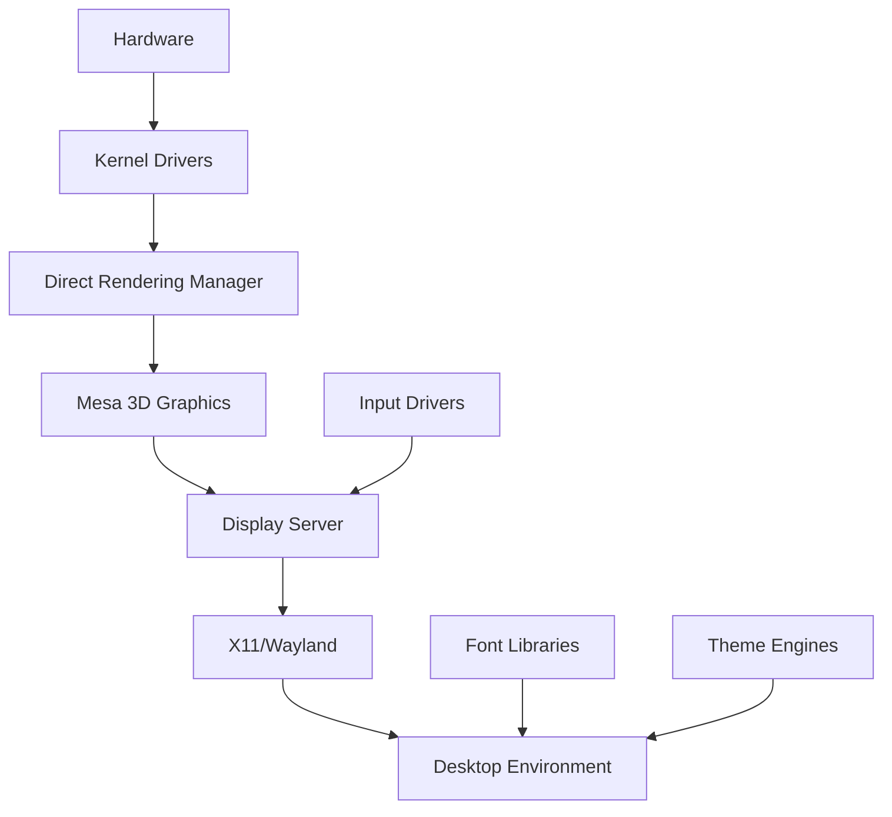

# Desktop Dependencies

## Introduction

Before installing a desktop environment, we need to build and install the graphical stack dependencies. This includes X11 (or Wayland), graphics drivers, font rendering libraries, and other essential GUI components.

## Prerequisites

- Pacman package manager configured (Chapter 7.2)
- Package building infrastructure ready (Chapter 7.3)
- Basic system complete (Chapter 3)
- Kernel with graphics support enabled

## Architecture Overview



## Core Components

### 1. X.Org Server (X11)

The X Window System provides the foundation for graphical applications.

**Key Packages:**
- xorg-server: Core X11 display server
- xorg-xinit: X server initialization
- xorg-xauth: X authority utilities
- xf86-video-* : Hardware-specific video drivers

**Alternative: Wayland**
- wlroots: Wayland compositor library
- wayland: Core Wayland protocol
- xwayland: X11 compatibility layer

### 2. Mesa 3D Graphics

Hardware-accelerated 3D graphics support.

**Components:**
- mesa: 3D graphics library
- mesa-libgl: OpenGL library
- mesa-demos: Testing utilities

### 3. Font Rendering

High-quality font rendering for the desktop.

**Core Libraries:**
- freetype2: Font rasterization
- fontconfig: Font configuration and customization
- cairo: 2D graphics library with font support
- pango: Text layout and rendering

### 4. Input Drivers

**Required Packages:**
- xf86-input-libinput: Modern input driver
- libinput: Input device management library
- xf86-input-evdev: Event device input driver (fallback)

### 5. Graphics Utilities

**Essential Tools:**
- xrandr: Screen resolution and output management
- xset: X server preference settings
- xinput: Input device configuration
- xdpyinfo: Display information utility

## Build Order and Dependencies

The components must be built in dependency order:

```
1. libdrm (Direct Rendering Manager)
   └─> 2. Mesa
       └─> 3. X.Org libraries (libX11, libXext, etc.)
           └─> 4. X.Org server
               └─> 5. X.Org drivers (video, input)
                   └─> 6. Font libraries (freetype, fontconfig)
                       └─> 7. Cairo, Pango
                           └─> 8. Desktop environment
```

## Installation Steps

### Step 1: Build Core Graphics Stack

#### 1.1 Install libdrm

```bash
# Create PKGBUILD for libdrm
cat > /tmp/PKGBUILD << 'EOF'
pkgname=libdrm
pkgver=2.4.115
pkgrel=1
pkgdesc="Userspace library for kernel DRM services"
arch=('x86_64')
url="https://dri.freedesktop.org/"
license=('MIT')
depends=('glibc' 'libpciaccess')
makedepends=('meson' 'ninja')
source=("https://dri.freedesktop.org/libdrm/$pkgname-$pkgver.tar.xz")
sha256sums=('SKIP')

build() {
  cd "$pkgname-$pkgver"
  meson setup build \
    --prefix=/usr \
    --buildtype=release \
    -Dudev=true \
    -Dvalgrind=disabled
  ninja -C build
}

package() {
  cd "$pkgname-$pkgver"
  DESTDIR="$pkgdir" ninja -C build install
  install -Dm644 LICENSE -t "$pkgdir/usr/share/licenses/$pkgname/"
}
EOF

# Build and install
cd /tmp
makepkg -si --noconfirm
```

#### 1.2 Install Mesa

```bash
# Create PKGBUILD for Mesa
cat > /tmp/PKGBUILD << 'EOF'
pkgname=mesa
pkgver=23.1.0
pkgrel=1
pkgdesc="Open-source OpenGL implementation"
arch=('x86_64')
url="https://www.mesa3d.org/"
license=('MIT')
depends=('libdrm' 'wayland' 'libxshmfence' 'libxrandr' 'libxdamage')
makedepends=('meson' 'ninja' 'python' 'llvm')
source=("https://mesa.freedesktop.org/archive/$pkgname-$pkgver.tar.xz")
sha256sums=('SKIP')

build() {
  cd "$pkgname-$pkgver"
  meson setup build \
    --prefix=/usr \
    --buildtype=release \
    -Dplatforms=x11,wayland \
    -Dgallium-drivers=auto \
    -Dvulkan-drivers=auto \
    -Dglx=dri \
    -Dllvm=enabled
  ninja -C build
}

package() {
  cd "$pkgname-$pkgver"
  DESTDIR="$pkgdir" ninja -C build install
}
EOF

cd /tmp
makepkg -si --noconfirm
```

### Step 2: Install X.Org Server

#### 2.1 X.Org Libraries

```bash
# Install X.Org base libraries using pacman
# These would typically be pre-built packages in your repository

pacman -S --noconfirm \
  libx11 \
  libxext \
  libxrender \
  libxrandr \
  libxinerama \
  libxcursor \
  libxi \
  libxfixes \
  libxdamage \
  libxcomposite
```

#### 2.2 X.Org Server

```bash
# Create PKGBUILD for xorg-server
cat > /tmp/PKGBUILD << 'EOF'
pkgname=xorg-server
pkgver=21.1.8
pkgrel=1
pkgdesc="X.Org X server"
arch=('x86_64')
url="https://www.x.org/"
license=('custom')
depends=('libepoxy' 'libxfont2' 'pixman' 'xorg-xkbcomp' 'xorg-setxkbmap'
         'libunwind' 'libgl' 'libxshmfence' 'libpciaccess')
makedepends=('meson' 'xorgproto' 'xtrans')
source=("https://xorg.freedesktop.org/releases/individual/xserver/$pkgname-$pkgver.tar.xz")
sha256sums=('SKIP')

build() {
  cd "$pkgname-$pkgver"
  meson setup build \
    --prefix=/usr \
    --buildtype=release \
    -Dsuid_wrapper=true \
    -Dxkb_dir=/usr/share/X11/xkb \
    -Dxkb_output_dir=/var/lib/xkb
  ninja -C build
}

package() {
  cd "$pkgname-$pkgver"
  DESTDIR="$pkgdir" ninja -C build install
}
EOF

cd /tmp
makepkg -si --noconfirm
```

### Step 3: Install Video Drivers

```bash
# For Intel graphics
pacman -S --noconfirm xf86-video-intel

# For AMD graphics
pacman -S --noconfirm xf86-video-amdgpu

# For NVIDIA (open-source)
pacman -S --noconfirm xf86-video-nouveau

# Generic VESA driver (fallback)
pacman -S --noconfirm xf86-video-vesa
```

### Step 4: Install Input Drivers

```bash
pacman -S --noconfirm \
  xf86-input-libinput \
  libinput \
  xf86-input-evdev
```

### Step 5: Install Font Stack

```bash
# Core font libraries
pacman -S --noconfirm \
  freetype2 \
  fontconfig \
  cairo \
  pango \
  harfbuzz

# Basic fonts
pacman -S --noconfirm \
  ttf-dejavu \
  ttf-liberation \
  noto-fonts
```

### Step 6: Install Essential X Utilities

```bash
pacman -S --noconfirm \
  xorg-xinit \
  xorg-xauth \
  xorg-xrandr \
  xorg-xset \
  xorg-xinput \
  xorg-xdpyinfo \
  xorg-xprop \
  xorg-xwininfo
```

## Configuration

### X.Org Configuration

Create basic X.Org configuration:

```bash
# Generate initial config
mkdir -p /etc/X11/xorg.conf.d

# Configure keyboard layout
cat > /etc/X11/xorg.conf.d/00-keyboard.conf << 'EOF'
Section "InputClass"
    Identifier "system-keyboard"
    MatchIsKeyboard "on"
    Option "XkbLayout" "us"
    Option "XkbModel" "pc105"
EndSection
EOF

# Configure touchpad (if applicable)
cat > /etc/X11/xorg.conf.d/30-touchpad.conf << 'EOF'
Section "InputClass"
    Identifier "touchpad"
    Driver "libinput"
    MatchIsTouchpad "on"
    Option "Tapping" "on"
    Option "NaturalScrolling" "true"
EndSection
EOF
```

### Font Configuration

```bash
# Update font cache
fc-cache -fv

# Enable font hinting
cat > /etc/fonts/local.conf << 'EOF'
<?xml version="1.0"?>
<!DOCTYPE fontconfig SYSTEM "fonts.dtd">
<fontconfig>
  <match target="font">
    <edit name="antialias" mode="assign">
      <bool>true</bool>
    </edit>
    <edit name="hinting" mode="assign">
      <bool>true</bool>
    </edit>
    <edit name="hintstyle" mode="assign">
      <const>hintslight</const>
    </edit>
    <edit name="rgba" mode="assign">
      <const>rgb</const>
    </edit>
  </match>
</fontconfig>
EOF
```

## Verification

### Test X Server

```bash
# Start X server (as regular user, not root)
startx

# Or test with a simple client
X :0 &
export DISPLAY=:0
xterm
```

### Verify Graphics Acceleration

```bash
# Check direct rendering
glxinfo | grep "direct rendering"

# Expected output: "direct rendering: Yes"

# Check OpenGL version
glxinfo | grep "OpenGL version"

# Run simple GL test
glxgears
```

### Verify Input Devices

```bash
# List input devices
xinput list

# Check keyboard
xev  # Press keys and verify events

# Check mouse/touchpad
xinput list-props <device-id>
```

### Check Font Rendering

```bash
# List available fonts
fc-list

# Test font rendering
xfontsel
```

## Troubleshooting

### X Server Won't Start

**Check logs:**
```bash
cat /var/log/Xorg.0.log | grep EE
```

**Common issues:**
- Missing video drivers: Install appropriate xf86-video-* package
- Permissions: Ensure user is in 'video' group
- Missing modules: Check kernel has DRM/KMS support enabled

### No Graphics Acceleration

**Check DRM:**
```bash
# Verify DRM module loaded
lsmod | grep drm

# Check kernel messages
dmesg | grep -i drm
```

**Load appropriate module:**
```bash
# Intel
modprobe i915

# AMD
modprobe amdgpu

# NVIDIA (nouveau)
modprobe nouveau
```

### Font Rendering Issues

```bash
# Rebuild font cache
fc-cache -fv

# Check font configuration
fc-match sans
fc-match serif
fc-match monospace
```

## Package Management Integration

### Create Meta-Package for Desktop Dependencies

```bash
cat > /tmp/PKGBUILD << 'EOF'
pkgname=desktop-dependencies
pkgver=1.0
pkgrel=1
pkgdesc="Meta-package for desktop environment dependencies"
arch=('any')
depends=(
  'xorg-server'
  'xorg-xinit'
  'mesa'
  'libgl'
  'xf86-input-libinput'
  'xf86-video-vesa'
  'freetype2'
  'fontconfig'
  'cairo'
  'pango'
  'ttf-dejavu'
)
optdepends=(
  'xf86-video-intel: Intel graphics driver'
  'xf86-video-amdgpu: AMD graphics driver'
  'xf86-video-nouveau: NVIDIA open-source driver'
  'ttf-liberation: Microsoft font replacement'
  'noto-fonts: Unicode font coverage'
)

package() {
  # Meta-package, no files to install
  true
}
EOF

cd /tmp
makepkg -si --noconfirm
```

### Add to Repository

```bash
# Copy package to repository
cp /tmp/desktop-dependencies-*.pkg.tar.zst /repo/custom/

# Update repository database
repo-add /repo/custom/custom.db.tar.gz /repo/custom/desktop-dependencies-*.pkg.tar.zst

# Refresh pacman database
pacman -Sy
```

## Exercises

### Exercise 1: Install and Configure X.Org

1. Install X.Org server and dependencies
2. Configure keyboard layout for your region
3. Start X server and verify it works
4. Check Xorg.0.log for any errors
5. Document hardware detected

**Expected Outcome**: Working X.Org server with basic configuration

### Exercise 2: Graphics Driver Setup

1. Identify your graphics hardware: `lspci | grep VGA`
2. Install appropriate driver package
3. Load kernel module if needed
4. Test direct rendering with glxinfo
5. Run glxgears to verify acceleration

**Expected Outcome**: Hardware-accelerated graphics working

### Exercise 3: Font Configuration

1. Install additional font packages
2. Configure font rendering preferences
3. Rebuild font cache
4. Test with various applications
5. Compare rendering quality

**Expected Outcome**: High-quality font rendering configured

### Exercise 4: Create Custom Dependency Package

1. Research your specific hardware needs
2. Create a custom meta-package PKGBUILD
3. Include all necessary dependencies
4. Build and add to repository
5. Test installation on fresh system

**Expected Outcome**: Custom meta-package for your hardware

## Security Considerations

### X.Org Security

**Limitations:**
- X11 is not security-focused (clients can snoop on each other)
- Consider Wayland for better isolation
- Run X server with minimal privileges

**Mitigations:**
```bash
# Disable X server listening on network
# In /etc/X11/xinit/xserverrc:
exec /usr/bin/X -nolisten tcp "$@"

# Restrict X server access
# Set proper permissions on .Xauthority
chmod 600 ~/.Xauthority
```

### Graphics Driver Security

- Keep drivers updated for security patches
- Use open-source drivers when possible
- Monitor kernel CVEs related to DRM/KMS

## Performance Tuning

### Enable Compositor Optimizations

```bash
# For modern Intel graphics
cat > /etc/X11/xorg.conf.d/20-intel.conf << 'EOF'
Section "Device"
  Identifier "Intel Graphics"
  Driver "intel"
  Option "TearFree" "true"
  Option "AccelMethod" "sna"
  Option "DRI" "3"
EndSection
EOF
```

### Configure VRAM for Integrated Graphics

```bash
# Add to kernel command line (in GRUB config)
# For Intel:
i915.enable_guc=2

# For AMD:
amdgpu.gpu_recovery=1
```

## Next Steps

With desktop dependencies installed, proceed to Chapter 7.6 to install and configure a desktop environment. The graphical stack provides the foundation for running GUI applications and desktop environments.

## References

- X.Org Documentation: https://www.x.org/wiki/Documentation/
- Mesa Documentation: https://docs.mesa3d.org/
- Wayland Documentation: https://wayland.freedesktop.org/docs.html
- Fontconfig User Documentation: https://www.freedesktop.org/wiki/Software/fontconfig/
- Direct Rendering Manager: https://www.kernel.org/doc/html/latest/gpu/drm-internals.html
- libinput Documentation: https://wayland.freedesktop.org/libinput/doc/latest/
