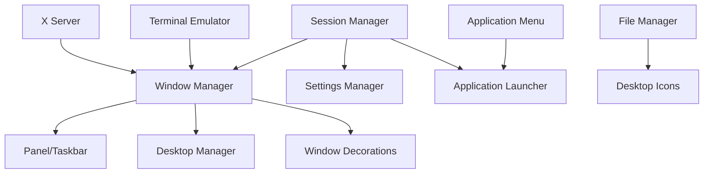

# Desktop Environment Setup

## Introduction

After installing the desktop dependencies, we can now install a desktop environment. For this tutorial, we'll focus on XFCE, a lightweight yet feature-complete desktop environment that's perfect for a custom Linux distribution.

## Prerequisites

- Desktop dependencies installed (Chapter 7.5)
- X.Org server configured and working
- Package management system ready (Chapter 7.1-7.4)
- Display manager (optional but recommended)

## Desktop Environment Options

### Recommended: XFCE

**Pros:**
- Lightweight (low resource usage)
- Modular architecture
- Stable and mature
- GTK-based
- Easy to customize
- Good for learning

**System Requirements:**
- RAM: 512MB minimum, 1GB recommended
- Disk: ~500MB for base installation

### Alternatives

**LXQt** (Even lighter):
- Qt-based
- Very minimal resource usage
- Modern and actively developed

**MATE** (Traditional):
- GNOME 2 fork
- Familiar interface
- Medium resource usage

**Cinnamon** (Feature-rich):
- Modern and polished
- Higher resource requirements
- Better for desktop use

## Architecture Overview



## XFCE Installation

### Step 1: Install Core XFCE Packages

```bash
# Install XFCE base group
pacman -S --noconfirm \
  xfce4 \
  xfce4-goodies

# Or install individual components:
pacman -S --noconfirm \
  xfwm4 \              # Window manager
  xfce4-panel \        # Panel/taskbar
  xfce4-session \      # Session manager
  xfdesktop \          # Desktop manager
  xfce4-settings \     # Settings manager
  thunar \             # File manager
  xfce4-terminal       # Terminal emulator
```

### Step 2: Install Essential Applications

```bash
# File manager plugins
pacman -S --noconfirm \
  thunar-volman \      # Removable media management
  thunar-archive-plugin \
  gvfs \               # Virtual filesystem
  gvfs-mtp \           # MTP device support
  gvfs-gphoto2         # Camera support

# System utilities
pacman -S --noconfirm \
  xfce4-taskmanager \  # Task manager
  xfce4-power-manager \ # Power management
  xfce4-screensaver \  # Screen saver/locker
  xfce4-notifyd        # Notification daemon

# Panel plugins (optional but useful)
pacman -S --noconfirm \
  xfce4-pulseaudio-plugin \
  xfce4-battery-plugin \
  xfce4-cpufreq-plugin \
  xfce4-datetime-plugin \
  xfce4-mount-plugin \
  xfce4-netload-plugin \
  xfce4-systemload-plugin \
  xfce4-weather-plugin
```

### Step 3: Install Display Manager

A display manager provides a graphical login screen:

```bash
# LightDM (recommended for XFCE)
pacman -S --noconfirm \
  lightdm \
  lightdm-gtk-greeter \
  lightdm-gtk-greeter-settings

# Enable LightDM service
systemctl enable lightdm.service
```

**Alternative: SDDM** (for Qt-based systems):
```bash
pacman -S --noconfirm sddm
systemctl enable sddm.service
```

### Step 4: Install Audio Support

```bash
# PulseAudio (recommended)
pacman -S --noconfirm \
  pulseaudio \
  pulseaudio-alsa \
  pavucontrol \        # GUI mixer
  alsa-utils           # ALSA utilities

# Enable audio for user
usermod -aG audio <username>
```

### Step 5: Install Network Manager

```bash
pacman -S --noconfirm \
  networkmanager \
  network-manager-applet \
  nm-connection-editor

# Enable NetworkManager
systemctl enable NetworkManager.service
systemctl disable systemd-networkd.service  # If previously enabled
```

## Configuration

### Configure LightDM

```bash
# Edit LightDM configuration
cat > /etc/lightdm/lightdm.conf << 'EOF'
[Seat:*]
greeter-session=lightdm-gtk-greeter
user-session=xfce

[LightDM]
run-directory=/run/lightdm

[XDMCPServer]
enabled=false
EOF

# Configure greeter theme
cat > /etc/lightdm/lightdm-gtk-greeter.conf << 'EOF'
[greeter]
theme-name=Adwaita
icon-theme-name=Adwaita
font-name=Sans 10
background=/usr/share/backgrounds/xfce/xfce-blue.jpg
position=50%,center 50%,center
EOF
```

### Configure XFCE Session

```bash
# Create default session configuration
mkdir -p /etc/xdg/xfce4

cat > /etc/xdg/xfce4/xinitrc << 'EOF'
#!/bin/sh
# XFCE default startup script

# Start session manager
exec xfce4-session
EOF

chmod +x /etc/xdg/xfce4/xinitrc
```

### Configure User Session

For users who don't use a display manager:

```bash
# Create ~/.xinitrc for the user
cat > ~/.xinitrc << 'EOF'
#!/bin/sh

# Load X resources
[ -f ~/.Xresources ] && xrdb -merge ~/.Xresources

# Start XFCE
exec startxfce4
EOF

chmod +x ~/.xinitrc
```

### Configure Default Applications

```bash
# Create mimeapps.list for default applications
mkdir -p ~/.config

cat > ~/.config/mimeapps.list << 'EOF'
[Default Applications]
text/plain=mousepad.desktop
text/html=firefox.desktop
image/png=ristretto.desktop
image/jpeg=ristretto.desktop
application/pdf=atril.desktop
inode/directory=thunar.desktop

[Added Associations]
text/plain=mousepad.desktop;
image/png=ristretto.desktop;
image/jpeg=ristretto.desktop;
EOF
```

## Theme and Appearance

### Install Themes

```bash
# GTK themes
pacman -S --noconfirm \
  arc-gtk-theme \
  papirus-icon-theme \
  adwaita-icon-theme

# Window manager themes
pacman -S --noconfirm \
  xfwm4-themes

# Cursors
pacman -S --noconfirm \
  xcursor-themes
```

### Configure Theme

```bash
# Set theme via xfconf
xfconf-query -c xsettings -p /Net/ThemeName -s "Arc-Dark"
xfconf-query -c xsettings -p /Net/IconThemeName -s "Papirus-Dark"
xfconf-query -c xfwm4 -p /general/theme -s "Arc-Dark"

# Or use GUI settings manager
xfce4-appearance-settings
```

### Configure Fonts

```bash
# Set default fonts
xfconf-query -c xsettings -p /Gtk/FontName -s "DejaVu Sans 10"
xfconf-query -c xsettings -p /Gtk/MonospaceFontName -s "DejaVu Sans Mono 10"

# Enable font antialiasing
xfconf-query -c xsettings -p /Xft/Antialias -s 1
xfconf-query -c xsettings -p /Xft/HintStyle -s "hintslight"
xfconf-query -c xsettings -p /Xft/RGBA -s "rgb"
```

## Essential Applications

### Install Basic Applications

```bash
# Text editor
pacman -S --noconfirm mousepad

# Image viewer
pacman -S --noconfirm ristretto

# Archive manager
pacman -S --noconfirm xarchiver

# PDF viewer
pacman -S --noconfirm atril

# Web browser
pacman -S --noconfirm firefox

# Media player
pacman -S --noconfirm vlc

# Screenshot tool
pacman -S --noconfirm xfce4-screenshooter
```

### Optional Development Tools

```bash
# Code editor
pacman -S --noconfirm \
  geany \
  geany-plugins

# Terminal tools
pacman -S --noconfirm \
  tmux \
  htop \
  git
```

## Starting the Desktop

### Using Display Manager

```bash
# The display manager starts automatically on boot
systemctl start lightdm.service

# Check status
systemctl status lightdm.service

# View logs
journalctl -u lightdm.service
```

### Manual Start (without Display Manager)

```bash
# Login on console
# Then start X:
startx

# Or start XFCE directly:
startxfce4
```

### Auto-login Configuration

For development/testing systems:

```bash
# Configure auto-login in LightDM
cat > /etc/lightdm/lightdm.conf.d/50-autologin.conf << 'EOF'
[Seat:*]
autologin-user=<username>
autologin-session=xfce
EOF

# Add user to autologin group
groupadd -r autologin
usermod -aG autologin <username>
```

## Customization

### Panel Configuration

```bash
# Panel is configured via GUI:
xfce4-panel --preferences

# Or edit configuration files in:
# ~/.config/xfce4/panel/
```

### Desktop Configuration

```bash
# Desktop settings:
xfdesktop-settings

# Configure background, icons, menu
```

### Keyboard Shortcuts

```bash
# Open keyboard settings:
xfce4-keyboard-settings

# Common shortcuts to configure:
# - Terminal: Super+T
# - Application finder: Super+Space
# - File manager: Super+E
# - Lock screen: Ctrl+Alt+L
```

### Window Manager Tweaks

```bash
# Open window manager tweaks:
xfwm4-tweaks-settings

# Configure:
# - Compositor (for transparency, shadows)
# - Window snapping
# - Focus behavior
# - Workspaces
```

## Multi-User Setup

### Create User Accounts

```bash
# Create a new user with home directory
useradd -m -G wheel,audio,video,storage -s /bin/bash <username>
passwd <username>

# Configure sudo access
echo "%wheel ALL=(ALL:ALL) ALL" >> /etc/sudoers.d/wheel
```

### User Session Management

```bash
# Switch users (via display manager)
# Click on username dropdown in LightDM greeter

# Switch users from terminal:
dm-tool switch-to-greeter

# List active sessions:
loginctl list-sessions

# Lock screen:
xflock4
```

## Verification and Testing

### Test Desktop Components

```bash
# Test window manager
xfwm4 --replace &

# Test panel
xfce4-panel --restart

# Test desktop
xfdesktop --reload

# Test session manager
xfce4-session-settings
```

### Check Running Services

```bash
# List XFCE processes
ps aux | grep xfce

# Check session status
loginctl show-session $XDG_SESSION_ID

# Verify D-Bus
dbus-send --session --print-reply \
  --dest=org.freedesktop.DBus \
  /org/freedesktop/DBus \
  org.freedesktop.DBus.ListNames
```

### Performance Check

```bash
# Monitor resource usage
xfce4-taskmanager

# Or use htop
htop

# Check memory usage
free -h

# Expected XFCE idle memory: 300-500MB
```

## Troubleshooting

### Display Manager Won't Start

**Check service status:**
```bash
systemctl status lightdm.service
journalctl -u lightdm.service -b
```

**Common fixes:**
```bash
# Reconfigure X server
dpkg-reconfigure xserver-xorg  # Debian-based

# Check X server works
X :1 &

# Verify display manager installed
pacman -Q lightdm
```

### Desktop Environment Won't Start

**Check session errors:**
```bash
cat ~/.xsession-errors

# Or check journal
journalctl --user -b
```

**Reset XFCE configuration:**
```bash
# Backup first
mv ~/.config/xfce4 ~/.config/xfce4.backup

# Restart session
xfce4-session-logout --logout
```

### No Sound

**Check PulseAudio:**
```bash
# Start PulseAudio
pulseaudio --start

# Check status
pactl info

# Test sound
speaker-test -c 2

# Open mixer
pavucontrol
```

**Check ALSA:**
```bash
# Unmute audio
alsamixer

# Test with aplay
aplay /usr/share/sounds/alsa/Front_Center.wav
```

### No Network

**Check NetworkManager:**
```bash
systemctl status NetworkManager

# Restart if needed
systemctl restart NetworkManager

# Use nmcli
nmcli device status
nmcli connection show
```

### High CPU/Memory Usage

**Disable compositor:**
```bash
xfconf-query -c xfwm4 -p /general/use_compositing -s false
```

**Disable animations:**
```bash
# In Settings > Window Manager Tweaks > Compositor
# Uncheck "Show shadows under dock windows"
# Reduce opacity settings
```

## Package Management Integration

### Create XFCE Meta-Package

```bash
cat > /tmp/PKGBUILD << 'EOF'
pkgname=xfce-desktop-complete
pkgver=1.0
pkgrel=1
pkgdesc="Complete XFCE desktop environment for LFS"
arch=('any')
url="https://www.xfce.org/"
license=('GPL')
depends=(
  # Core XFCE
  'xfce4'
  'xfce4-goodies'
  
  # Display manager
  'lightdm'
  'lightdm-gtk-greeter'
  
  # Audio
  'pulseaudio'
  'pavucontrol'
  
  # Network
  'networkmanager'
  'network-manager-applet'
  
  # Essential apps
  'firefox'
  'mousepad'
  'ristretto'
  'xarchiver'
)
optdepends=(
  'vlc: Media player'
  'gimp: Image editing'
  'libreoffice-fresh: Office suite'
  'thunderbird: Email client'
)

package() {
  # Meta-package, no files
  mkdir -p "$pkgdir/etc/skel/.config"
  
  # Create default user configuration
  cat > "$pkgdir/etc/skel/.xinitrc" << 'XINITRC'
#!/bin/sh
exec startxfce4
XINITRC
  
  chmod +x "$pkgdir/etc/skel/.xinitrc"
}
EOF

cd /tmp
makepkg -si --noconfirm
```

### Add to Repository

```bash
# Copy to repository
cp /tmp/xfce-desktop-complete-*.pkg.tar.zst /repo/custom/

# Update database
repo-add /repo/custom/custom.db.tar.gz \
  /repo/custom/xfce-desktop-complete-*.pkg.tar.zst

# Sync
pacman -Sy
```

## Exercises

### Exercise 1: Basic XFCE Installation

1. Install XFCE core packages
2. Install and configure LightDM
3. Start the display manager
4. Login and explore the desktop
5. Document the components installed

**Expected Outcome**: Working XFCE desktop with graphical login

### Exercise 2: Customize Appearance

1. Install additional themes and icons
2. Change desktop theme to Arc-Dark
3. Configure panel plugins
4. Set custom wallpaper
5. Configure keyboard shortcuts

**Expected Outcome**: Customized XFCE desktop matching your preferences

### Exercise 3: Multi-User Setup

1. Create two test user accounts
2. Configure different desktop settings for each
3. Test switching between users
4. Configure auto-login for one user
5. Verify session isolation

**Expected Outcome**: Multi-user desktop environment working correctly

### Exercise 4: Application Integration

1. Install Firefox and configure as default browser
2. Install and configure email client
3. Set up file associations
4. Configure application menu
5. Test launching applications from various methods

**Expected Outcome**: Integrated application environment

### Exercise 5: Performance Optimization

1. Measure baseline resource usage
2. Disable unnecessary services
3. Optimize compositor settings
4. Configure lightweight alternatives
5. Document performance improvements

**Expected Outcome**: Optimized XFCE desktop with minimal resource usage

## Security Considerations

### Screen Locking

```bash
# Install screen locker
pacman -S --noconfirm xfce4-screensaver

# Configure automatic lock
xfconf-query -c xfce4-screensaver -p /lock/enabled -s true
xfconf-query -c xfce4-screensaver -p /saver/idle-activation/delay -s 10

# Lock on suspend
xfconf-query -c xfce4-power-manager \
  -p /xfce4-power-manager/lock-screen-suspend-hibernate -s true
```

### Disable Guest Session

```bash
# In LightDM configuration
cat >> /etc/lightdm/lightdm.conf << 'EOF'
[Seat:*]
allow-guest=false
EOF
```

### Configure Firewall for Desktop

```bash
# Allow common desktop services
ufw allow mdns      # Avahi/mDNS
ufw allow cups      # Printing

# Block unnecessary ports
ufw deny 23         # Telnet
ufw deny 21         # FTP
```

### AppArmor Profiles

```bash
# Enable AppArmor profiles for desktop apps
aa-enforce /etc/apparmor.d/usr.bin.firefox
aa-enforce /etc/apparmor.d/usr.bin.thunderbird
```

## Next Steps

With the desktop environment installed and configured, you have a complete graphical Linux distribution. You can now:

1. Install additional applications as needed
2. Configure system-wide policies (Chapter 8 - Security Hardening)
3. Set up container support for desktop applications (Chapter 9)
4. Create an ISO image for distribution (Chapter 10)

## References

- XFCE Documentation: https://docs.xfce.org/
- XFCE Wiki: https://wiki.xfce.org/
- LightDM Configuration: https://wiki.archlinux.org/title/LightDM
- GTK Theming: https://wiki.gnome.org/Projects/GnomeThemes
- NetworkManager: https://wiki.archlinux.org/title/NetworkManager
- PulseAudio: https://www.freedesktop.org/wiki/Software/PulseAudio/
- Desktop Entry Specification: https://specifications.freedesktop.org/desktop-entry-spec/
