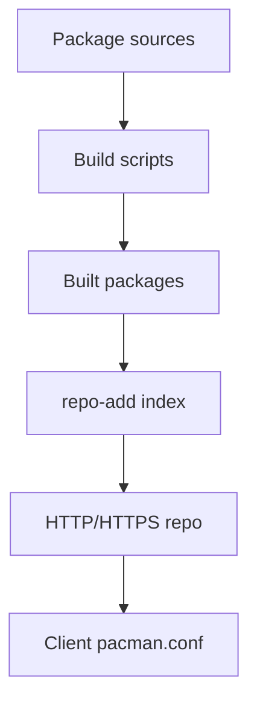

# Chapter 7: Package Management System

Implementing a package management system for easy software installation and updates.

## Learning objectives

- Choose and bootstrap a lightweight package manager (pacman example)
- Build packages reproducibly and host a small binary repository
- Sign packages and configure client verification

## Chosen System: Pacman

- Lightweight and fast
- Dependency resolution
- Simple package building
- Suitable for minimal distributions

## Quick start (conceptual)

```bash
# build pacman from source (high-level, details vary per host)
git clone https://gitlab.archlinux.org/pacman/pacman.git
cd pacman
./autogen.sh && ./configure --prefix=/usr --sysconfdir=/etc --localstatedir=/var
make && sudo make install

# minimal repo structure
mkdir -p /srv/repo/os/x86_64
# add packages with repo-add
repo-add /srv/repo/os/x86_64/custom.db.tar.gz /path/to/pkg/*.pkg.tar.*
```

## Implementation

- Build and install pacman
- Create package repository
- Package building infrastructure
- Update mechanisms

## Repository diagram



## Exercises

- Exercise 1: Create a local repo directory and index it with one test package; install from that repo.
- Exercise 2: Enable package signing and verify signature enforcement on the client.

## Next steps

- Continue to Chapter 8 to apply distribution-wide hardening and security policies.
