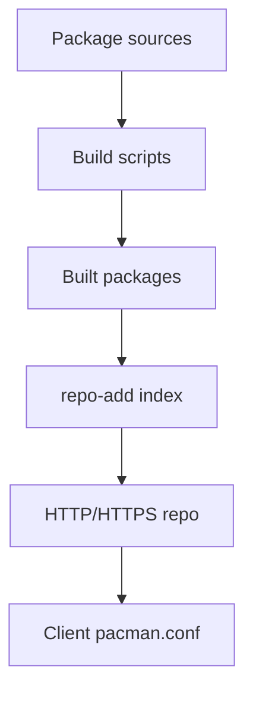

# Chapter 7: Package Management System

Implementing a package management system for easy software installation and updates, including desktop environment setup.

## Learning objectives

- Choose and bootstrap a lightweight package manager (pacman example)
- Build packages reproducibly and host a small binary repository
- Sign packages and configure client verification
- Install and configure desktop environment dependencies (X11, Mesa, graphics drivers)
- Set up a complete desktop environment (XFCE) with all necessary components

## Chosen System: Pacman

- Lightweight and fast
- Dependency resolution
- Simple package building
- Suitable for minimal distributions

## Quick start (conceptual)

```bash
# build pacman from source (high-level, details vary per host)
git clone https://gitlab.archlinux.org/pacman/pacman.git
cd pacman
./autogen.sh && ./configure --prefix=/usr --sysconfdir=/etc --localstatedir=/var
make && sudo make install

# minimal repo structure
mkdir -p /srv/repo/os/x86_64
# add packages with repo-add
repo-add /srv/repo/os/x86_64/custom.db.tar.gz /path/to/pkg/*.pkg.tar.*
```

## Implementation

- Build and install pacman
- Create package repository
- Package building infrastructure
- Update mechanisms
- Desktop dependencies (X11, graphics stack, fonts)
- Desktop environment (XFCE, display manager, applications)

## Repository diagram



## Chapter Sections

### 7.1 Introduction
- Package management fundamentals
- Pacman architecture and components
- Repository concepts

### 7.2 Pacman Setup
- Installing pacman from source
- Configuration and initialization
- Repository configuration

### 7.3 Package Building
- Creating PKGBUILD files
- Building packages with makepkg
- Package signing and verification

### 7.4 Repository Setup
- Creating custom repositories
- Repository maintenance
- Client configuration

### 7.5 Desktop Dependencies
- X.Org Server and libraries
- Mesa 3D graphics
- Graphics drivers (Intel, AMD, NVIDIA)
- Font rendering stack
- Input drivers and utilities

### 7.6 Desktop Environment
- XFCE installation and configuration
- Display manager (LightDM) setup
- Audio support (PulseAudio)
- Network management (NetworkManager)
- Essential desktop applications
- Themes and customization

## Exercises

- Exercise 1: Create a local repo directory and index it with one test package; install from that repo.
- Exercise 2: Enable package signing and verify signature enforcement on the client.
- Exercise 3: Install X.Org server and test basic graphics functionality
- Exercise 4: Set up XFCE desktop environment with LightDM display manager
- Exercise 5: Customize desktop appearance and configure essential applications

## Next steps

- Continue to Chapter 8 to apply distribution-wide hardening and security policies.
