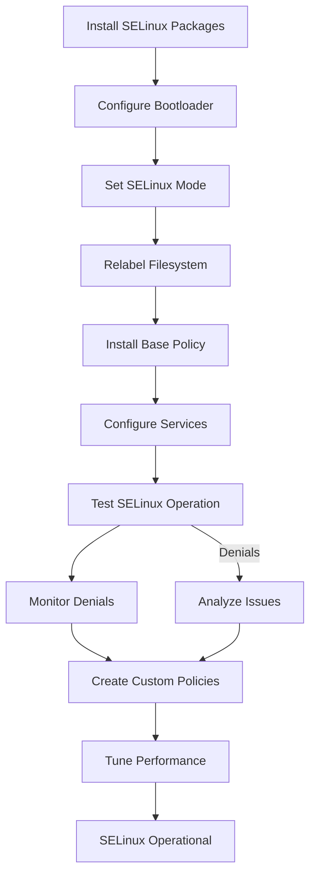

# SELinux Setup

## Overview

SELinux (Security Enhanced Linux) is a mandatory access control (MAC) system that provides fine-grained security policies for Linux systems. In a container-ready distribution, SELinux plays a crucial role in isolating containers, protecting the host system, and preventing privilege escalation attacks. This chapter covers comprehensive SELinux setup, policy management, and integration with container runtimes.

## SELinux Fundamentals

### Security Models

**Discretionary Access Control (DAC):**

- Traditional Unix permissions (user/group/world)
- Owner controls access to resources
- Limited security granularity

**Mandatory Access Control (MAC):**

- System-wide security policies
- Administrator-defined access rules
- Process and resource labeling
- Default deny policy

### SELinux Architecture

**Core Components:**

- **Security Server**: Kernel component enforcing policies
- **Policy**: Rules defining allowed operations
- **Context**: Security labels on processes and objects
- **AVC (Access Vector Cache)**: Performance optimization cache

**Kernel Code References**:

- `security/selinux/`: Main SELinux implementation directory
- `security/selinux/ss/services.c`: Security server - policy decision engine
- `security/selinux/avc.c`: Access Vector Cache implementation
- `security/selinux/hooks.c`: LSM (Linux Security Module) hook implementations
- `security/selinux/selinuxfs.c`: SELinux filesystem (`/sys/fs/selinux/`)
- Look for `security_*()` LSM hooks that SELinux implements

**Security Context Format:**

```
user:role:type:level
```

- **User**: Identity (system_u, user_u, etc.)
- **Role**: Privilege level (object_r, system_r, etc.)
- **Type**: Security type (httpd_t, sshd_t, container_t, etc.)
- **Level**: MLS/MCS sensitivity level (s0, s0:c0.c1023, etc.)

## SELinux Installation and Initial Setup

### Prerequisites

**Kernel Support:**

```bash
# Verify SELinux support in kernel
grep -i selinux /boot/config-* | grep -v "^#"

# Check for SELinux filesystem
ls -la /sys/fs/selinux/

# Verify SELinux utilities
which sestatus getenforce setenforce
```

**Package Installation:**

```bash
# Install SELinux packages
pacman -S selinux-refpolicy \
         selinux-policycoreutils \
         checkpolicy \
         setools \
         mcstrans \
         restorecond

# Install development tools
pacman -S selinux-policy-devel
```

### Bootloader Configuration

**GRUB Parameters:**

```bash
# Add SELinux parameters to GRUB
cat >> /etc/default/grub << EOF
GRUB_CMDLINE_LINUX_DEFAULT="quiet security=selinux selinux=1 enforcing=1"
EOF

# Regenerate GRUB config
grub-mkconfig -o /boot/grub/grub.cfg
```

**Kernel Command Line Verification:**

```bash
# Check current parameters
cat /proc/cmdline | grep -o "security=[^ ]*\|selinux=[^ ]*\|enforcing=[^ ]*"
```

### Initial SELinux Configuration

**Configuration File Setup:**

```bash
# Create SELinux configuration
cat > /etc/selinux/config << EOF
# SELinux configuration
SELINUX=enforcing
SELINUXTYPE=refpolicy
EOF

# For development/testing
# SELINUX=permissive  # Log violations but don't enforce
# SELINUX=disabled    # Completely disable SELinux
```

**Initial Filesystem Relabeling:**

```bash
# Trigger relabeling on next boot
touch /.autorelabel

# Alternative: Manual relabeling (time-consuming)
# setenforce 0
# find / -context "*:object_r:*" -print0 | restorecon -f -
# setenforce 1
```

## SELinux Modes and States

### Enforcement Modes

**Enforcing Mode:**

```bash
# Set enforcing mode
setenforce 1
getenforce  # Should show "Enforcing"

# Make permanent
sed -i 's/SELINUX=.*/SELINUX=enforcing/' /etc/selinux/config
```

**Permissive Mode:**

```bash
# Set permissive mode (log but don't block)
setenforce 0
getenforce  # Should show "Permissive"

# Useful for troubleshooting
sed -i 's/SELINUX=.*/SELINUX=permissive/' /etc/selinux/config
```

**Disabled Mode:**

```bash
# Completely disable SELinux
sed -i 's/SELINUX=.*/SELINUX=disabled/' /etc/selinux/config
# Requires reboot
```

### Status Checking

```bash
# Comprehensive status
sestatus

# Quick mode check
getenforce

# Policy version
cat /sys/fs/selinux/policyvers

# Loaded policy
cat /sys/fs/selinux/policy
```

## Policy Management

### Policy Types

**Targeted Policy:**

- Protects specific services
- Most common in distributions
- Balances security and usability

**MLS (Multi-Level Security):**

- Military-grade security
- Sensitivity levels and categories
- Complex administration

**Minimum Policy:**

- Minimal protection
- For embedded systems
- Reduced resource usage

### Policy Installation

**Install Reference Policy:**

```bash
# Install base policy
pacman -S selinux-refpolicy

# Install targeted policy modules
pacman -S selinux-refpolicy-targeted

# Load policy
semodule -i /usr/share/selinux/refpolicy/*.pp
```

**Custom Policy Modules:**

```bash
# Create policy module
cat > myapp.te << EOF
policy_module(myapp, 1.0.0)

type myapp_t;
type myapp_exec_t;
application_domain(myapp_t, myapp_exec_t)

files_read_etc_files(myapp_t)
EOF

# Compile and install
make -f /usr/share/selinux/refpolicy/Makefile myapp.pp
semodule -i myapp.pp
```

## Security Context Management

### Context Viewing

```bash
# View process contexts
ps -Z
ps auxZ | head -10

# View file contexts
ls -Z /etc/passwd
ls -Z /

# View current process context
id -Z
```

### Context Modification

**Temporary Changes:**

```bash
# Change file context
chcon -t httpd_sys_content_t /var/www/html/index.html

# Change process context (requires privilege)
runcon -t httpd_t /usr/sbin/httpd
```

**Persistent Changes:**

```bash
# Add file context specification
semanage fcontext -a -t httpd_sys_content_t "/var/www/html(/.*)?"

# Apply context changes
restorecon -R /var/www/html

# View context specifications
semanage fcontext -l | grep httpd
```

## SELinux Troubleshooting

### Analyzing Denials

**View Recent Denials:**

```bash
# Use audit2why for explanations
ausearch -m avc -ts recent | audit2why

# Raw denial logs
ausearch -m avc -ts recent

# Allow rules from denials
ausearch -m avc -ts recent | audit2allow
```

**Common Denial Patterns:**

```bash
# File access denials
ausearch -m avc | grep "denied.*open"

# Network access denials
ausearch -m avc | grep "denied.*connect"

# Process execution denials
ausearch -m avc | grep "denied.*execute"
```

### Debugging Tools

**SELinux Debug Tools:**

```bash
# Enable SELinux debugging
semodule -DB  # Disable dontaudit rules
# Test application
semodule -B   # Re-enable dontaudit rules

# Check boolean values
getsebool -a | grep httpd

# Set boolean temporarily
setsebool httpd_can_network_connect on

# Set boolean permanently
setsebool -P httpd_can_network_connect on
```

**Policy Analysis:**

```bash
# Check policy syntax
checkpolicy -M /etc/selinux/refpolicy/policy.conf

# Validate module
semodule -c mymodule.pp

# List loaded modules
semodule -l
```

## Container SELinux Integration

### Docker SELinux

**Docker SELinux Labels:**

```bash
# Run container with SELinux separation
docker run --security-opt label:type:container_t nginx

# Custom SELinux type
docker run --security-opt label:type:mycontainer_t nginx

# Disable SELinux for container
docker run --security-opt label:disable nginx
```

**Kernel Code References for Container Labeling**:

- `security/selinux/hooks.c`: Look for `selinux_socket_*()` hooks for network labeling
- `security/selinux/hooks.c`: `selinux_file_open()` for file context enforcement
- `security/selinux/netlabel.c`: Network packet labeling for containers
- `security/selinux/ss/services.c`: `security_transition_sid()` for context transitions
- Container runtimes use `setexeccon()` syscall to set process context before exec

**Docker SELinux Policy:**

```bash
# Install Docker SELinux policy
pacman -S docker-selinux

# Check Docker boolean
getsebool docker_transition_unconfined

# Allow Docker to transition
setsebool -P docker_transition_unconfined on
```

### Podman SELinux

**Podman Container Labels:**

```bash
# Run with default container type
podman run --security-opt label=type:container_t nginx

# Run privileged (no SELinux)
podman run --privileged nginx

# Custom label
podman run --security-opt label=type:custom_container_t nginx
```

**Podman Rootless SELinux:**

```bash
# Enable rootless SELinux
setsebool -P container_manage_cgroup on

# Check rootless context
podman unshare id -Z
```

### Container Policy Modules

**Custom Container Policy:**

```bash
cat > container_app.te << EOF
policy_module(container_app, 1.0.0)

type container_app_t;
type container_app_exec_t;
application_domain(container_app_t, container_app_exec_t)

# Allow network access
corenet_tcp_connect_http_port(container_app_t)
corenet_tcp_connect_https_port(container_app_t)

# Allow file access
files_read_etc_files(container_app_t)
EOF

# Build and install
make -f /usr/share/selinux/refpolicy/Makefile container_app.pp
semodule -i container_app.pp
```

## Advanced SELinux Features

### Multi-Category Security (MCS)

**MCS Configuration:**

```bash
# Enable MCS
echo 'SELINUXTYPE=mcs' >> /etc/selinux/config

# Assign categories to processes
runcon -l s0:c0,c1,c2 /bin/bash

# Category-based access control
chcon -l s0:c0 /secret/file1
chcon -l s0:c1 /secret/file2
```

### Conditional Policies

**Boolean Management:**

```bash
# List all booleans
getsebool -a

# Set boolean for service
setsebool -P httpd_can_sendmail on

# Check boolean status
getsebool httpd_can_sendmail
```

**Custom Booleans:**

```bash
# Add custom boolean to policy
cat >> myapp.te << EOF
gen_bool(myapp_can_network, false)
if (myapp_can_network) {
    corenet_tcp_connect_http_port(myapp_t)
}
EOF
```

## SELinux Monitoring and Auditing

### Audit Integration

**SELinux Audit Rules:**

```bash
# Add SELinux audit rules
cat > /etc/audit/rules.d/selinux.rules << EOF
-w /etc/selinux/ -p wa -k selinux_config
-w /sys/fs/selinux/ -p wa -k selinux_sysfs
EOF

systemctl restart auditd
```

**Audit Analysis:**

```bash
# SELinux-specific audit queries
ausearch -m avc,user_avc,selinux_err -ts today

# Generate policy from audit logs
ausearch -m avc -ts recent | audit2allow -M mypolicy
semodule -i mypolicy.pp
```

### Performance Monitoring

**AVC Statistics:**

```bash
# View AVC cache statistics
cat /sys/fs/selinux/avc/cache_stats

# Check policy load time
time semodule -R

# Monitor SELinux overhead
perf stat -e selinux:avc_cache_hit,selinux:avc_cache_miss
```

## SELinux in Production

### Hardening Practices

**Server Hardening:**

```bash
# Disable unconfined domains
setsebool -P unconfined_login off

# Restrict user domains
setsebool -P user_ping off

# Secure network services
setsebool -P nis_enabled off
setsebool -P ftp_home_dir off
```

**Container Host Hardening:**

```bash
# Container-specific booleans
setsebool -P container_use_ceph off
setsebool -P container_connect_any on

# Secure container runtime
setsebool -P container_manage_cgroup on
setsebool -P container_use_devices on
```

### Backup and Recovery

**SELinux Configuration Backup:**

```bash
# Backup SELinux configuration
tar -czf /backup/selinux-config-$(date +%Y%m%d).tar.gz \
    /etc/selinux/ \
    /etc/audit/rules.d/selinux.rules

# Backup loaded modules
semodule -e > /backup/selinux-modules-$(date +%Y%m%d).list
```

**Recovery Procedures:**

```bash
# Boot into permissive mode
# Edit GRUB: add selinux=0 to kernel parameters

# Fix policy issues
semodule -r broken_module
semodule -i fixed_module.pp

# Relabel filesystem
touch /.autorelabel
reboot
```

## SELinux Workflow Diagram



## Exercises

### Exercise 1: SELinux Installation and Basic Setup

1. Verify SELinux kernel support: `grep SELINUX /boot/config-*`
2. Install SELinux packages: `pacman -S selinux-refpolicy selinux-policycoreutils`
3. Configure GRUB with SELinux parameters
4. Set SELinux to permissive mode initially
5. Trigger filesystem relabeling and reboot
6. Verify SELinux status: `sestatus`

**Expected Outcome**: SELinux installed and running in permissive mode

### Exercise 2: SELinux Modes and Configuration

1. Switch between enforcing and permissive modes: `setenforce 0/1`
2. Configure permanent SELinux settings in `/etc/selinux/config`
3. View security contexts: `ps -Z` and `ls -Z`
4. Check SELinux booleans: `getsebool -a`
5. Modify a boolean setting and test
6. Document SELinux configuration

**Expected Outcome**: Understanding of SELinux modes and basic configuration

### Exercise 3: Policy Management and Troubleshooting

1. View recent SELinux denials: `ausearch -m avc -ts recent`
2. Analyze denial with audit2why
3. Create allow rule from denial: `audit2allow`
4. Install custom policy module
5. Test policy change
6. Document troubleshooting process

**Expected Outcome**: Ability to analyze and resolve SELinux policy issues

### Exercise 4: Container SELinux Integration

1. Run Docker container with SELinux labels
2. Check container security context
3. Configure Podman SELinux settings
4. Create custom container policy
5. Test container isolation
6. Verify SELinux protection

**Expected Outcome**: Containers running with SELinux security

### Exercise 5: Advanced SELinux Features

1. Configure Multi-Category Security (MCS)
2. Set up category-based access control
3. Create conditional policies with booleans
4. Implement custom security contexts
5. Test advanced SELinux features
6. Document advanced configuration

**Expected Outcome**: Advanced SELinux security features implemented

### Exercise 6: SELinux Monitoring and Auditing

1. Configure SELinux audit rules
2. Set up denial monitoring
3. Create automated policy generation
4. Monitor SELinux performance
5. Generate security reports
6. Document monitoring procedures

**Expected Outcome**: Comprehensive SELinux monitoring and auditing

### Exercise 7: Production SELinux Hardening

1. Apply server hardening practices
2. Configure container host security
3. Set up backup and recovery procedures
4. Test security measures
5. Document hardening procedures
6. Create security baseline

**Expected Outcome**: Production-ready SELinux hardening

## Next Steps

With SELinux properly configured, proceed to Chapter 8.2 for AppArmor setup. SELinux provides the foundation for mandatory access control, while AppArmor offers complementary application-level security restrictions.

## References

- SELinux Documentation: https://selinuxproject.org/page/Main_Page
- Reference Policy: https://github.com/SELinuxProject/refpolicy
- SELinux User's and Administrator's Guide: https://access.redhat.com/documentation/en-us/red_hat_enterprise_linux/8/html/using_selinux/
- audit2allow: https://linux.die.net/man/1/audit2allow
- sestatus: https://linux.die.net/man/8/sestatus
- Docker SELinux: https://docs.docker.com/engine/security/selinux/
