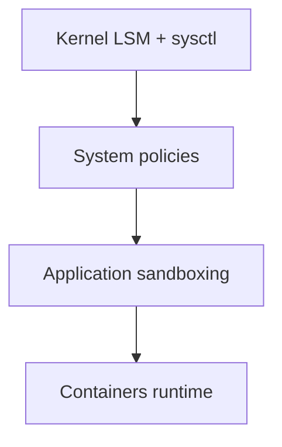

# Chapter 8: Security Hardening

Implementing comprehensive security measures for the distribution.

## Learning objectives

- Apply a multi-layer hardening strategy (kernel, system, application)
- Configure SELinux/AppArmor, firewall (nftables) and audit
- Establish secure defaults and continuous update posture

## Security Layers

- SELinux mandatory access control
- AppArmor application confinement
- Firewall configuration (nftables)
- Audit system for logging
- Secure defaults and policies

## Hardening baseline (checklist)

| Area     | Control                                 | How to enable                                        | Verify                                              |
| -------- | --------------------------------------- | ---------------------------------------------------- | --------------------------------------------------- | ----------------------------- |
| LSM      | SELinux/AppArmor enforcing              | Select one; enable enforcing at boot                 | `sestatus` or `aa-status`                           |
| Lockdown | Kernel Lockdown LSM                     | boot param `lockdown=integrity` or `confidentiality` | `cat /sys/kernel/security/lockdown`                 |
| Sysctl   | kptr/dmesg restrictions                 | sysctl drop-in                                       | `sysctl kernel.kptr_restrict kernel.dmesg_restrict` |
| Sysctl   | disable unprivileged BPF                | `kernel.unprivileged_bpf_disabled=1`                 | `sysctl kernel.unprivileged_bpf_disabled`           |
| Sysctl   | restrict ptrace                         | `kernel.yama.ptrace_scope=1`                         | `sysctl kernel.yama.ptrace_scope`                   |
| Net      | sane defaults (no redirects, rp_filter) | sysctl drop-in                                       | `sysctl net.ipv4.* net.ipv6.*`                      |
| FW       | nftables default-drop policy            | base ruleset                                         | `nft list ruleset`                                  |
| Audit    | auditd with base rules                  | rules file                                           | `auditctl -s; auditctl -l`                          |
| FS       | nodev/nosuid/noexec where safe          | fstab options                                        | `findmnt -no OPTIONS /tmp`                          |
| Auth     | SSH hardening (no root pwd, keys)       | sshd_config                                          | `sshd -T                                            | findstr /c:"permitrootlogin"` |

## Quick start (examples)

```bash
# AppArmor (example)
sudo aa-status || true
sudo aa-enforce /etc/apparmor.d/usr.bin.podman || true

# nftables minimal policy
sudo nft add table inet filter
sudo nft add chain inet filter input { type filter hook input priority 0; policy drop; }
sudo nft add rule inet filter input ct state established,related accept
sudo nft add rule inet filter input iif lo accept
sudo nft add rule inet filter input tcp dport {22,80,443} accept

# auditd
sudo systemctl enable --now auditd || true
```

## Sysctl baseline

Create `/etc/sysctl.d/99-hardening.conf`:

```conf
# General kernel info leak reduction
kernel.kptr_restrict = 2
kernel.dmesg_restrict = 1
kernel.yama.ptrace_scope = 1
kernel.kexec_load_disabled = 1
dev.tty.legacy_tiocsti = 0

# Unprivileged BPF and user namespaces
kernel.unprivileged_bpf_disabled = 1
user.max_user_namespaces = 15000

# Networking (IPv4)
net.ipv4.conf.all.accept_redirects = 0
net.ipv4.conf.default.accept_redirects = 0
net.ipv4.conf.all.send_redirects = 0
net.ipv4.conf.default.send_redirects = 0
net.ipv4.conf.all.rp_filter = 1
net.ipv4.conf.default.rp_filter = 1
net.ipv4.tcp_syncookies = 1

# Networking (IPv6)
net.ipv6.conf.all.accept_redirects = 0
net.ipv6.conf.default.accept_redirects = 0
net.ipv6.conf.all.accept_ra = 0
net.ipv6.conf.default.accept_ra = 0
```

Apply and verify:

```bash
sudo sysctl --system
sysctl kernel.kptr_restrict kernel.dmesg_restrict kernel.unprivileged_bpf_disabled
```

## nftables baseline ruleset

For persistence, define `/etc/nftables.conf`:

```nft
flush ruleset

table inet filter {
	sets {
		ssh_ports { type inet_service; elements = { 22 } }
	}

	chains {
		input {
			type filter hook input priority 0; policy drop;
			ct state established,related accept
			iif lo accept
			ip protocol icmp accept
			ip6 nexthdr icmpv6 accept
			tcp dport @ssh_ports ct state new limit rate over 15/minute burst 30 packets reject with icmpx type admin-prohibited
			tcp dport @ssh_ports accept
		}
		forward { type filter hook forward priority 0; policy drop; }
		output { type filter hook output priority 0; policy accept; }
	}
}
```

Enable at boot:

```bash
sudo systemctl enable --now nftables
sudo nft list ruleset
```

## Auditd base rules

Place in `/etc/audit/rules.d/hardening.rules`:

```text
-D
-b 8192
# track execs
-a always,exit -F arch=b64 -S execve,execveat -k exec
# identity changes
-w /etc/passwd -p wa -k identity
-w /etc/group -p wa -k identity
-w /etc/shadow -p wa -k identity
# time changes
-w /etc/localtime -p wa -k time-change
# login events
-w /var/log/lastlog -p wa -k logins
-w /var/run/faillock -p wa -k logins
```

Activate:

```bash
sudo augenrules --load || sudo service auditd restart
auditctl -s
auditctl -l | head -n 10
```

## SELinux vs AppArmor (choosing an LSM)

- SELinux: fine-grained, label-based MAC; steeper learning curve; broad policy coverage; good for servers.
- AppArmor: path-based, simpler to author; great for quick confinement of apps and containers.

Switch default LSM order via kernel cmdline, e.g.: `lsm=landlock,lockdown,yama,apparmor,bpf` or include `selinux` instead of `apparmor`.

- SELinux quick check: `sestatus` and `getenforce`; enforce with `setenforce 1`.
- AppArmor quick check: `aa-status`; enforce with `aa-enforce <profile>`.

## Filesystem mount options

Use `nodev,nosuid,noexec` where safe. Example `/etc/fstab` entries:

```fstab
tmpfs /tmp tmpfs defaults,noexec,nosuid,nodev,mode=1777 0 0
proc  /proc proc  defaults,hidepid=2,gid=proc 0 0
```

Note: noexec on /tmp can break some installers; adjust per workload.

## Kernel hardening hooks (overview)

- Enable module signing: `CONFIG_MODULE_SIG=y`, `CONFIG_MODULE_SIG_ALL=y`, optionally enforce with `CONFIG_MODULE_SIG_FORCE`.
- Consider Lockdown LSM and enable lockdown mode via `lockdown=` kernel parameter.
- Explore IMA/EVM for file integrity; plan for key management before enabling enforcement.

## Hardening Principles

- Principle of least privilege
- Defense in depth
- Minimal attack surface
- Regular security updates

## Layers diagram



## Exercises

- Exercise 1: Choose SELinux or AppArmor, set to enforcing, and confine a simple binary (e.g., curl). Verify denials in logs and tune policy.
- Exercise 2: Write a baseline nftables ruleset with default-drop, enable rate limiting on SSH, and verify with nmap/ab.
- Exercise 3: Create `/etc/sysctl.d/99-hardening.conf`, apply with `sysctl --system`, and validate key toggles.
- Exercise 4: Add 3 custom audit rules that alert on changes to `/usr/bin` and auth failures; confirm events appear in `ausearch -k`.

## Next steps

- Proceed to Chapter 9 to wire security with container runtimes and validate policies under containers.
