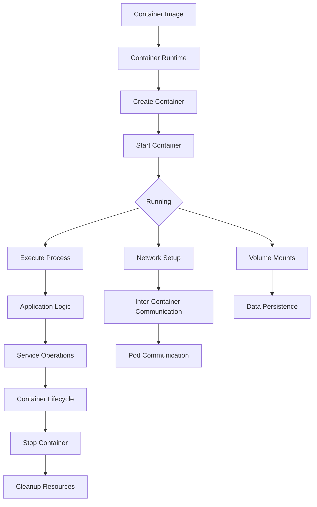

# Container Operations

## Overview

This chapter explores the operational aspects of containers, focusing on how containers work internally, how pods communicate, and practical examples of container operations. Understanding these concepts is crucial for building and managing containerized applications in your custom Linux distribution.

## Container Fundamentals

### What is a Container?

A container is a lightweight, standalone, executable package that includes everything needed to run a piece of software. Containers isolate applications from the host system and from each other, providing consistency across different environments.

**Key Characteristics:**

- **Isolation**: Processes, filesystem, network
- **Portability**: Run anywhere with container runtime
- **Efficiency**: Shared kernel, minimal overhead
- **Immutability**: Consistent deployment

### Container Architecture

**Core Components:**

- **Container Runtime**: Executes containers (Docker, Podman, containerd)
- **Container Image**: Read-only template with application and dependencies
- **Container Layer**: Writable layer for runtime changes
- **Namespaces**: Kernel feature for isolation
- **cgroups**: Resource limits and accounting

**Container Lifecycle:**

```
Image → Container → Running Process → Stopped Container → Removed
```

## Namespaces and Isolation

### Linux Namespaces

**Types of Namespaces:**

- **PID**: Process ID isolation
- **NET**: Network interface isolation
- **MNT**: Filesystem mount isolation
- **UTS**: Hostname/domainname isolation
- **IPC**: Inter-process communication isolation
- **USER**: User/group ID isolation

**Namespace Example:**

```bash
# Create network namespace
ip netns add container_net

# Run command in namespace
ip netns exec container_net ip addr

# List namespaces
lsns
```

### Control Groups (cgroups)

**cgroup Hierarchy:**

```
cgroup/
├── cpu/
│   ├── container1/
│   └── container2/
├── memory/
│   ├── container1/
│   └── container2/
└── blkio/
    ├── container1/
    └── container2/
```

**Resource Limits:**

```bash
# Create cgroup
cgcreate -g cpu,memory:container1

# Set CPU limit (50% of one core)
cgset -r cpu.shares=512 container1

# Set memory limit
cgset -r memory.limit_in_bytes=100M container1

# Execute in cgroup
cgexec -g cpu,memory:container1 /bin/bash
```

## Container Images and Layers

### Image Architecture

**Layer Structure:**

```
Base OS Layer (Ubuntu, Alpine, etc.)
├── Runtime Layer (Node.js, Python, etc.)
├── Application Layer (Your code)
└── Configuration Layer (Environment variables, etc.)
```

**Union Filesystem:**

- **OverlayFS**: Modern Linux union filesystem
- **AUFS**: Older union filesystem
- **Btrfs/ZFS**: Copy-on-write filesystems

### Image Operations

**Building Images:**

```bash
# Dockerfile example
FROM ubuntu:20.04
RUN apt-get update && apt-get install -y nginx
COPY app /usr/share/nginx/html
EXPOSE 80
CMD ["nginx", "-g", "daemon off;"]
```

**Layer Inspection:**

```bash
# Docker layer inspection
docker history nginx:latest

# Podman layer inspection
podman inspect nginx:latest | jq .RootFS

# Buildah layer manipulation
buildah from ubuntu:20.04
buildah run container_id apt-get update
buildah commit container_id myimage
```

## Pod Concepts and Multi-Container Applications

### What is a Pod?

A pod is a group of one or more containers that share storage, network, and specifications for how to run. In Kubernetes, pods are the smallest deployable units, but the concept applies to container orchestration in general.

**Pod Characteristics:**

- **Shared Network**: All containers in a pod share IP and port space
- **Shared Storage**: Volumes mounted to all containers
- **Lifecycle Management**: Containers started/stopped together
- **Local Communication**: Containers communicate via localhost

### Pod Implementation

**Docker Compose Pod:**

```yaml
# docker-compose.yml
version: "3.8"
services:
  web:
    image: nginx
    ports:
      - "80:80"
    volumes:
      - ./html:/usr/share/nginx/html
  app:
    image: myapp
    depends_on:
      - web
    environment:
      - WEB_HOST=web
```

**Podman Pod:**

```bash
# Create pod
podman pod create --name mypod -p 8080:80

# Add containers to pod
podman run --pod mypod --name web nginx
podman run --pod mypod --name app myapp

# Pod operations
podman pod ps
podman pod logs mypod
podman pod stop mypod
```

## Inter-Container Communication

### Network Modes

**Bridge Network (Default):**

- Containers get IP from bridge network
- Communication via IP addresses
- Port mapping for external access

**Host Network:**

- Container uses host network stack
- Direct access to host ports
- No port mapping needed

**Container Network:**

- Share network namespace with another container
- Communication via localhost

**None Network:**

- No network access
- Isolated container

### Communication Patterns

**Direct IP Communication:**

```bash
# Get container IP
docker inspect web | grep IPAddress

# Connect from another container
curl http://172.17.0.2:80
```

**DNS-Based Service Discovery:**

```bash
# Docker networks with DNS
docker network create mynetwork
docker run --network mynetwork --name web nginx
docker run --network mynetwork --name app myapp

# App connects via hostname
curl http://web:80
```

**Environment Variables:**

```bash
# Pass connection info via env
docker run --env WEB_HOST=web --env DB_HOST=db myapp

# Application reads environment
web_host = os.getenv('WEB_HOST')
```

## Container Operations Examples

### Example 1: Web Application Pod

**Architecture:**

```
[Web Server] ←→ [Application] ←→ [Database]
     ↑              ↑              ↑
   Port 80      localhost      localhost
```

**Implementation:**

```bash
# Create pod
podman pod create --name webapp -p 8080:80

# Database container
podman run -d --pod webapp --name db \
  -e POSTGRES_PASSWORD=mypass \
  -e POSTGRES_DB=myapp \
  postgres:13

# Application container
podman run -d --pod webapp --name app \
  -e DB_HOST=localhost \
  -e DB_PORT=5432 \
  myapp:latest

# Web server container
podman run -d --pod webapp --name web \
  -v ./nginx.conf:/etc/nginx/nginx.conf \
  nginx

# Check pod status
podman pod ps
podman ps --pod
```

### Example 2: Microservices Communication

**Service Mesh Pattern:**

```yaml
# docker-compose.yml
version: "3.8"
services:
  api-gateway:
    image: nginx
    ports:
      - "80:80"
    volumes:
      - ./gateway.conf:/etc/nginx/nginx.conf
    depends_on:
      - auth-service
      - user-service

  auth-service:
    image: auth-service
    environment:
      - USER_SERVICE_URL=http://user-service:8080
    depends_on:
      - user-service

  user-service:
    image: user-service
    environment:
      - DB_URL=postgres://db:5432/myapp
    depends_on:
      - db

  db:
    image: postgres:13
    environment:
      - POSTGRES_DB=myapp
```

**Inter-Service Calls:**

```python
# auth-service communicating with user-service
import requests

def authenticate_user(token):
    # Call user service
    response = requests.get(
        f"{os.getenv('USER_SERVICE_URL')}/user",
        headers={'Authorization': f'Bearer {token}'}
    )
    return response.json()
```

### Example 3: Data Processing Pipeline

**Pipeline Architecture:**

```
[Data Source] → [Processor 1] → [Processor 2] → [Storage]
```

**Implementation:**

```bash
# Create processing pod
podman pod create --name pipeline

# Shared volume for data
podman volume create pipeline-data

# Data source (simulated)
podman run -d --pod pipeline --name source \
  --volume pipeline-data:/data \
  busybox sh -c 'while true; do echo $(date) >> /data/input.txt; sleep 5; done'

# Processor 1
podman run -d --pod pipeline --name proc1 \
  --volume pipeline-data:/data \
  python:3 python -c "
import time
while True:
    with open('/data/input.txt', 'r') as f:
        lines = f.readlines()
    processed = [line.upper() for line in lines]
    with open('/data/processed1.txt', 'w') as f:
        f.writelines(processed)
    time.sleep(10)
"

# Processor 2
podman run -d --pod pipeline --name proc2 \
  --volume pipeline-data:/data \
  python:3 python -c "
import time
while True:
    try:
        with open('/data/processed1.txt', 'r') as f:
            data = f.read()
        result = data.replace(' ', '_')
        with open('/data/final.txt', 'w') as f:
            f.write(result)
    except FileNotFoundError:
        pass
    time.sleep(15)
"

# Monitor pipeline
podman logs -f pipeline
```

## Container Orchestration

### Docker Compose Orchestration

**Multi-Service Application:**

```yaml
# docker-compose.yml
version: "3.8"
services:
  frontend:
    image: react-app
    ports:
      - "3000:3000"
    environment:
      - API_URL=http://api:8080

  api:
    image: node-api
    ports:
      - "8080:8080"
    environment:
      - DB_CONNECTION=postgresql://db:5432/app
    depends_on:
      - db

  db:
    image: postgres:13
    environment:
      - POSTGRES_DB=app
    volumes:
      - db_data:/var/lib/postgresql/data

volumes:
  db_data:
```

**Orchestration Commands:**

```bash
# Start all services
docker-compose up -d

# Scale services
docker-compose up -d --scale api=3

# Check service health
docker-compose ps

# View logs
docker-compose logs -f api

# Update services
docker-compose pull
docker-compose up -d
```

### Podman Orchestration

**Podman Quadlets:**

```ini
# /etc/containers/systemd/api.container
[Unit]
Description=API Service
After=network.target

[Container]
Image=api:latest
PublishPort=8080:8080
Environment=DB_HOST=db
Volume=/data:/app/data

[Install]
WantedBy=multi-user.target
```

**Generate systemd units:**

```bash
# Convert quadlet to systemd
podman generate systemd --new --files --name api

# Enable and start
systemctl enable podman-api.service
systemctl start podman-api.service
```

## Container Monitoring and Debugging

### Runtime Inspection

**Container Introspection:**

```bash
# Docker inspection
docker inspect container_name

# Podman inspection
podman inspect container_name

# Process tree
docker top container_name
podman top container_name
```

**Resource Usage:**

```bash
# Container stats
docker stats
podman stats

# Specific container
docker stats container_name
podman stats container_name
```

### Debugging Techniques

**Container Logs:**

```bash
# View logs
docker logs container_name
podman logs container_name

# Follow logs
docker logs -f container_name
podman logs -f container_name

# Log filtering
docker logs --since 1h container_name
```

**Interactive Debugging:**

```bash
# Execute in running container
docker exec -it container_name /bin/bash
podman exec -it container_name /bin/bash

# Debug stopped container
docker run --rm -it --volumes-from container_name ubuntu /bin/bash
```

**Network Debugging:**

```bash
# Check container networking
docker network ls
podman network ls

# Inspect network
docker network inspect bridge
podman network inspect podman

# Network troubleshooting
docker exec container_name netstat -tlnp
podman exec container_name ss -tlnp
```

## Container Workflow Diagram



## Exercises

### Exercise 1: Basic Container Operations

1. Create a simple container with busybox
2. Execute commands inside the container
3. Inspect container filesystem and processes
4. Check resource usage with container stats
5. Clean up the container

**Expected Outcome**: Understanding of basic container lifecycle and inspection

### Exercise 2: Pod Creation and Management

1. Create a pod with Podman
2. Add multiple containers to the pod
3. Configure shared networking
4. Test inter-container communication
5. Monitor pod resources and logs

**Expected Outcome**: Working pod with communicating containers

### Exercise 3: Multi-Container Application

1. Design a simple web application architecture
2. Create containers for each component
3. Set up networking between containers
4. Configure environment variables
5. Test the complete application

**Expected Outcome**: Functional multi-container application

### Exercise 4: Container Networking

1. Create custom Docker networks
2. Connect containers to networks
3. Test DNS resolution between containers
4. Configure network aliases
5. Debug network connectivity issues

**Expected Outcome**: Understanding of container networking patterns

### Exercise 5: Data Sharing Between Containers

1. Create shared volumes
2. Mount volumes in multiple containers
3. Test data persistence across container restarts
4. Implement data sharing patterns
5. Clean up volumes safely

**Expected Outcome**: Containers sharing data through volumes

### Exercise 6: Container Orchestration

1. Create a docker-compose file for a multi-service app
2. Define service dependencies
3. Configure environment variables
4. Scale services horizontally
5. Update services with zero downtime

**Expected Outcome**: Orchestrated multi-service application

### Exercise 7: Container Debugging

1. Create a failing container application
2. Use logs to diagnose issues
3. Execute commands in running containers
4. Inspect container state and configuration
5. Fix the application and redeploy

**Expected Outcome**: Proficiency in container debugging techniques

## Next Steps

With a solid understanding of container operations, proceed to Chapter 12 for container security. Container operations provide the foundation for understanding how containers work together, while security focuses on protecting these operations from threats.

## References

- Docker Documentation: https://docs.docker.com/
- Podman Documentation: https://podman.io/
- Kubernetes Pods: https://kubernetes.io/docs/concepts/workloads/pods/
- Container Networking: https://docs.docker.com/network/
- Docker Compose: https://docs.docker.com/compose/
