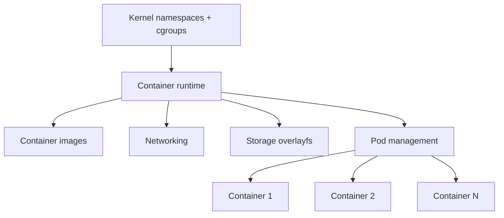

# Chapter 11: Container Operations

Advanced container operations including fundamentals, pod management, inter-container communication, and orchestration.

## Learning objectives

- Understand container architecture and lifecycle management
- Implement pod concepts for multi-container applications
- Configure inter-container communication patterns
- Orchestrate containers using Docker Compose and Podman

## Overview

This chapter explores the operational aspects of containers, focusing on how containers work internally, how pods communicate, and practical examples of container operations. Understanding these concepts is crucial for building and managing containerized applications in your custom Linux distribution.

## Components

- Container fundamentals (namespaces, cgroups, images)
- Pod concepts and multi-container management
- Inter-container communication and networking
- Container orchestration with Docker Compose and Podman
- Container monitoring and debugging

## Quick start (Pod example)

```bash
# Create a pod with Podman
podman pod create --name mypod -p 8080:80

# Add containers to pod
podman run --pod mypod --name web -d nginx
podman run --pod mypod --name app -d myapp

# Pod operations
podman pod ps
podman pod logs mypod
podman pod stop mypod
```

## Container Runtime Flow



## Detailed Topics

### 01. Container Fundamentals
- [Container architecture and lifecycle](01-fundamentals/01-container-operations.md#container-fundamentals)
- [Namespaces and isolation](01-fundamentals/01-container-operations.md#namespaces-and-isolation)
- [Control groups (cgroups)](01-fundamentals/01-container-operations.md#namespaces-and-isolation)
- [Container images and layers](01-fundamentals/01-container-operations.md#container-images-and-layers)

### 02. Pod Operations
- [Pod concepts and architecture](01-fundamentals/01-container-operations.md#pod-concepts-and-multi-container-applications)
- [Multi-container applications](01-fundamentals/01-container-operations.md#pod-concepts-and-multi-container-applications)
- [Shared network and storage](01-fundamentals/01-container-operations.md#pod-concepts-and-multi-container-applications)
- [Pod lifecycle management](01-fundamentals/01-container-operations.md#pod-concepts-and-multi-container-applications)

### 03. Inter-Container Communication
- [Network modes (bridge, host, none)](01-fundamentals/01-container-operations.md#inter-container-communication)
- [DNS-based service discovery](01-fundamentals/01-container-operations.md#inter-container-communication)
- [Environment variables and configuration](01-fundamentals/01-container-operations.md#inter-container-communication)
- [Shared volumes and IPC](01-fundamentals/01-container-operations.md#inter-container-communication)

### 04. Container Orchestration
- [Docker Compose orchestration](01-fundamentals/01-container-operations.md#container-orchestration)
- [Podman quadlets and systemd](01-fundamentals/01-container-operations.md#container-orchestration)
- [Service dependencies and health checks](01-fundamentals/01-container-operations.md#container-orchestration)
- [Scaling and updates](01-fundamentals/01-container-operations.md#container-orchestration)

## Container Monitoring

- Runtime inspection (docker/podman inspect)
- Resource monitoring (stats, top)
- Log aggregation and analysis
- Debugging container issues

Example monitoring commands:

```bash
# Monitor container resources
podman stats

# View container processes
podman top container_name

# Stream logs
podman logs -f container_name

# Inspect container details
podman inspect container_name
```

## Exercises

- Exercise 1: Create a multi-container pod with a web server and application, verify they communicate via localhost.
- Exercise 2: Set up DNS-based service discovery between containers on a custom network.
- Exercise 3: Orchestrate a 3-tier application (frontend, API, database) using Docker Compose.
- Exercise 4: Convert a Docker Compose application to Podman quadlets with systemd integration.
- Exercise 5: Debug a failing container using logs, inspect, and exec commands.

## Next steps

- Proceed to Chapter 12 to learn about container security threats, vulnerabilities, and mitigation strategies.
- Review the detailed content in [01-fundamentals/01-container-operations.md](01-fundamentals/01-container-operations.md) for comprehensive examples and code.

## References

- [Docker Documentation](https://docs.docker.com/)
- [Podman Documentation](https://docs.podman.io/)
- [Kubernetes Pods Concepts](https://kubernetes.io/docs/concepts/workloads/pods/)
- [Linux Namespaces](https://man7.org/linux/man-pages/man7/namespaces.7.html)
- [Control Groups (cgroups)](https://www.kernel.org/doc/html/latest/admin-guide/cgroup-v2.html)
