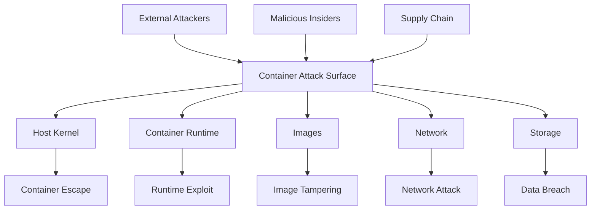
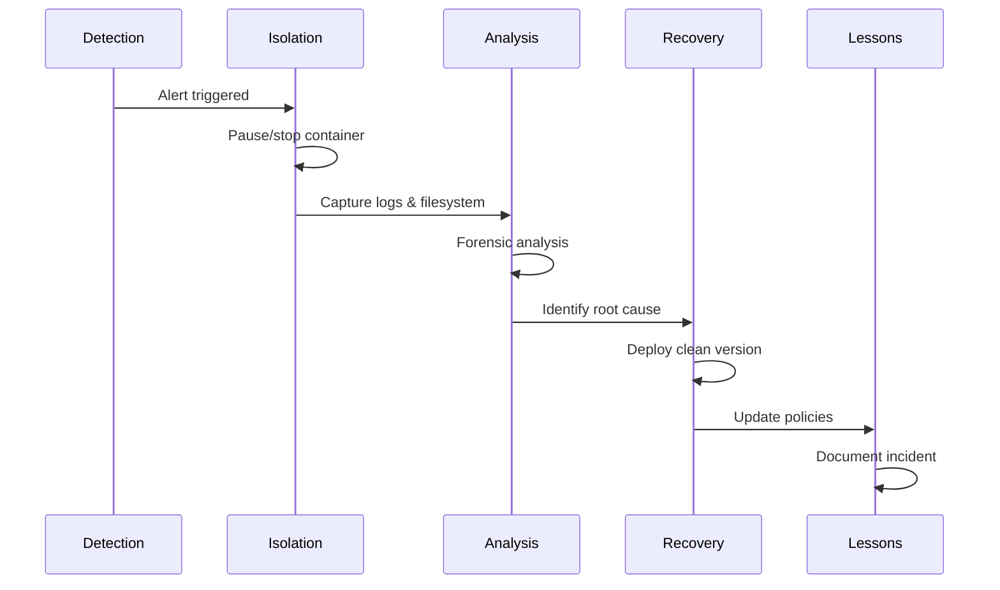

# Chapter 12: Container Security

Advanced container security including threat modeling, common attacks, mitigation strategies, and security testing.

## Learning objectives

- Understand container attack surfaces and threat modeling
- Identify common container attacks and vulnerabilities
- Implement comprehensive security mitigation strategies
- Conduct security testing and incident response

## Overview

Container security is critical in modern infrastructure, as containers introduce unique attack surfaces and vulnerabilities. This chapter explores common container attacks, security threats, and comprehensive mitigation strategies. Understanding these security concepts is essential for building secure containerized applications in your custom Linux distribution.

## Components

- Container threat modeling and attack surface analysis
- Common container attacks and exploits
- Vulnerability classes (CVEs, misconfigurations)
- Comprehensive mitigation strategies
- Advanced security techniques (gVisor, Kata, SELinux/AppArmor)
- Incident response and forensics
- Security testing and validation

## Quick start (Security hardening)

```bash
# Run container with security hardening
podman run --rm \
  --security-opt seccomp=/path/to/seccomp-profile.json \
  --security-opt apparmor=podman-default \
  --cap-drop=ALL --cap-add=NET_BIND_SERVICE \
  --read-only --tmpfs /tmp \
  --user 1000:1000 \
  -p 8080:8080 myapp:latest

# Scan image for vulnerabilities
trivy image myapp:latest

# Verify image signature
cosign verify myregistry.com/myapp:latest
```

## Security Threat Model



## Detailed Topics

### 01. Threat Modeling
- [Attack surface analysis](01-threat-modeling/01-container-security.md#container-threat-modeling)
- [Threat actors and motivations](01-threat-modeling/01-container-security.md#container-threat-modeling)
- [STRIDE threat model](01-threat-modeling/01-container-security.md#container-threat-modeling)
- [Risk assessment](01-threat-modeling/01-container-security.md#container-threat-modeling)

### 02. Common Attacks
- [Privilege escalation via mounts](01-threat-modeling/01-container-security.md#common-container-attacks)
- [Container escape via kernel exploits](01-threat-modeling/01-container-security.md#common-container-attacks)
- [Image tampering and supply chain attacks](01-threat-modeling/01-container-security.md#common-container-attacks)
- [DoS and resource exhaustion](01-threat-modeling/01-container-security.md#common-container-attacks)
- [Vulnerability classes (CVEs, misconfigurations)](01-threat-modeling/01-container-security.md#vulnerability-classes)

### 03. Mitigation Strategies
- [Image security (scanning, signing, minimal images)](01-threat-modeling/01-container-security.md#mitigation-strategies)
- [Runtime security (security contexts, seccomp, AppArmor)](01-threat-modeling/01-container-security.md#mitigation-strategies)
- [Network security (segmentation, policies)](01-threat-modeling/01-container-security.md#mitigation-strategies)
- [Secrets management](01-threat-modeling/01-container-security.md#mitigation-strategies)
- [Advanced techniques (gVisor, Kata, SELinux)](01-threat-modeling/01-container-security.md#advanced-security-techniques)
- [Supply chain security (SBOM, binary authorization)](01-threat-modeling/01-container-security.md#advanced-security-techniques)

### 04. Security Testing
- [Container security scanning (static analysis)](01-threat-modeling/01-container-security.md#security-testing)
- [Dynamic testing and penetration testing](01-threat-modeling/01-container-security.md#security-testing)
- [Compliance validation](01-threat-modeling/01-container-security.md#security-testing)
- [Incident response and forensics](01-threat-modeling/01-container-security.md#incident-response)

## Security Best Practices

### Defense in Depth

1. **Image Security**: Use minimal base images, scan for vulnerabilities, sign images
2. **Runtime Security**: Apply security contexts, use seccomp/AppArmor, drop capabilities
3. **Network Security**: Implement network policies, segment traffic, use TLS
4. **Access Control**: Enforce RBAC, use secrets management, audit access
5. **Monitoring**: Enable logging, monitor anomalies, set up alerts

### Example Hardened Deployment

```bash
# Build secure image
docker build --no-cache -t myapp:secure .

# Scan for vulnerabilities
trivy image myapp:secure

# Sign image
cosign sign myregistry.com/myapp:secure

# Deploy with security controls
podman run -d \
  --name secure-app \
  --security-opt seccomp=default.json \
  --security-opt apparmor=docker-default \
  --cap-drop=ALL \
  --cap-add=NET_BIND_SERVICE \
  --read-only \
  --tmpfs /tmp \
  --tmpfs /run \
  --user 1000:1000 \
  --memory 512m \
  --cpus 1.0 \
  --pids-limit 100 \
  --network mynetwork \
  -p 8080:8080 \
  myapp:secure
```

## Incident Response

### Response Workflow



## Exercises

- Exercise 1: Scan a container image and remediate critical vulnerabilities.
- Exercise 2: Implement a seccomp profile that blocks dangerous syscalls and test it.
- Exercise 3: Configure AppArmor/SELinux policies for a containerized application.
- Exercise 4: Simulate a privilege escalation attack and verify mitigation controls.
- Exercise 5: Create an incident response playbook for container compromise.
- Exercise 6: Generate and analyze an SBOM for your container images.

## Next steps

- Apply security practices to your complete LFS distribution
- Implement continuous security scanning in your CI/CD pipeline
- Develop custom security policies for your use cases
- Review the detailed content in [01-threat-modeling/01-container-security.md](01-threat-modeling/01-container-security.md) for comprehensive examples and attack scenarios
- Proceed to Chapter 13 to compare our custom LFS distribution with modern cloud-native operating systems

## References

- [OWASP Docker Security Cheat Sheet](https://cheatsheetseries.owasp.org/cheatsheets/Docker_Security_Cheat_Sheet.html)
- [CIS Docker Benchmark](https://www.cisecurity.org/benchmark/docker)
- [Kubernetes Security Best Practices](https://kubernetes.io/docs/concepts/security/)
- [Docker Security Documentation](https://docs.docker.com/engine/security/)
- [Podman Security Features](https://docs.podman.io/en/latest/markdown/podman-run.1.html#security-options)
- [NIST Container Security Guide](https://nvlpubs.nist.gov/nistpubs/SpecialPublications/NIST.SP.800-190.pdf)
