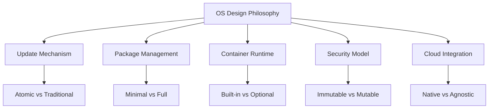

# Chapter 13: OS Distribution Comparison

Comparing our custom Linux From Scratch distribution with modern cloud-native operating systems.

## Learning objectives

- Understand the landscape of cloud-native and container-optimized operating systems
- Compare design philosophies, features, and use cases across distributions
- Evaluate strengths and weaknesses of different approaches
- Identify scenarios where each distribution excels
- Assess our custom LFS distribution in the context of production alternatives

## Overview

Throughout this tutorial, we've built a custom Linux distribution from scratch with container support, security hardening, and modern features. But how does our custom build compare to production-ready, cloud-native operating systems designed specifically for containerized workloads?

This chapter examines leading container-optimized distributions and compares them with our custom LFS build, helping you understand when to use each approach.

## Cloud-Native OS Landscape

The container revolution has spawned a new generation of operating systems designed specifically for running containerized workloads. These distributions typically feature:

- Minimal attack surface with reduced package count
- Immutable or read-only root filesystems
- Atomic updates and rollback capabilities
- Container runtime as a first-class citizen
- Cloud-native integrations and automation

## Distributions Covered

### Pioneer: CoreOS
**Status**: End of Life (succeeded by Flatcar)
**Legacy**: Pioneered container-optimized OS concepts

CoreOS was the first major distribution designed specifically for containerized workloads, introducing concepts like automatic atomic updates, minimal OS design, and fleet management.

### Successor: Flatcar Container Linux
**Maintainer**: Kinvolk (now part of Microsoft Azure)
**Focus**: Drop-in CoreOS replacement with active maintenance

Flatcar continues the CoreOS vision with modern updates, maintaining compatibility while adding new features and security improvements.

### Lightweight: K3OS
**Maintainer**: Rancher Labs (SUSE)
**Focus**: Minimal OS for Kubernetes (K3s)

K3OS is purpose-built for running Kubernetes clusters with minimal overhead, featuring a stripped-down design that boots directly into Kubernetes.

### Amazonian: Bottlerocket
**Maintainer**: Amazon Web Services
**Focus**: Security and automation for container workloads

Bottlerocket is AWS's take on a container-optimized OS, emphasizing security, minimal attack surface, and deep cloud integration.

### CNCF-Certified: Talos
**Maintainer**: Sidero Labs
**Focus**: API-driven Kubernetes OS

Talos is a modern, immutable Kubernetes OS managed entirely via API with no SSH access, representing the latest evolution in cloud-native OS design.

### Factory: Kairos
**Maintainer**: Spectro Cloud
**Focus**: Meta-distribution framework

Kairos is unique as a framework for building immutable, cloud-native Linux distributions rather than a single distribution itself.

## Comparison Framework



## Quick Start (Comparison Overview)

```bash
# Our custom LFS distribution
# - Full control over every component
# - Traditional package management
# - Mutable filesystem
# - Manual updates and configuration

# Cloud-native alternatives
# - Opinionated, minimal design
# - Atomic/transactional updates
# - Often immutable or read-only root
# - Automated update mechanisms
```

## Detailed Comparison

For comprehensive comparisons including:
- Architecture and design philosophy
- Update and maintenance mechanisms
- Security features and hardening
- Use case fit and deployment scenarios
- Performance characteristics
- Community and ecosystem support

See: [Cloud-Native OS Comparison](01-cloud-native-comparison/01-os-comparison.md)

## Comparison Matrix (Summary)

| Feature | LFS Custom | Flatcar | K3OS | Bottlerocket | Talos | Kairos |
|---------|-----------|---------|------|--------------|-------|--------|
| **Learning Value** | ★★★★★ | ★★☆☆☆ | ★★★☆☆ | ★★☆☆☆ | ★★★☆☆ | ★★★★☆ |
| **Production Ready** | ★★☆☆☆ | ★★★★★ | ★★★★☆ | ★★★★★ | ★★★★★ | ★★★★☆ |
| **Customization** | ★★★★★ | ★★☆☆☆ | ★★☆☆☆ | ★☆☆☆☆ | ★★☆☆☆ | ★★★★★ |
| **Update Complexity** | ★★★☆☆ | ★★★★★ | ★★★★★ | ★★★★★ | ★★★★★ | ★★★★★ |
| **Security by Default** | ★★★☆☆ | ★★★★☆ | ★★★☆☆ | ★★★★★ | ★★★★★ | ★★★★☆ |
| **Cloud Integration** | ★★☆☆☆ | ★★★★☆ | ★★★☆☆ | ★★★★★ | ★★★★☆ | ★★★★☆ |

## When to Use Each Distribution

### Use Our Custom LFS Build When:
- Learning and understanding Linux internals
- Full control and customization required
- Specific hardware or software requirements
- Educational or research purposes
- Building foundation knowledge

### Use Production Cloud-Native OS When:
- Running production containerized workloads
- Need automated updates and maintenance
- Security and compliance requirements
- Cloud-native architectures
- Kubernetes deployments

## Exercises

- **Exercise 1**: Boot a Flatcar Container Linux VM and compare the user experience with your LFS build
- **Exercise 2**: Analyze the package counts: compare installed packages on your LFS system vs. a Bottlerocket instance
- **Exercise 3**: Test update mechanisms: perform a traditional package update on LFS vs. an atomic update on Talos
- **Exercise 4**: Security baseline comparison: run CIS benchmarks on your LFS build and a cloud-native OS
- **Exercise 5**: Container performance: benchmark container startup time and resource usage across distributions

## Next Steps

After completing this comparison:
- Decide whether to continue developing your custom LFS build or adopt a cloud-native alternative for production
- Consider hybrid approaches: use LFS knowledge to customize cloud-native distributions
- Explore contributing to open-source cloud-native OS projects
- Apply lessons learned from cloud-native designs to your custom builds

## References

- [Flatcar Container Linux Documentation](https://www.flatcar.org/docs/latest/)
- [K3OS GitHub Repository](https://github.com/rancher/k3os)
- [Bottlerocket Documentation](https://github.com/bottlerocket-os/bottlerocket)
- [Talos Documentation](https://www.talos.dev/)
- [Kairos Documentation](https://kairos.io/)
- [CNCF Cloud Native Landscape](https://landscape.cncf.io/)
- [Container Optimized OS Comparison (Google Cloud)](https://cloud.google.com/container-optimized-os/docs)
